# Metis ロジック図解集

調査日: 2026-10-06（日本時間） / 対象commit: `efb532f74c383cd35c055d85d3f989ba643c3611`

fetchしたorigin/developの対象commitの主要な業務判断・処理順・権限・再開・例外を56図に整理した。図中の矢印は処理・通信・参照の関係であり、データモデル図と依存図を時系列として読まない。

[閲覧版を開く](index.html) · [用語集](glossary.md) · [技術スタック](tech-stack.md) / [説明ページ](tech-stack.html) · [develop照合記録](verification.md) · [APIとSQLの索引](inventory.md) · [抽出データ](inventory.json) · [図のノードと接続](diagrams.json)

基準を作業ブランチからdevelopへ変更した。更新内容と検証範囲は[照合記録](verification.md)を参照する。全てのコード根拠は対象commitへの固定リンクで、手元の別branchの内容とは区別できる。

## 読む順序

全体 → アカウント → ガイド生成 → 学習 → 教材 → 検索・交流 → 通知 → 決済 → 管理 → 実行・ジョブ → 運用。閲覧版では検索・カテゴリ切替・前後移動・拡大ができる。API・Python/TypeScript関数・Desktopファイル・SQL定義にも静的参照図とソース位置を付けた。

## 用語の読み方

[用語集](glossary.md)に129項目の説明を掲載した。閲覧版は「用語集」ボタンまたはカテゴリで検索できる。各主要図には該当用語の説明を付け、図のノードにカーソルを合わせると短い説明も表示する。

## 範囲と読み方

- 手作業でコード・資料を照合した主要図: 56図。UC0001〜UC0033を下表で対応付ける。
- API宣言: 132入口。OpenAPI掲載124件と、`include_in_schema=False`の非掲載8件を区別する。
- Backendの関数・メソッド宣言: 2,751件。生成コードを除いた`apps/backend/src/metis_backend`をPython ASTで抽出。port宣言・内部関数も含む。
- Desktop: 239ファイル、2,394関数・メソッド・callback。`src`のTS/TSXをTypeScript ASTで抽出。`test`、`__tests__`、`generated`と`.test/.spec`を除外。
- SQL履歴: CREATE TABLEの名前109件、CREATE FUNCTION 318定義イベント、CREATE POLICY 245件、CREATE TRIGGER 105件を索引化。
- 自動抽出の参照図は宣言上の呼出先・import先を示す。実際に全ての呼出が実行される図や時系列ではない。動的dispatch、外部ライブラリ内部、計算されたimport名、SQLの実行計画は追跡しない。関数の条件式は最大180文字で表示し、完全な条件はソースを参照する。
- SQL索引はマイグレーション履歴の字句抽出。後続DROP/ALTER、overload、既存DB適用状況を解決した「現在の実在一覧」ではない。物理データ関係の詳細は[既存ER索引](../../design/07-er/README.md)と[migration正本](../../../supabase/migrations/)を参照する。
- アプリ・DB・外部AIを実行した結果ではなく、対象commitの静的調査。運用先の稼働状態・本番activationは確認していない。

## 実装・設計の区別

| 対象 | 確認した状態 |
| --- | --- |
| code_evaluation | worker handlerは`NotImplementedError`。作成・取得serviceは`FeatureUnavailableError`を返す。相談・step達成評価・完了評価は別経路。 |
| 教材完成イメージ | materialization新規経路はimage_status=failedを記録して成功。別jobのサムネイル生成とは区別する。 |
| Windows 11検証 | versionに紐付いたvariant作成と検証結果提出。通常workerに自動変換handlerはない。 |
| 組織招待一覧 | `services/org_view.py`の`build_invitations`は空一覧の暫定実装。招待作成・参加・失効とは別。 |
| 個別の環境再生成 | `services/generation/guides.py`の`create_environment_job`は本人確認後に`FeatureUnavailableError`。通常のガイド生成内での環境作成とは別。 |
| 作者売上・払出の利用者API | `services/account_view.py`の売上summaryとpayoutsは`FeatureUnavailableError`。管理者取引readとは別。 |
| ジョブ種別 | ADR-038の表題は5種。現行SQL/worker契約はサムネイル追加後の6種を使う。 |
| ガイド生成 | ADR-050の専用全面ハーネスが現行。共通workflowとは別。実際のLangGraphはGrounded Docsのtool agentで使用する。 |
| ガードレール・教材タグ | GuardrailDecision / MaterialTagSelectionOutputの構造化応答。Jev専用実装はdevelopに含まれない。 |
| R09D本番切替 | README上未実施。ローカルdefault適用とproduction owner CASを区別する。 |
| 本番退会受入 | README上、実Storage/Authのdeploy先受入は未完了。 |

## ユースケース対応表

| UC | 内容 | 図 |
| --- | --- | --- |
| [UC0001](../../design/01-use-cases/UC0001.md) | 規約・同意 | [図 05](#図-05), [図 06](#図-06) |
| [UC0002](../../design/01-use-cases/UC0002.md) | 会員登録 | [図 04](#図-04), [図 05](#図-05) |
| [UC0003](../../design/01-use-cases/UC0003.md) | ログイン | [図 04](#図-04), [図 05](#図-05) |
| [UC0004](../../design/01-use-cases/UC0004.md) | 外部連携・組織 | [図 08](#図-08), [図 09](#図-09) |
| [UC0005](../../design/01-use-cases/UC0005.md) | プロフィール | [図 07](#図-07) |
| [UC0006](../../design/01-use-cases/UC0006.md) | お気に入り技術 | [図 07](#図-07), [図 25](#図-25) |
| [UC0007](../../design/01-use-cases/UC0007.md) | 学習スタイル | [図 07](#図-07), [図 12](#図-12) |
| [UC0008](../../design/01-use-cases/UC0008.md) | ゴール設定 | [図 12](#図-12), [図 53](#図-53) |
| [UC0009](../../design/01-use-cases/UC0009.md) | 新規学習・生成 | [図 13](#図-13), [図 14](#図-14), [図 15](#図-15), [図 16](#図-16), [図 17](#図-17), [図 18](#図-18), [図 19](#図-19), [図 51](#図-51) |
| [UC0010](../../design/01-use-cases/UC0010.md) | 学習進行 | [図 20](#図-20), [図 21](#図-21), [図 22](#図-22), [図 24](#図-24), [図 43](#図-43), [図 44](#図-44) |
| [UC0011](../../design/01-use-cases/UC0011.md) | AI相談・評価 | [図 22](#図-22), [図 23](#図-23), [図 24](#図-24) |
| [UC0012](../../design/01-use-cases/UC0012.md) | 進捗確認 | [図 20](#図-20), [図 21](#図-21) |
| [UC0013](../../design/01-use-cases/UC0013.md) | 学習履歴 | [図 25](#図-25) |
| [UC0014](../../design/01-use-cases/UC0014.md) | 履歴削除 | [図 25](#図-25) |
| [UC0015](../../design/01-use-cases/UC0015.md) | 検索 | [図 34](#図-34) |
| [UC0016](../../design/01-use-cases/UC0016.md) | 教材閲覧・取得 | [図 27](#図-27), [図 38](#図-38) |
| [UC0017](../../design/01-use-cases/UC0017.md) | 教材学習 | [図 27](#図-27), [図 30](#図-30) |
| [UC0018](../../design/01-use-cases/UC0018.md) | レビュー | [図 31](#図-31) |
| [UC0019](../../design/01-use-cases/UC0019.md) | 教材作成 | [図 26](#図-26), [図 29](#図-29), [図 33](#図-33) |
| [UC0020](../../design/01-use-cases/UC0020.md) | 教材編集 | [図 28](#図-28) |
| [UC0021](../../design/01-use-cases/UC0021.md) | 公開状態変更 | [図 28](#図-28) |
| [UC0022](../../design/01-use-cases/UC0022.md) | 教材削除 | [図 28](#図-28) |
| [UC0023](../../design/01-use-cases/UC0023.md) | 教材共有 | [図 36](#図-36) |
| [UC0024](../../design/01-use-cases/UC0024.md) | エクスポート | [図 27](#図-27), [図 32](#図-32) |
| [UC0025](../../design/01-use-cases/UC0025.md) | フォロー | [図 35](#図-35), [図 37](#図-37) |
| [UC0026](../../design/01-use-cases/UC0026.md) | アカウント共有 | [図 36](#図-36) |
| [UC0027](../../design/01-use-cases/UC0027.md) | 通報 | [図 36](#図-36) |
| [UC0028](../../design/01-use-cases/UC0028.md) | 問い合わせ | [図 36](#図-36) |
| [UC0029](../../design/01-use-cases/UC0029.md) | 課金 | [図 38](#図-38), [図 39](#図-39), [図 40](#図-40) |
| [UC0030](../../design/01-use-cases/UC0030.md) | ログアウト | [図 10](#図-10) |
| [UC0031](../../design/01-use-cases/UC0031.md) | 退会 | [図 11](#図-11) |
| [UC0032](../../design/01-use-cases/UC0032.md) | 利用者管理 | [図 41](#図-41), [図 42](#図-42) |
| [UC0033](../../design/01-use-cases/UC0033.md) | 教材管理 | [図 41](#図-41), [図 42](#図-42) |

## 図の一覧

- [図 01: プロダクト全体の循環](#図-01)
- [図 02: 実行プロセスと通信境界](#図-02)
- [図 03: Moduleの依存と更新責任](#図-03)
- [図 04: ソーシャルログインとOAuth callback](#図-04)
- [図 05: API認証・利用者状態・法務gate](#図-05)
- [図 06: 法務文書と同意履歴](#図-06)
- [図 07: プロフィール・画像・学習設定](#図-07)
- [図 08: 外部アカウント連携・解除](#図-08)
- [図 09: 組織・招待・APIキー](#図-09)
- [図 10: ログアウトとowner切替](#図-10)
- [図 11: 退会の段階実行と再開](#図-11)
- [図 12: ゴール入力から生成開始まで](#図-12)
- [図 13: 生成session・構成案承認・再生成](#図-13)
- [図 14: 全面ハーネスの本生成](#図-14)
- [図 15: 章patchの並列生成と原子的採用](#図-15)
- [図 16: 品質判定・RepairGroup・学習可能化](#図-16)
- [図 17: 再開・冪等AI実行・費用ソフト上限](#図-17)
- [図 18: Grounded Docs・context圧縮・終端report](#図-18)
- [図 19: 環境成果物のimmutable公開](#図-19)
- [図 20: 下書き・active・completedの能力判定](#図-20)
- [図 21: 進捗保存と古い応答の排除](#図-21)
- [図 22: step達成条件と実行証跡の評価](#図-22)
- [図 23: AI相談・選択テキスト・workspace文脈](#図-23)
- [図 24: ガイド完了・評価attempt・教材化可能性](#図-24)
- [図 25: 学習履歴・MyPage・お気に入り](#図-25)
- [図 26: 完了ガイドから教材化](#図-26)
- [図 27: 閲覧・学習・exportの権限判定](#図-27)
- [図 28: 作者メモ・公開・非公開・削除要求](#図-28)
- [図 29: サムネイル準備・生成・合成・確定](#図-29)
- [図 30: 教材学習・sample code・AI質問](#図-30)
- [図 31: レビュー・評価・おすすめ](#図-31)
- [図 32: 非同期exportとファイル保存](#図-32)
- [図 33: Windows 11検証バリアント](#図-33)
- [図 34: 教材・ユーザー・技術の横断検索](#図-34)
- [図 35: フォローと通知の原子性](#図-35)
- [図 36: 共有・公開プロフィール・通報・問い合わせ](#図-36)
- [図 37: 通知生成・抑止・購読・既読化](#図-37)
- [図 38: 無料取得・カート・購入可能性](#図-38)
- [図 39: 課金主体・プラン・利用権](#図-39)
- [図 40: Stripe Webhookの重複・再送・確定](#図-40)
- [図 41: 管理者command・監査・終端状態](#図-41)
- [図 42: dashboard・教材管理・取引詳細・返品例外](#図-42)
- [図 43: ローカルworkspace準備・起動](#図-43)
- [図 44: 実行・中断・再接続・workspace削除](#図-44)
- [図 45: 6種job・2キュー・実装revision](#図-45)
- [図 46: attempt lease・heartbeat・retry・安全停止](#図-46)
- [図 47: DBの整合性・RLS・RPC](#図-47)
- [図 48: Storage GC・保持期限・再観測](#図-48)
- [図 49: 観測・ログ・provider metrics](#図-49)
- [図 50: 開発起動・品質チェック・配布](#図-50)
- [図 51: 構造化応答による入出力ガードレール](#図-51)
- [図 52: ドメイン別データの接続](#図-52)
- [図 53: タグ推薦の決定アルゴリズム](#図-53)
- [図 54: 教材検索タグの構造化生成とID解決](#図-54)
- [図 55: CI runner配置とDocker preflight](#図-55)
- [図 56: GitHub ProjectsからDiscordへ日次担当一覧](#図-56)

## 図 01: プロダクト全体の循環

ゴールから個別ガイドを作り、ローカルで実装し、学習結果を教材として再利用する。課金・権限・通知・管理はこの循環を支える。

関連: UC0001–UC0033

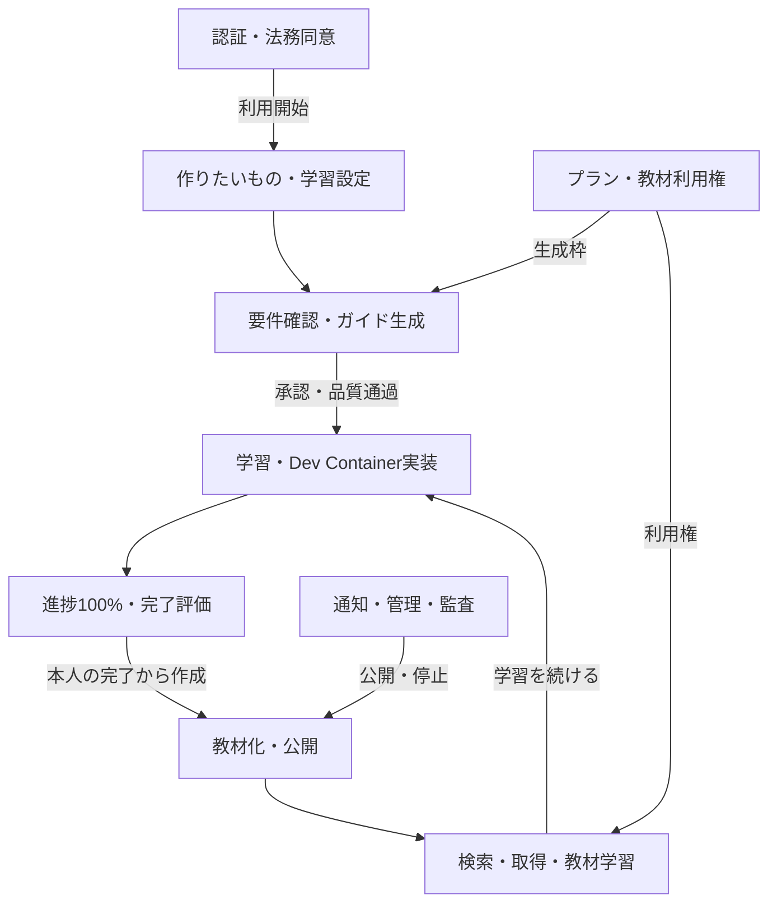
```mermaid
flowchart TB
    goal["作りたいもの・学習設定"]
    gen["要件確認・ガイド生成"]
    learn["学習・Dev Container実装"]
    done["進捗100%・完了評価"]
    material["教材化・公開"]
    search["検索・取得・教材学習"]
    account["認証・法務同意"]
    commerce["プラン・教材利用権"]
    admin["通知・管理・監査"]
    account -->|"利用開始"| goal
    goal --> gen
    gen -->|"承認・品質通過"| learn
    learn --> done
    done -->|"本人の完了から作成"| material
    material --> search
    search -->|"学習を続ける"| learn
    commerce -->|"生成枠"| gen
    commerce -->|"利用権"| search
    admin -->|"公開・停止"| material
```

根拠: [docs/project/README.md](https://github.com/5B-Projects/metis/blob/efb532f74c383cd35c055d85d3f989ba643c3611/docs/project/README.md) / [docs/design/01-use-cases/README.md](https://github.com/5B-Projects/metis/blob/efb532f74c383cd35c055d85d3f989ba643c3611/docs/design/01-use-cases/README.md) / [apps/backend/src/metis_backend/routers/learning_guides.py](https://github.com/5B-Projects/metis/blob/efb532f74c383cd35c055d85d3f989ba643c3611/apps/backend/src/metis_backend/routers/learning_guides.py) / [apps/backend/src/metis_backend/routers/materials.py](https://github.com/5B-Projects/metis/blob/efb532f74c383cd35c055d85d3f989ba643c3611/apps/backend/src/metis_backend/routers/materials.py)

この図の用語（6項目）

**認証 / 認可** — 認証は「誰か」を確認すること。認可は「その人がこの操作をできるか」を判断すること。 Metisでは: 有効なログインでも、他人の進捗更新やowner限定操作は許可されない。

**quota** — 利用できる回数・量の割当。 Metisでは: プランに応じたガイド生成枠を確認・消費する。providerの実費上限とは別。

**Dev Container / Docker** — Dev Containerはコンテナ内の開発環境。Dockerはコンテナを動かすための基盤の一つ。 Metisでは: 利用者のコードはローカルのコンテナ内で実行し、ホストOSで直接実行する経路と分ける。

**materialization（教材化）** — 学習済ガイドの内容を、再利用できる教材の構造へ変換する処理。 Metisでは: 本人の完了と品質を確認し、章本文、sample code、検索タグ等を保存する。

**entitlement（利用権）** — 対象の機能や教材を利用してよいことを示す権利。 Metisでは: プラン権利と教材の取得・購入権を確認する。教材がpublicかどうかとは別に判断する。

**audit / append-only** — auditは誰が何をしたかを追跡する記録。append-onlyは既存記録を上書きせず追加する方式。 Metisでは: 管理commandの成功・失敗と理由を保存する。

## 図 02: 実行プロセスと通信境界

UIのサーバー処理はAPIへ、OS操作は限定されたpreload APIからmainへ送る。backendとworkerは別のプロセス。

注記: OpenAI SDKはOpenRouter互換endpointへのHTTP送信に利用する。Jev専用Decisions経路はこのdevelopに含まれない。

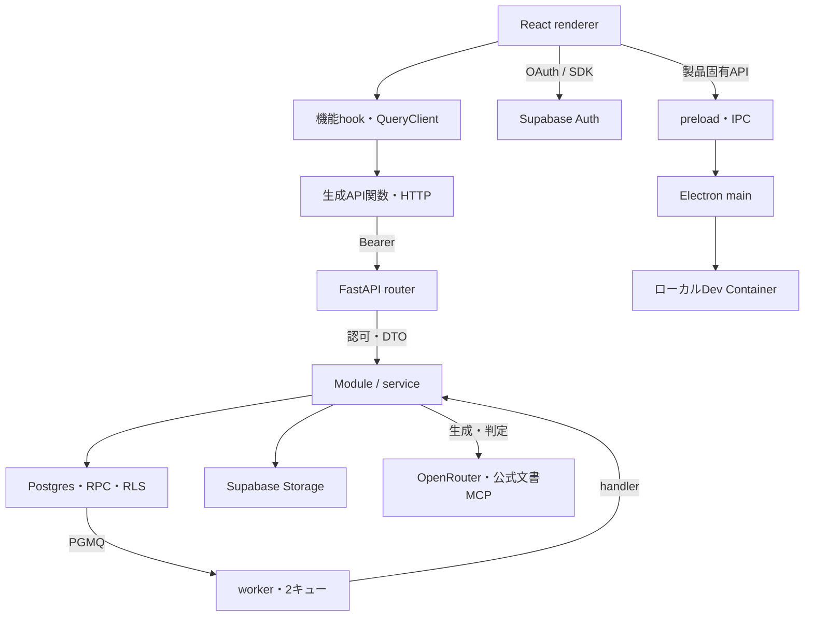
```mermaid
flowchart TB
    ui["React renderer"]
    query["機能hook・QueryClient"]
    api["生成API関数・HTTP"]
    fast["FastAPI router"]
    domain["Module / service"]
    db["Postgres・RPC・RLS"]
    storage["Supabase Storage"]
    auth["Supabase Auth"]
    pre["preload・IPC"]
    main["Electron main"]
    container["ローカルDev Container"]
    worker["worker・2キュー"]
    ai["OpenRouter・公式文書MCP"]
    ui --> query
    query --> api
    api -->|"Bearer"| fast
    fast -->|"認可・DTO"| domain
    domain --> db
    domain --> storage
    ui -->|"OAuth / SDK"| auth
    ui -->|"製品固有API"| pre
    pre --> main
    main --> container
    db -->|"PGMQ"| worker
    worker -->|"handler"| domain
    domain -->|"生成・判定"| ai
```

根拠: [docs/architecture/module-contracts.md](https://github.com/5B-Projects/metis/blob/efb532f74c383cd35c055d85d3f989ba643c3611/docs/architecture/module-contracts.md) / [apps/backend/src/metis_backend/main.py](https://github.com/5B-Projects/metis/blob/efb532f74c383cd35c055d85d3f989ba643c3611/apps/backend/src/metis_backend/main.py) / [apps/backend/src/metis_backend/composition/worker.py](https://github.com/5B-Projects/metis/blob/efb532f74c383cd35c055d85d3f989ba643c3611/apps/backend/src/metis_backend/composition/worker.py) / [apps/desktop/src/preload/index.ts](https://github.com/5B-Projects/metis/blob/efb532f74c383cd35c055d85d3f989ba643c3611/apps/desktop/src/preload/index.ts)

この図の用語（29項目）

**API** — アプリやサービスが処理を依頼したり、結果を受け取ったりするための窓口。 Metisでは: 画面からバックエンドへ、ガイド取得や進捗保存などを依頼する。

**HTTP** — 要求と応答をやり取りする通信方式。HTTPSは通信を暗号化する。 Metisでは: API呼出や外部AIへの要求で使う。

**router** — URLや要求を対応する処理へ振り分ける入口。 Metisでは: FastAPIでは認証・入力・応答の変換を担当し、業務判断はModuleやserviceへ渡す。

**DTO** — 通信で受け渡す情報の形を定めたデータ。Data Transfer Objectの略。 Metisでは: DB内部の情報をそのまま出さず、画面へ返してよい項目に変換する。

**生成APIクライアント** — API仕様から機械的に作られた呼出関数と型。 Metisでは: 画面側の独自hookが利用する。生成物自体は業務判断やDB更新責任を持たない。

**React** — 画面を部品に分けて作るUIライブラリ。 Metisでは: Desktopのrendererで学習・教材・設定画面を描画する。

**hook** — Reactの部品から状態や処理を再利用する仕組み。 Metisでは: 機能ごとのAPI取得、保存操作、画面の寿命管理をまとめる。

**Electron** — Web技術でデスクトップアプリを作る実行基盤。 Metisでは: 画面用rendererとOS操作用mainを分離し、限定したIPCで接続する。

**renderer** — Electronで画面を表示し、利用者の操作を受け取る実行領域。 Metisでは: React UIとAPI呼出を担当する。OS操作はpreload経由でmainへ依頼する。

**main process** — ElectronでウィンドウやOS資源を管理する実行領域。 Metisでは: workspace、Docker、コマンド実行、ファイル保存を管理する。

**preload** — 画面に公開してよい機能だけを橋渡しするElectronのスクリプト。 Metisでは: contextBridgeで製品固有APIを公開し、rendererからmainへの入口を限定する。

**IPC** — 別々のプロセス間で要求・結果をやり取りする仕組み。Inter-Process Communicationの略。 Metisでは: rendererからmainへ、workspace準備やコマンド実行を依頼する。

**FastAPI** — PythonでHTTP APIを構築するフレームワーク。 Metisでは: 認証付きの業務APIとOpenAPI生成を担う。

**Module** — 一つの機能の判断・処理・更新責任をまとめた単位。 Metisでは: 教材、決済、通知などが、それぞれの公開入口を持つ。

**QueryClient** — TanStack Queryで取得済みサーバーデータを管理する主体。 Metisでは: 保存結果をキャッシュへ反映する。利用者が切り替わったら旧利用者のデータを消す。

**OAuth** — 利用者が外部サービスへ認証・許可を委ね、結果をアプリに戻す仕組み。 Metisでは: ソーシャルログインや外部identityの追加に使う。ログインでは外部サービス側の認証の仕組みと組み合わせる。

**SDK** — サービスを利用するための公式ライブラリ群。Software Development Kitの略。 Metisでは: Supabase SDKが認証・session更新・identity操作などを扱う。

**JWT / Bearer** — JWTは署名付きの情報を持つtoken。Bearerはtokenを持つ者としてAPIへ提示する認証方式。 Metisでは: APIで署名・期限・発行元・対象・利用者IDを検証する。

**認証 / 認可** — 認証は「誰か」を確認すること。認可は「その人がこの操作をできるか」を判断すること。 Metisでは: 有効なログインでも、他人の進捗更新やowner限定操作は許可されない。

**OpenRouter / provider** — OpenRouterは複数のAIモデルへ要求を送る窓口。providerは実際にAI処理を提供する実行先。 Metisでは: 生成や安全判定の要求を送り、実費・token・遅延などを記録する。

**Grounded Docs / MCP** — Grounded Docsは公式文書の索引・参照機能。MCPは外部ツールを共通の方式で呼び出すための接続規約。 Metisでは: 読み取り専用検索から、章の生成・reviewに使う文書packetを作る。

**Dev Container / Docker** — Dev Containerはコンテナ内の開発環境。Dockerはコンテナを動かすための基盤の一つ。 Metisでは: 利用者のコードはローカルのコンテナ内で実行し、ホストOSで直接実行する経路と分ける。

**job / worker / handler** — jobは後で処理する仕事、workerはその仕事を受け取る実行プロセス、handlerは種類ごとの処理本体。 Metisでは: ガイド生成、教材化、export、退会などを画面の要求から切り離して実行する。

**queue / PGMQ / poller** — queueは仕事の待ち行列、PGMQはPostgresベースのキュー機能、pollerは仕事の到着を繰り返し確認する処理。 Metisでは: cpu_boundとio_boundの2キューをworkerが並行して確認する。

**Supabase / Postgres** — Supabaseは認証・DB・Storage等を提供する基盤。PostgresはそのDBの中心となるデータベース。 Metisでは: 利用者、ガイド、教材、権利、job等を保存し、認証・ファイル管理とも接続する。

**RPC** — 名前付きの処理を、離れた場所から呼び出す方式。Remote Procedure Callの略。 Metisでは: ここでは主にPostgres関数を呼び、権限・lock・複数行更新をDB内で確定する。

**RLS** — DBの行単位で読み書きを制限する仕組み。Row Level Securityの略。 Metisでは: 本人・組織等のscopeをDBで制限する。教材の利用権等の業務認可はAPI側でも確認する。

**Storage / bucket / object key** — Storageはファイル保存サービス、bucketは保存先の区分、object keyは区分内のファイル識別名。 Metisでは: 教材本文・サムネイル・環境archiveを保存する。DBにはassetの参照や証跡を残す。

**endpoint（API入口）** — URLとHTTPメソッドの組合せで特定される処理の入口。 Metisでは: 例: 進捗取得のGETと進捗保存のPATCHは別の入口。

## 図 03: Moduleの依存と更新責任

compositionが起動時に依存を接続する。別Moduleへの参照は公開入口に限定し、データ更新は所有する機能へ渡す。

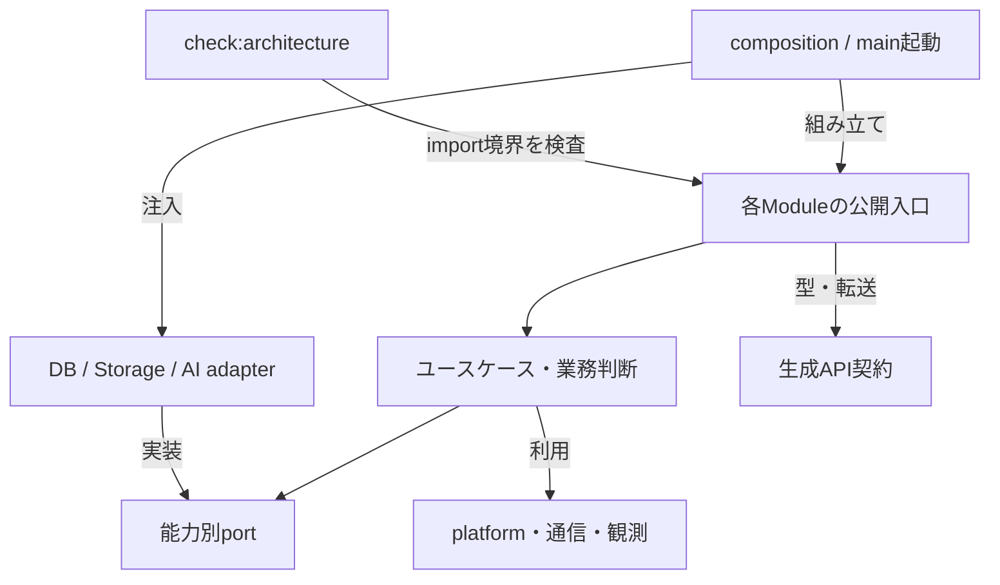
```mermaid
flowchart TB
    composition["composition / main起動"]
    public["各Moduleの公開入口"]
    usecase["ユースケース・業務判断"]
    port["能力別port"]
    adapter["DB / Storage / AI adapter"]
    platform["platform・通信・観測"]
    generated["生成API契約"]
    gate["check:architecture"]
    composition -->|"組み立て"| public
    composition -->|"注入"| adapter
    public --> usecase
    usecase --> port
    adapter -->|"実装"| port
    usecase -->|"利用"| platform
    public -->|"型・転送"| generated
    gate -->|"import境界を検査"| public
```

根拠: [docs/architecture/module-contracts.md](https://github.com/5B-Projects/metis/blob/efb532f74c383cd35c055d85d3f989ba643c3611/docs/architecture/module-contracts.md) / [docs/architecture/migration-register.md](https://github.com/5B-Projects/metis/blob/efb532f74c383cd35c055d85d3f989ba643c3611/docs/architecture/migration-register.md)

この図の用語（11項目）

**API** — アプリやサービスが処理を依頼したり、結果を受け取ったりするための窓口。 Metisでは: 画面からバックエンドへ、ガイド取得や進捗保存などを依頼する。

**生成APIクライアント** — API仕様から機械的に作られた呼出関数と型。 Metisでは: 画面側の独自hookが利用する。生成物自体は業務判断やDB更新責任を持たない。

**main process** — ElectronでウィンドウやOS資源を管理する実行領域。 Metisでは: workspace、Docker、コマンド実行、ファイル保存を管理する。

**Module** — 一つの機能の判断・処理・更新責任をまとめた単位。 Metisでは: 教材、決済、通知などが、それぞれの公開入口を持つ。

**public interface（公開入口）** — 別の機能から利用してよいと決めた関数・型・commandの集合。 Metisでは: 別Moduleは内部実装を直接参照せず、この入口を経由する。公開Web APIとは別の意味。

**port** — 必要な能力を表すインターフェース。通信のポート番号とは別の意味。 Metisでは: 業務処理は「保存する」「AIへ依頼する」等の能力に依存し、具体的なSupabaseやAI実装から分離する。

**adapter** — 能力のインターフェースを、具体的な外部サービスや実装に接続する部品。 Metisでは: 業務portをSupabase RPC、Storage、AI providerなどへつなぐ。

**composition** — 起動時にModule・port・adapterを接続する組立部分。 Metisでは: APIとworkerの依存注入やhandler登録を行う。業務判断自体は所有しない。

**platform** — 通信・ログなど、複数機能で使う技術基盤。 Metisでは: Moduleから利用するが、各機能の業務更新責任は持たない。

**UNIQUE / FK / CHECK / lock** — UNIQUEは重複禁止、FKは参照先の整合性、CHECKは値の条件、lockは競合する更新の調整。 Metisでは: 同じ購入・follow・進捗の重複や、同時更新で不整合が起きることを防ぐ。

**Storage / bucket / object key** — Storageはファイル保存サービス、bucketは保存先の区分、object keyは区分内のファイル識別名。 Metisでは: 教材本文・サムネイル・環境archiveを保存する。DBにはassetの参照や証跡を残す。

## 図 04: ソーシャルログインとOAuth callback

本番ログインはソーシャル認証。SDK・callback・初期検証の競合はcoordinatorが世代と寿命で整理する。

関連: UC0002, UC0003, UC0004

注記: ローカル起動ではGitHub/Google OAuth設定の欠落とGoogle client ID形式を診断する。Googleのauthorization-code flowはnonce検査を維持する。設定値は診断ログに表示しない。

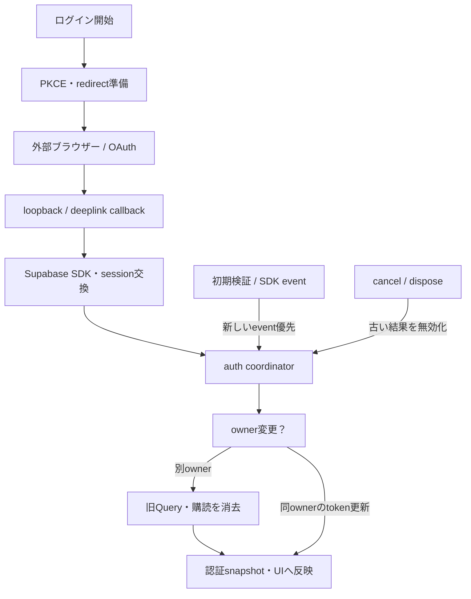
```mermaid
flowchart TB
    start["ログイン開始"]
    pkce["PKCE・redirect準備"]
    external["外部ブラウザー / OAuth"]
    callback["loopback / deeplink callback"]
    sdk["Supabase SDK・session交換"]
    coord["auth coordinator"]
    valid["初期検証 / SDK event"]
    owner["owner変更？"]
    clear["旧Query・購読を消去"]
    snapshot["認証snapshot・UIへ反映"]
    cancel["cancel / dispose"]
    start --> pkce
    pkce --> external
    external --> callback
    callback --> sdk
    sdk --> coord
    valid -->|"新しいevent優先"| coord
    coord --> owner
    owner -->|"別owner"| clear
    clear --> snapshot
    owner -->|"同ownerのtoken更新"| snapshot
    cancel -->|"古い結果を無効化"| coord
```

根拠: [apps/desktop/src/renderer/src/modules/account/auth/coordinator.ts](https://github.com/5B-Projects/metis/blob/efb532f74c383cd35c055d85d3f989ba643c3611/apps/desktop/src/renderer/src/modules/account/auth/coordinator.ts) / [apps/desktop/src/renderer/src/modules/account/auth/oauth-commands.ts](https://github.com/5B-Projects/metis/blob/efb532f74c383cd35c055d85d3f989ba643c3611/apps/desktop/src/renderer/src/modules/account/auth/oauth-commands.ts) / [apps/desktop/src/main/oauth-loopback-server.ts](https://github.com/5B-Projects/metis/blob/efb532f74c383cd35c055d85d3f989ba643c3611/apps/desktop/src/main/oauth-loopback-server.ts) / [docs/adr/ADR-001-social-login-only.md](https://github.com/5B-Projects/metis/blob/efb532f74c383cd35c055d85d3f989ba643c3611/docs/adr/ADR-001-social-login-only.md) / [scripts/local-env.mjs](https://github.com/5B-Projects/metis/blob/efb532f74c383cd35c055d85d3f989ba643c3611/scripts/local-env.mjs) / [supabase/config.toml](https://github.com/5B-Projects/metis/blob/efb532f74c383cd35c055d85d3f989ba643c3611/supabase/config.toml)

この図の用語（14項目）

**command / query** — commandは状態を変える要求、queryは情報を読む要求。 Metisでは: 管理画面の参照と、停止・返金などの更新操作を分ける。SQL文のqueryという意味もあり、文脈で区別する。

**owner** — ある処理・データ・資源の所有者。 Metisでは: 認証図では現在の利用者、組織図では管理権限を持つ所属者、教材図では作者を指す。文脈ごとに意味が異なる。

**generation（世代）** — 新旧の処理を区別するための番号や識別値。 Metisでは: 画面の古い取得結果や、以前のjob attemptによる更新を現在の状態へ混入させない。

**lifecycle / dispose** — 処理や部品の開始から終了までの期間。disposeは終了時に購読・資源を解放する操作。 Metisでは: 画面離脱やHMR終了後のcallback、通知購読、古い認証検証結果を無効化する。

**OAuth** — 利用者が外部サービスへ認証・許可を委ね、結果をアプリに戻す仕組み。 Metisでは: ソーシャルログインや外部identityの追加に使う。ログインでは外部サービス側の認証の仕組みと組み合わせる。

**PKCE** — 認証開始時に作った秘密の検証値を、認証結果の交換時に照合するOAuthの保護方式。 Metisでは: 外部ブラウザーから戻った認証コードを、開始したアプリのsessionへ結び付ける。

**callback** — 処理が終わったときやイベントが発生したときに呼ばれる処理。 Metisでは: OAuth結果の受取にも使う。古いcallbackが現在の利用者状態を変更しないよう寿命を確認する。

**loopback / deeplink** — loopbackは自分のPC内への通信、deeplinkは特定アプリや画面を開くURL。 Metisでは: 外部ブラウザーのOAuth結果をDesktopへ戻す入口。

**SDK** — サービスを利用するための公式ライブラリ群。Software Development Kitの略。 Metisでは: Supabase SDKが認証・session更新・identity操作などを扱う。

**認証 / 認可** — 認証は「誰か」を確認すること。認可は「その人がこの操作をできるか」を判断すること。 Metisでは: 有効なログインでも、他人の進捗更新やowner限定操作は許可されない。

**snapshot** — ある時点の情報を固定して保存した写し。 Metisでは: 生成時の設定、教材化入力、法務公開本文を固定し、後の設定変更で処理の意味が変わらないようにする。

**token** — AI文脈ではモデルが文章を処理する単位。認証文脈では権限を示す証票。 Metisでは: AI費用や入力上限のtokenと、JWTの認証tokenを混同しない。

**workspace / session** — workspaceは学習用の作業場所。sessionは処理や利用状態のひとまとまり。 Metisでは: 認証session、ガイド生成session、workspace sessionは別の対象で、同じ識別子として扱わない。

**Supabase / Postgres** — Supabaseは認証・DB・Storage等を提供する基盤。PostgresはそのDBの中心となるデータベース。 Metisでは: 利用者、ガイド、教材、権利、job等を保存し、認証・ファイル管理とも接続する。

## 図 05: API認証・利用者状態・法務gate

JWTの署名とclaimsを検証し、DBのaccount_statusを確認する。必須同意を要求するAPIは公開版と同意記録も照合する。

関連: UC0001, UC0003

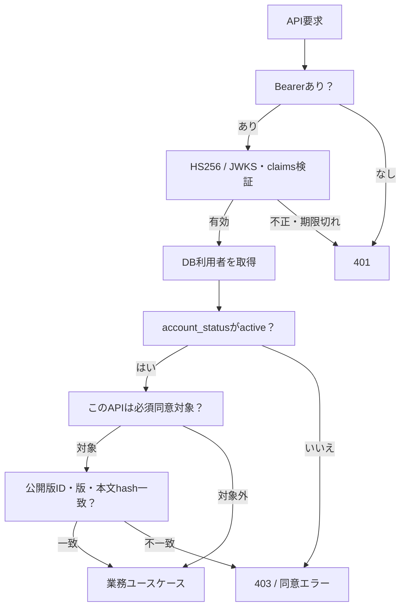
```mermaid
flowchart TB
    request["API要求"]
    bearer["Bearerあり？"]
    jwt["HS256 / JWKS・claims検証"]
    user["DB利用者を取得"]
    active["account_statusがactive？"]
    consent["このAPIは必須同意対象？"]
    hash["公開版ID・版・本文hash一致？"]
    business["業務ユースケース"]
    unauth["401"]
    forbid["403 / 同意エラー"]
    request --> bearer
    bearer -->|"あり"| jwt
    bearer -->|"なし"| unauth
    jwt -->|"有効"| user
    jwt -->|"不正・期限切れ"| unauth
    user --> active
    active -->|"はい"| consent
    active -->|"いいえ"| forbid
    consent -->|"対象"| hash
    consent -->|"対象外"| business
    hash -->|"一致"| business
    hash -->|"不一致"| forbid
```

根拠: [apps/backend/src/metis_backend/core/auth.py](https://github.com/5B-Projects/metis/blob/efb532f74c383cd35c055d85d3f989ba643c3611/apps/backend/src/metis_backend/core/auth.py) / [apps/backend/src/metis_backend/core/legal_consent.py](https://github.com/5B-Projects/metis/blob/efb532f74c383cd35c055d85d3f989ba643c3611/apps/backend/src/metis_backend/core/legal_consent.py) / [apps/backend/src/metis_backend/modules/account_legal/public.py](https://github.com/5B-Projects/metis/blob/efb532f74c383cd35c055d85d3f989ba643c3611/apps/backend/src/metis_backend/modules/account_legal/public.py)

この図の用語（8項目）

**API** — アプリやサービスが処理を依頼したり、結果を受け取ったりするための窓口。 Metisでは: 画面からバックエンドへ、ガイド取得や進捗保存などを依頼する。

**401 / 403 / 404 / 409 / 422 / 500** — HTTP応答コード。401は認証不成立、403は操作禁止、404は対象不在、409は状態の競合、422は入力・処理条件の不備、500はサーバー側の失敗。 Metisでは: 他人の対象は情報を漏らさないため404として扱う経路がある。

**JWT / Bearer** — JWTは署名付きの情報を持つtoken。Bearerはtokenを持つ者としてAPIへ提示する認証方式。 Metisでは: APIで署名・期限・発行元・対象・利用者IDを検証する。

**claims / HS256 / JWKS** — claimsはJWT内の情報。HS256は共有秘密による署名方式、JWKSは公開鍵群の配布形式。 Metisでは: 認証設定に応じて署名鍵を選び、JWTが有効か確認する。

**hash / fingerprint** — 入力から作る要約値。fingerprintは対象を識別・照合するための指紋値。 Metisでは: 法務本文、入力、環境archive等の同一性を確認する。暗号化して内容を復元するものではない。

**revision** — 内容や契約の変更を区別する版。 Metisでは: 章の編集前提となるbase revisionと、jobのimplementation revisionは別々の版を指す。

**draft / active / completed** — draftは未完成の下書き、activeは学習可能なガイド、completedは学習完了したガイド。 Metisでは: 表示能力を分離する。生成完了と学習完了は別の状態。

**認証 / 認可** — 認証は「誰か」を確認すること。認可は「その人がこの操作をできるか」を判断すること。 Metisでは: 有効なログインでも、他人の進捗更新やowner限定操作は許可されない。

## 図 06: 法務文書と同意履歴

Git原稿からの生成はdraft。公開版は不変snapshotとして保持し、版とhashを指定して同意を保存する。撤回は別commandで扱う。

関連: UC0001

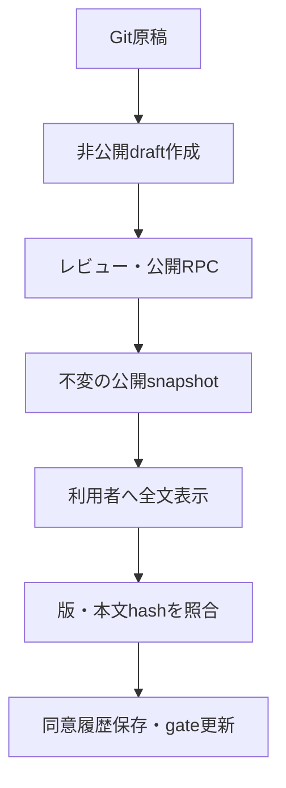
```mermaid
flowchart TB
    n0["Git原稿"]
    n1["非公開draft作成"]
    n2["レビュー・公開RPC"]
    n3["不変の公開snapshot"]
    n4["利用者へ全文表示"]
    n5["版・本文hashを照合"]
    n6["同意履歴保存・gate更新"]
    n0 --> n1
    n1 --> n2
    n2 --> n3
    n3 --> n4
    n4 --> n5
    n5 --> n6
```

根拠: [apps/backend/src/metis_backend/modules/account_legal/public.py](https://github.com/5B-Projects/metis/blob/efb532f74c383cd35c055d85d3f989ba643c3611/apps/backend/src/metis_backend/modules/account_legal/public.py) / [apps/backend/src/metis_backend/services/legal.py](https://github.com/5B-Projects/metis/blob/efb532f74c383cd35c055d85d3f989ba643c3611/apps/backend/src/metis_backend/services/legal.py) / [docs/adr/ADR-044-legal-document-git-source-immutable-snapshot.md](https://github.com/5B-Projects/metis/blob/efb532f74c383cd35c055d85d3f989ba643c3611/docs/adr/ADR-044-legal-document-git-source-immutable-snapshot.md)

この図の用語（7項目）

**command / query** — commandは状態を変える要求、queryは情報を読む要求。 Metisでは: 管理画面の参照と、停止・返金などの更新操作を分ける。SQL文のqueryという意味もあり、文脈で区別する。

**snapshot** — ある時点の情報を固定して保存した写し。 Metisでは: 生成時の設定、教材化入力、法務公開本文を固定し、後の設定変更で処理の意味が変わらないようにする。

**hash / fingerprint** — 入力から作る要約値。fingerprintは対象を識別・照合するための指紋値。 Metisでは: 法務本文、入力、環境archive等の同一性を確認する。暗号化して内容を復元するものではない。

**revision** — 内容や契約の変更を区別する版。 Metisでは: 章の編集前提となるbase revisionと、jobのimplementation revisionは別々の版を指す。

**draft / active / completed** — draftは未完成の下書き、activeは学習可能なガイド、completedは学習完了したガイド。 Metisでは: 表示能力を分離する。生成完了と学習完了は別の状態。

**RPC** — 名前付きの処理を、離れた場所から呼び出す方式。Remote Procedure Callの略。 Metisでは: ここでは主にPostgres関数を呼び、権限・lock・複数行更新をDB内で確定する。

**immutable / read-back / 2PC** — immutableは確定後に内容を変えないこと、read-backは書いたものを再取得して確認すること、2PCは複数システムを二段階で一括確定する方式。 Metisでは: 環境成果物は不変keyを使い、Storageへ書いた内容を再確認する。DBとStorageを一括確定する2PCは使っていない。

## 図 07: プロフィール・画像・学習設定

未保存editorと取得済みサーバー状態を分ける。学習設定の既定値は設定画面の保存だけで変更し、生成中の選択へ強制反映しない。

関連: UC0005, UC0006, UC0007

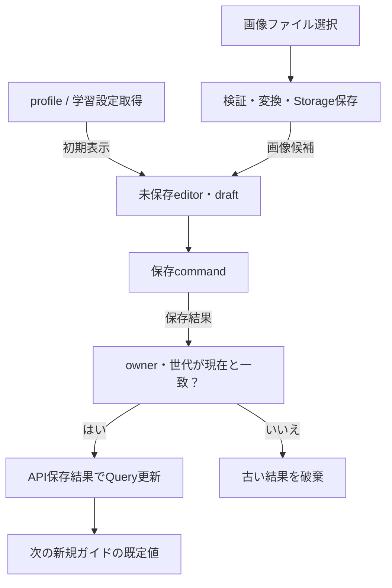
```mermaid
flowchart TB
    fetch["profile / 学習設定取得"]
    editor["未保存editor・draft"]
    image["画像ファイル選択"]
    check["検証・変換・Storage保存"]
    save["保存command"]
    owner["owner・世代が現在と一致？"]
    query["API保存結果でQuery更新"]
    goal["次の新規ガイドの既定値"]
    discard["古い結果を破棄"]
    fetch -->|"初期表示"| editor
    image --> check
    check -->|"画像候補"| editor
    editor --> save
    save -->|"保存結果"| owner
    owner -->|"はい"| query
    owner -->|"いいえ"| discard
    query --> goal
```

根拠: [apps/desktop/src/renderer/src/modules/account/profile/editor.ts](https://github.com/5B-Projects/metis/blob/efb532f74c383cd35c055d85d3f989ba643c3611/apps/desktop/src/renderer/src/modules/account/profile/editor.ts) / [apps/desktop/src/renderer/src/modules/account/learning/command.ts](https://github.com/5B-Projects/metis/blob/efb532f74c383cd35c055d85d3f989ba643c3611/apps/desktop/src/renderer/src/modules/account/learning/command.ts) / [apps/backend/src/metis_backend/services/account_write.py](https://github.com/5B-Projects/metis/blob/efb532f74c383cd35c055d85d3f989ba643c3611/apps/backend/src/metis_backend/services/account_write.py) / [docs/adr/ADR-020-profile-image-storage-conversion-validation.md](https://github.com/5B-Projects/metis/blob/efb532f74c383cd35c055d85d3f989ba643c3611/docs/adr/ADR-020-profile-image-storage-conversion-validation.md)

この図の用語（6項目）

**API** — アプリやサービスが処理を依頼したり、結果を受け取ったりするための窓口。 Metisでは: 画面からバックエンドへ、ガイド取得や進捗保存などを依頼する。

**command / query** — commandは状態を変える要求、queryは情報を読む要求。 Metisでは: 管理画面の参照と、停止・返金などの更新操作を分ける。SQL文のqueryという意味もあり、文脈で区別する。

**owner** — ある処理・データ・資源の所有者。 Metisでは: 認証図では現在の利用者、組織図では管理権限を持つ所属者、教材図では作者を指す。文脈ごとに意味が異なる。

**generation（世代）** — 新旧の処理を区別するための番号や識別値。 Metisでは: 画面の古い取得結果や、以前のjob attemptによる更新を現在の状態へ混入させない。

**draft / active / completed** — draftは未完成の下書き、activeは学習可能なガイド、completedは学習完了したガイド。 Metisでは: 表示能力を分離する。生成完了と学習完了は別の状態。

**Storage / bucket / object key** — Storageはファイル保存サービス、bucketは保存先の区分、object keyは区分内のファイル識別名。 Metisでは: 教材本文・サムネイル・環境archiveを保存する。DBにはassetの参照や証跡を残す。

## 図 08: 外部アカウント連携・解除

連携状態の正本はSupabase Auth identities。追加は外部認証へ移り、解除は確認とSDK操作を経て再取得する。

関連: UC0004

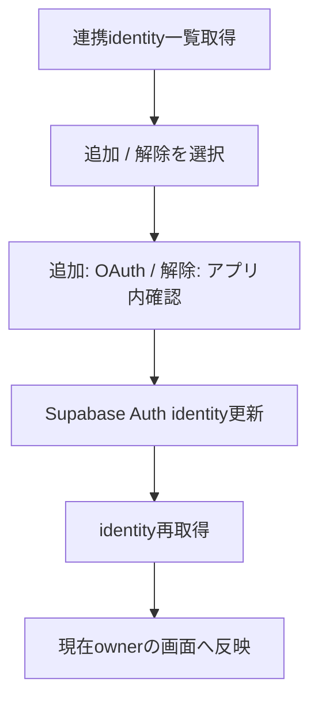
```mermaid
flowchart TB
    n0["連携identity一覧取得"]
    n1["追加 / 解除を選択"]
    n2["追加: OAuth / 解除: アプリ内確認"]
    n3["Supabase Auth identity更新"]
    n4["identity再取得"]
    n5["現在ownerの画面へ反映"]
    n0 --> n1
    n1 --> n2
    n2 --> n3
    n3 --> n4
    n4 --> n5
```

根拠: [apps/desktop/src/renderer/src/modules/account/identity/controller.ts](https://github.com/5B-Projects/metis/blob/efb532f74c383cd35c055d85d3f989ba643c3611/apps/desktop/src/renderer/src/modules/account/identity/controller.ts) / [apps/backend/src/metis_backend/services/identity.py](https://github.com/5B-Projects/metis/blob/efb532f74c383cd35c055d85d3f989ba643c3611/apps/backend/src/metis_backend/services/identity.py) / [docs/adr/ADR-002-external-account-linking-token-storage.md](https://github.com/5B-Projects/metis/blob/efb532f74c383cd35c055d85d3f989ba643c3611/docs/adr/ADR-002-external-account-linking-token-storage.md)

この図の用語（5項目）

**owner** — ある処理・データ・資源の所有者。 Metisでは: 認証図では現在の利用者、組織図では管理権限を持つ所属者、教材図では作者を指す。文脈ごとに意味が異なる。

**OAuth** — 利用者が外部サービスへ認証・許可を委ね、結果をアプリに戻す仕組み。 Metisでは: ソーシャルログインや外部identityの追加に使う。ログインでは外部サービス側の認証の仕組みと組み合わせる。

**SDK** — サービスを利用するための公式ライブラリ群。Software Development Kitの略。 Metisでは: Supabase SDKが認証・session更新・identity操作などを扱う。

**認証 / 認可** — 認証は「誰か」を確認すること。認可は「その人がこの操作をできるか」を判断すること。 Metisでは: 有効なログインでも、他人の進捗更新やowner限定操作は許可されない。

**Supabase / Postgres** — Supabaseは認証・DB・Storage等を提供する基盤。PostgresはそのDBの中心となるデータベース。 Metisでは: 利用者、ガイド、教材、権利、job等を保存し、認証・ファイル管理とも接続する。

## 図 09: 組織・招待・APIキー

owner限定操作と最終owner保護を業務Moduleで判断する。招待の平文コードは作成時だけ返し、DBにはhashを保存する。

関連: UC0004, UC0029

注記: 招待一覧はservices/org_view.pyのbuild_invitationsが空一覧を返す暫定実装。作成・参加・失効のcommandとは実装状況が異なる。

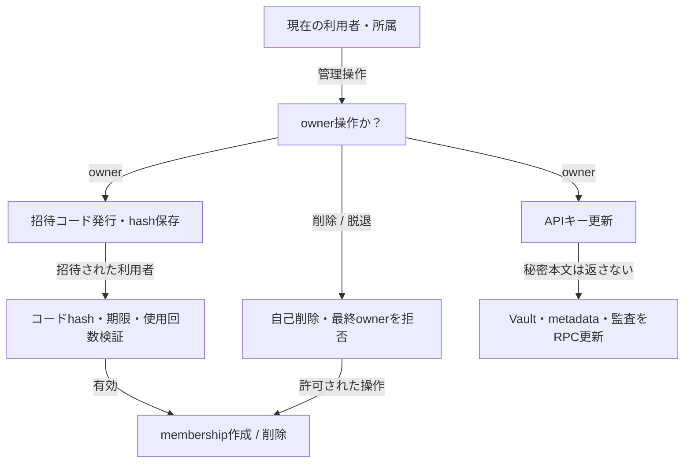
```mermaid
flowchart TB
    user["現在の利用者・所属"]
    owner["owner操作か？"]
    invite["招待コード発行・hash保存"]
    join["コードhash・期限・使用回数検証"]
    member["membership作成 / 削除"]
    last["自己削除・最終ownerを拒否"]
    key["APIキー更新"]
    vault["Vault・metadata・監査をRPC更新"]
    user -->|"管理操作"| owner
    owner -->|"owner"| invite
    invite -->|"招待された利用者"| join
    join -->|"有効"| member
    owner -->|"削除 / 脱退"| last
    last -->|"許可された操作"| member
    owner -->|"owner"| key
    key -->|"秘密本文は返さない"| vault
```

根拠: [apps/backend/src/metis_backend/modules/account_organizations/public.py](https://github.com/5B-Projects/metis/blob/efb532f74c383cd35c055d85d3f989ba643c3611/apps/backend/src/metis_backend/modules/account_organizations/public.py) / [apps/backend/src/metis_backend/services/org_write.py](https://github.com/5B-Projects/metis/blob/efb532f74c383cd35c055d85d3f989ba643c3611/apps/backend/src/metis_backend/services/org_write.py) / [apps/backend/src/metis_backend/routers/organizations.py](https://github.com/5B-Projects/metis/blob/efb532f74c383cd35c055d85d3f989ba643c3611/apps/backend/src/metis_backend/routers/organizations.py)

この図の用語（10項目）

**API** — アプリやサービスが処理を依頼したり、結果を受け取ったりするための窓口。 Metisでは: 画面からバックエンドへ、ガイド取得や進捗保存などを依頼する。

**Module** — 一つの機能の判断・処理・更新責任をまとめた単位。 Metisでは: 教材、決済、通知などが、それぞれの公開入口を持つ。

**command / query** — commandは状態を変える要求、queryは情報を読む要求。 Metisでは: 管理画面の参照と、停止・返金などの更新操作を分ける。SQL文のqueryという意味もあり、文脈で区別する。

**owner** — ある処理・データ・資源の所有者。 Metisでは: 認証図では現在の利用者、組織図では管理権限を持つ所属者、教材図では作者を指す。文脈ごとに意味が異なる。

**hash / fingerprint** — 入力から作る要約値。fingerprintは対象を識別・照合するための指紋値。 Metisでは: 法務本文、入力、環境archive等の同一性を確認する。暗号化して内容を復元するものではない。

**Vault** — 秘密情報を保管・管理する仕組み。 Metisでは: 組織APIキーの秘密本文を保管し、利用者向け応答には設定有無などのmetadataだけを返す。

**metadata** — 本文そのもの以外の、データを説明する情報。 Metisでは: 作成時刻、設定有無、版、実行件数など。秘密本文や教材本文とは分けて扱う。

**RPC** — 名前付きの処理を、離れた場所から呼び出す方式。Remote Procedure Callの略。 Metisでは: ここでは主にPostgres関数を呼び、権限・lock・複数行更新をDB内で確定する。

**audit / append-only** — auditは誰が何をしたかを追跡する記録。append-onlyは既存記録を上書きせず追加する方式。 Metisでは: 管理commandの成功・失敗と理由を保存する。

**membership** — 利用者と組織の所属関係を表す記録。 Metisでは: 組織内のroleとmember IDを保持し、メンバー削除・脱退・最終owner保護の対象になる。

## 図 10: ログアウトとowner切替

local logoutの失敗を成功扱いにしない。owner変更では旧Queryを消去し、旧世代のcallback・取得結果を無効化する。

関連: UC0030

注記: 既に送信済みの副作用やJWTの即時失効をcoordinatorが取り消す保証はない。

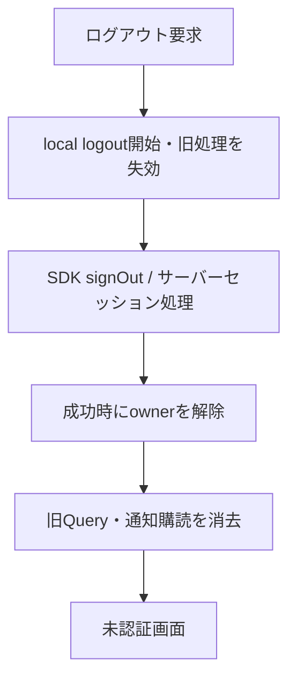
```mermaid
flowchart TB
    n0["ログアウト要求"]
    n1["local logout開始・旧処理を失効"]
    n2["SDK signOut / サーバーセッション処理"]
    n3["成功時にownerを解除"]
    n4["旧Query・通知購読を消去"]
    n5["未認証画面"]
    n0 --> n1
    n1 --> n2
    n2 --> n3
    n3 --> n4
    n4 --> n5
```

根拠: [apps/desktop/src/renderer/src/modules/account/auth/coordinator.ts](https://github.com/5B-Projects/metis/blob/efb532f74c383cd35c055d85d3f989ba643c3611/apps/desktop/src/renderer/src/modules/account/auth/coordinator.ts) / [apps/backend/src/metis_backend/routers/auth.py](https://github.com/5B-Projects/metis/blob/efb532f74c383cd35c055d85d3f989ba643c3611/apps/backend/src/metis_backend/routers/auth.py) / [docs/adr/ADR-024-logout-session-token-invalidation.md](https://github.com/5B-Projects/metis/blob/efb532f74c383cd35c055d85d3f989ba643c3611/docs/adr/ADR-024-logout-session-token-invalidation.md)

この図の用語（8項目）

**command / query** — commandは状態を変える要求、queryは情報を読む要求。 Metisでは: 管理画面の参照と、停止・返金などの更新操作を分ける。SQL文のqueryという意味もあり、文脈で区別する。

**owner** — ある処理・データ・資源の所有者。 Metisでは: 認証図では現在の利用者、組織図では管理権限を持つ所属者、教材図では作者を指す。文脈ごとに意味が異なる。

**generation（世代）** — 新旧の処理を区別するための番号や識別値。 Metisでは: 画面の古い取得結果や、以前のjob attemptによる更新を現在の状態へ混入させない。

**callback** — 処理が終わったときやイベントが発生したときに呼ばれる処理。 Metisでは: OAuth結果の受取にも使う。古いcallbackが現在の利用者状態を変更しないよう寿命を確認する。

**SDK** — サービスを利用するための公式ライブラリ群。Software Development Kitの略。 Metisでは: Supabase SDKが認証・session更新・identity操作などを扱う。

**JWT / Bearer** — JWTは署名付きの情報を持つtoken。Bearerはtokenを持つ者としてAPIへ提示する認証方式。 Metisでは: APIで署名・期限・発行元・対象・利用者IDを検証する。

**認証 / 認可** — 認証は「誰か」を確認すること。認可は「その人がこの操作をできるか」を判断すること。 Metisでは: 有効なログインでも、他人の進捗更新やowner限定操作は許可されない。

**workspace / session** — workspaceは学習用の作業場所。sessionは処理や利用状態のひとまとまり。 Metisでは: 認証session、ガイド生成session、workspace sessionは別の対象で、同じ識別子として扱わない。

## 図 11: 退会の段階実行と再開

DELETE確認・再認証・有効sessionを確認してjobを作る。DB、Storage、Authの完了時刻を保持し、再試行は未完了段階から続ける。

関連: UC0031

注記: 取引保持と個人データ削除は分離。実Storage/Authでのdeploy先受入はREADME上未完了。

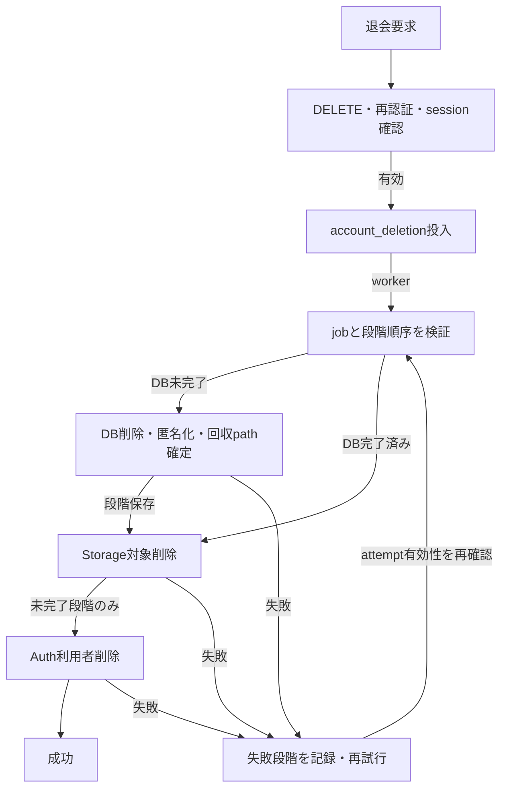
```mermaid
flowchart TB
    request["退会要求"]
    confirm["DELETE・再認証・session確認"]
    job["account_deletion投入"]
    load["jobと段階順序を検証"]
    db["DB削除・匿名化・回収path確定"]
    storage["Storage対象削除"]
    auth["Auth利用者削除"]
    finish["成功"]
    retry["失敗段階を記録・再試行"]
    request --> confirm
    confirm -->|"有効"| job
    job -->|"worker"| load
    load -->|"DB未完了"| db
    load -->|"DB完了済み"| storage
    db -->|"段階保存"| storage
    storage -->|"未完了段階のみ"| auth
    auth --> finish
    db -->|"失敗"| retry
    storage -->|"失敗"| retry
    auth -->|"失敗"| retry
    retry -->|"attempt有効性を再確認"| load
```

根拠: [apps/backend/src/metis_backend/modules/account_lifecycle/public.py](https://github.com/5B-Projects/metis/blob/efb532f74c383cd35c055d85d3f989ba643c3611/apps/backend/src/metis_backend/modules/account_lifecycle/public.py) / [apps/backend/src/metis_backend/workers/account_deletion.py](https://github.com/5B-Projects/metis/blob/efb532f74c383cd35c055d85d3f989ba643c3611/apps/backend/src/metis_backend/workers/account_deletion.py) / [docs/adr/ADR-011-account-deletion-retention-anonymization.md](https://github.com/5B-Projects/metis/blob/efb532f74c383cd35c055d85d3f989ba643c3611/docs/adr/ADR-011-account-deletion-retention-anonymization.md)

この図の用語（7項目）

**認証 / 認可** — 認証は「誰か」を確認すること。認可は「その人がこの操作をできるか」を判断すること。 Metisでは: 有効なログインでも、他人の進捗更新やowner限定操作は許可されない。

**retry / fallback** — retryは同じ目的の処理の再試行、fallbackは代わりの方法へ切り替えること。 Metisでは: 一時的な通信失敗等からの回復に使う。全エラーを再送できるわけではなく、予算超過や所有権喪失は停止する。

**workspace / session** — workspaceは学習用の作業場所。sessionは処理や利用状態のひとまとまり。 Metisでは: 認証session、ガイド生成session、workspace sessionは別の対象で、同じ識別子として扱わない。

**job / worker / handler** — jobは後で処理する仕事、workerはその仕事を受け取る実行プロセス、handlerは種類ごとの処理本体。 Metisでは: ガイド生成、教材化、export、退会などを画面の要求から切り離して実行する。

**attempt / claim** — attemptは1回の実行試行。claimはその仕事を処理する権利を取得する操作。 Metisでは: jobを受け取るたび、token・generation・期限を持つ実行権を確保する。

**Storage / bucket / object key** — Storageはファイル保存サービス、bucketは保存先の区分、object keyは区分内のファイル識別名。 Metisでは: 教材本文・サムネイル・環境archiveを保存する。DBにはassetの参照や証跡を残す。

**匿名化 / マスキング** — 匿名化は個人との結び付きを取り除く処理、マスキングは秘密や識別情報を伏せる処理。 Metisでは: 退会時の保持取引データと、AI相談の短期保存文脈で使う。単にログに出さないこととは別。

## 図 12: ゴール入力から生成開始まで

要件確認前と生成投入時に安全確認する。AIは選択肢の能力カテゴリを返し、タグ推薦そのものは決定ルールで計算する。

関連: UC0008, UC0009

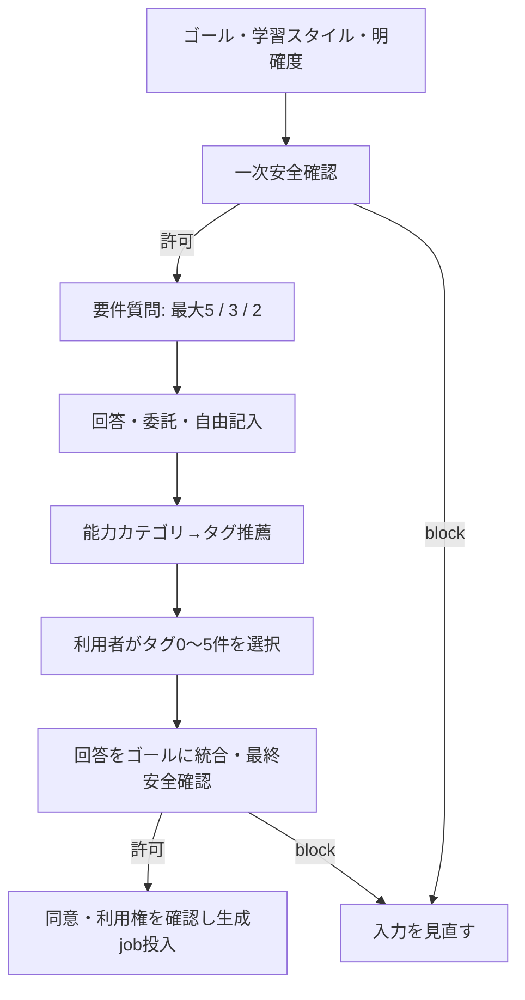
```mermaid
flowchart TB
    goal["ゴール・学習スタイル・明確度"]
    safe["一次安全確認"]
    q["要件質問: 最大5 / 3 / 2"]
    answer["回答・委託・自由記入"]
    intent["能力カテゴリ→タグ推薦"]
    tags["利用者がタグ0〜5件を選択"]
    final["回答をゴールに統合・最終安全確認"]
    enqueue["同意・利用権を確認し生成job投入"]
    block["入力を見直す"]
    goal --> safe
    safe -->|"許可"| q
    safe -->|"block"| block
    q --> answer
    answer --> intent
    intent --> tags
    tags --> final
    final -->|"許可"| enqueue
    final -->|"block"| block
```

根拠: [apps/backend/src/metis_backend/services/generation/requirements.py](https://github.com/5B-Projects/metis/blob/efb532f74c383cd35c055d85d3f989ba643c3611/apps/backend/src/metis_backend/services/generation/requirements.py) / [apps/backend/src/metis_backend/services/generation/jobs.py](https://github.com/5B-Projects/metis/blob/efb532f74c383cd35c055d85d3f989ba643c3611/apps/backend/src/metis_backend/services/generation/jobs.py) / [docs/adr/ADR-054-guide-requirement-confirmation-before-tag-selection.md](https://github.com/5B-Projects/metis/blob/efb532f74c383cd35c055d85d3f989ba643c3611/docs/adr/ADR-054-guide-requirement-confirmation-before-tag-selection.md) / [docs/adr/ADR-045-goal-based-deterministic-tag-recommendation.md](https://github.com/5B-Projects/metis/blob/efb532f74c383cd35c055d85d3f989ba643c3611/docs/adr/ADR-045-goal-based-deterministic-tag-recommendation.md)

この図の用語（4項目）

**entitlement（利用権）** — 対象の機能や教材を利用してよいことを示す権利。 Metisでは: プラン権利と教材の取得・購入権を確認する。教材がpublicかどうかとは別に判断する。

**job / worker / handler** — jobは後で処理する仕事、workerはその仕事を受け取る実行プロセス、handlerは種類ごとの処理本体。 Metisでは: ガイド生成、教材化、export、退会などを画面の要求から切り離して実行する。

**技術タグ** — 教材やゴールに関連する技術を分類する目印。 Metisでは: PythonやFastAPIなどのタグmasterと照合して推薦する。利用者が選ぶ生成タグと、教材検索タグの付与は別の処理。

**intent（能力カテゴリ）** — 要件回答から分かる、必要な実装能力の分類。 Metisでは: Web、認証、ローカル保存などを固定カテゴリにし、アプリの決定ルールで技術タグ候補へ変換する。

## 図 13: 生成session・構成案承認・再生成

構成案の保存と承認待ちへの移行を区別する。Desktopはjobのwaiting_for_userを確認して承認画面を表示し、本人・最新版・job状態をRPCで再検証して承認する。承認後にquota・骨格・receiptを原子的に確定する。

関連: UC0009

注記: statusが取得できる通常経路では、構成案を読めるだけで承認可能とはしない。status自体を取得できない互換経路では、読める構成案を返す。表示後にrunning・進捗40%以上が残る場合も追加監視し、承認/再生成中や画面離脱時には中断する。構成案出力枠は4,000〜20,000 tokensの件数式。JSONの途中切れ等は汎用の構造化補正で最大1回補正し、developにはoutline_output_truncated専用コードはない。

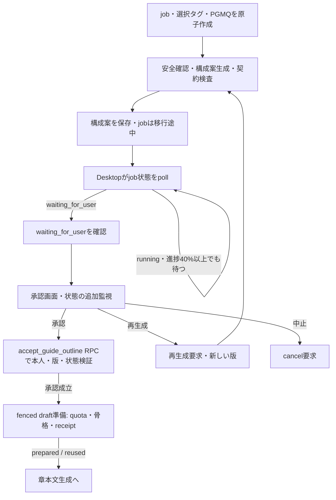
```mermaid
flowchart TB
    submit["job・選択タグ・PGMQを原子作成"]
    outline["安全確認・構成案生成・契約検査"]
    saved["構成案を保存・jobは移行途中"]
    poll["Desktopがjob状態をpoll"]
    wait["waiting_for_userを確認"]
    user["承認画面・状態の追加監視"]
    accept["accept_guide_outline RPCで本人・版・状態検証"]
    regen["再生成要求・新しい版"]
    draft["fenced draft準備: quota・骨格・receipt"]
    body["章本文生成へ"]
    cancel["cancel要求"]
    submit --> outline
    outline --> saved
    saved --> poll
    poll -->|"running・進捗40%以上でも待つ"| poll
    poll -->|"waiting_for_user"| wait
    wait --> user
    user -->|"承認"| accept
    user -->|"再生成"| regen
    regen --> outline
    accept -->|"承認成立"| draft
    draft -->|"prepared / reused"| body
    user -->|"中止"| cancel
```

根拠: [apps/backend/src/metis_backend/services/generation/jobs.py](https://github.com/5B-Projects/metis/blob/efb532f74c383cd35c055d85d3f989ba643c3611/apps/backend/src/metis_backend/services/generation/jobs.py) / [apps/backend/src/metis_backend/services/generation/guide_harness.py](https://github.com/5B-Projects/metis/blob/efb532f74c383cd35c055d85d3f989ba643c3611/apps/backend/src/metis_backend/services/generation/guide_harness.py) / [apps/backend/src/metis_backend/services/generation/draft_preparation.py](https://github.com/5B-Projects/metis/blob/efb532f74c383cd35c055d85d3f989ba643c3611/apps/backend/src/metis_backend/services/generation/draft_preparation.py) / [docs/adr/ADR-033-guide-outline-confirmation-before-body-generation.md](https://github.com/5B-Projects/metis/blob/efb532f74c383cd35c055d85d3f989ba643c3611/docs/adr/ADR-033-guide-outline-confirmation-before-body-generation.md) / [apps/desktop/src/renderer/src/modules/guide_learning/services/learningGuideFlowService.ts](https://github.com/5B-Projects/metis/blob/efb532f74c383cd35c055d85d3f989ba643c3611/apps/desktop/src/renderer/src/modules/guide_learning/services/learningGuideFlowService.ts) / [apps/desktop/src/renderer/src/features/learning-guide/pages/GuideGenerationPage.tsx](https://github.com/5B-Projects/metis/blob/efb532f74c383cd35c055d85d3f989ba643c3611/apps/desktop/src/renderer/src/features/learning-guide/pages/GuideGenerationPage.tsx) / [apps/backend/src/metis_backend/ai/token_budgets.py](https://github.com/5B-Projects/metis/blob/efb532f74c383cd35c055d85d3f989ba643c3611/apps/backend/src/metis_backend/ai/token_budgets.py) / [apps/backend/src/metis_backend/services/generation/guide_model_gateway.py](https://github.com/5B-Projects/metis/blob/efb532f74c383cd35c055d85d3f989ba643c3611/apps/backend/src/metis_backend/services/generation/guide_model_gateway.py) / [supabase/migrations/20260908172126_guide_draft_materialization.sql](https://github.com/5B-Projects/metis/blob/efb532f74c383cd35c055d85d3f989ba643c3611/supabase/migrations/20260908172126_guide_draft_materialization.sql)

この図の用語（15項目）

**quota** — 利用できる回数・量の割当。 Metisでは: プランに応じたガイド生成枠を確認・消費する。providerの実費上限とは別。

**outline / chapter / step** — outlineはガイドの構成案、chapterは章、stepは章内の学習手順。 Metisでは: 利用者がoutlineを承認してから本文を生成し、学習中はstep単位で進捗を記録する。

**stage / scope** — stageは処理段階。scopeは操作や参照を許す範囲。 Metisでは: 構成案生成等のstageを記録し、patchが変更してよい章・節のscopeを限定する。

**revision** — 内容や契約の変更を区別する版。 Metisでは: 章の編集前提となるbase revisionと、jobのimplementation revisionは別々の版を指す。

**draft / active / completed** — draftは未完成の下書き、activeは学習可能なガイド、completedは学習完了したガイド。 Metisでは: 表示能力を分離する。生成完了と学習完了は別の状態。

**workspace / session** — workspaceは学習用の作業場所。sessionは処理や利用状態のひとまとまり。 Metisでは: 認証session、ガイド生成session、workspace sessionは別の対象で、同じ識別子として扱わない。

**transaction（トランザクション）** — DBでは一連の変更をまとめて成功または失敗させる単位。決済文脈では取引記録も指す。 Metisでは: followと通知、jobとqueueなどを一括確定する。図の「取引」とDB原子更新を区別する。

**原子的 / atomic** — 複数の変更が全て成功するか、全て反映されないかのどちらかになる性質。 Metisでは: 生成枠とguide骨格、購読と権利などが一部分だけ更新される状態を防ぐ。

**job / worker / handler** — jobは後で処理する仕事、workerはその仕事を受け取る実行プロセス、handlerは種類ごとの処理本体。 Metisでは: ガイド生成、教材化、export、退会などを画面の要求から切り離して実行する。

**queue / PGMQ / poller** — queueは仕事の待ち行列、PGMQはPostgresベースのキュー機能、pollerは仕事の到着を繰り返し確認する処理。 Metisでは: cpu_boundとio_boundの2キューをworkerが並行して確認する。

**fencing** — 古い実行者が後から状態を書き換えることを防ぐ仕組み。 Metisでは: attemptのtoken・世代・期限をRPCで照合し、所有権を失ったworkerの更新を拒否する。

**terminal / receipt** — terminalは処理が最終状態に達したこと。receiptは確定した操作結果を再確認するための記録。 Metisでは: 成功・失敗等を確定し、応答を失っても同じ結果を再利用する。

**技術タグ** — 教材やゴールに関連する技術を分類する目印。 Metisでは: PythonやFastAPIなどのタグmasterと照合して推薦する。利用者が選ぶ生成タグと、教材検索タグの付与は別の処理。

**認証 / 認可** — 認証は「誰か」を確認すること。認可は「その人がこの操作をできるか」を判断すること。 Metisでは: 有効なログインでも、他人の進捗更新やowner限定操作は許可されない。

**RPC** — 名前付きの処理を、離れた場所から呼び出す方式。Remote Procedure Callの略。 Metisでは: ここでは主にPostgres関数を呼び、権限・lock・複数行更新をDB内で確定する。

## 図 14: 全面ハーネスの本生成

専用ハーネスは章を順に処理し、各章内で独立scopeのpatchを必要に応じ並列化する。まとめ・全体review・出力安全・環境成果物を通過して公開する。

関連: UC0009

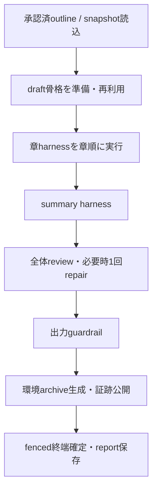
```mermaid
flowchart TB
    n0["承認済outline / snapshot読込"]
    n1["draft骨格を準備・再利用"]
    n2["章harnessを章順に実行"]
    n3["summary harness"]
    n4["全体review・必要時1回repair"]
    n5["出力guardrail"]
    n6["環境archive生成・証跡公開"]
    n7["fenced終端確定・report保存"]
    n0 --> n1
    n1 --> n2
    n2 --> n3
    n3 --> n4
    n4 --> n5
    n5 --> n6
    n6 --> n7
```

根拠: [apps/backend/src/metis_backend/services/generation/guide_harness.py](https://github.com/5B-Projects/metis/blob/efb532f74c383cd35c055d85d3f989ba643c3611/apps/backend/src/metis_backend/services/generation/guide_harness.py) / [apps/backend/src/metis_backend/services/generation/chapter_harness.py](https://github.com/5B-Projects/metis/blob/efb532f74c383cd35c055d85d3f989ba643c3611/apps/backend/src/metis_backend/services/generation/chapter_harness.py) / [apps/backend/src/metis_backend/services/generation/summary_harness.py](https://github.com/5B-Projects/metis/blob/efb532f74c383cd35c055d85d3f989ba643c3611/apps/backend/src/metis_backend/services/generation/summary_harness.py) / [apps/backend/src/metis_backend/workers/guide_generation.py](https://github.com/5B-Projects/metis/blob/efb532f74c383cd35c055d85d3f989ba643c3611/apps/backend/src/metis_backend/workers/guide_generation.py)

この図の用語（13項目）

**GET / POST / PUT / PATCH** — GETは取得、POSTは作成や処理の開始、PUTは指定資源の置換、PATCHは部分的な更新に使うHTTPメソッド。 Metisでは: 図のGETは再取得、PATCHは進捗や既読状態の保存を示す。実際の意味は各API契約に従う。

**snapshot** — ある時点の情報を固定して保存した写し。 Metisでは: 生成時の設定、教材化入力、法務公開本文を固定し、後の設定変更で処理の意味が変わらないようにする。

**guardrail** — AIへ渡す入力や生成出力が、安全性の条件を満たすか検査する処理。 Metisでは: developではGuardrailDecisionの構造化応答でallowed等を検証し、判定と費用を記録する。blockされた内容を次工程へ進めない。ガイド専用gatewayのlocal/test・DEBUG省略と通常検査を区別する。

**harness（ハーネス）** — 複数の生成・検査・修正・保存を制御する実行の枠組み。 Metisでは: ガイド生成専用harnessが構成案、章patch、品質確認、安全確認、終端確定を順序付ける。

**outline / chapter / step** — outlineはガイドの構成案、chapterは章、stepは章内の学習手順。 Metisでは: 利用者がoutlineを承認してから本文を生成し、学習中はstep単位で進捗を記録する。

**stage / scope** — stageは処理段階。scopeは操作や参照を許す範囲。 Metisでは: 構成案生成等のstageを記録し、patchが変更してよい章・節のscopeを限定する。

**patch / hunk** — patchは変更差分。hunkは変更対象の文脈、削除行、追加行をまとめた差分の単位。 Metisでは: 章全文を毎回作り直さず、許可scopeだけを部分更新する。

**finding / reviewer** — findingは検査で見つかった指摘。reviewerは生成内容を点検する役割。 Metisでは: 影響scopeと重大度を記録し、修正または停止を判断する。教材の利用者レビューとは文脈が異なる。

**draft / active / completed** — draftは未完成の下書き、activeは学習可能なガイド、completedは学習完了したガイド。 Metisでは: 表示能力を分離する。生成完了と学習完了は別の状態。

**evidence / binding** — evidenceは実行・確認した内容の記録。bindingは記録を対象のIDやfingerprintへ結び付ける照合。 Metisでは: 他のguideや環境で採った証跡を現在のstep評価に流用しない。

**fencing** — 古い実行者が後から状態を書き換えることを防ぐ仕組み。 Metisでは: attemptのtoken・世代・期限をRPCで照合し、所有権を失ったworkerの更新を拒否する。

**asset / manifest / archive** — assetは保存されたファイル等、manifestは内容・構成・識別情報の一覧、archiveは複数ファイルをまとめたもの。 Metisでは: 学習環境の内容とguide/job/fingerprintの対応を確認して展開する。

**terminal / receipt** — terminalは処理が最終状態に達したこと。receiptは確定した操作結果を再確認するための記録。 Metisでは: 成功・失敗等を確定し、応答を失っても同じ結果を再利用する。

## 図 15: 章patchの並列生成と原子的採用

各scopeは同じbase revisionから生成する。候補を個別適用した後、scope順で合成し、契約に違反するproposalは丸ごと棄却する。

関連: UC0009

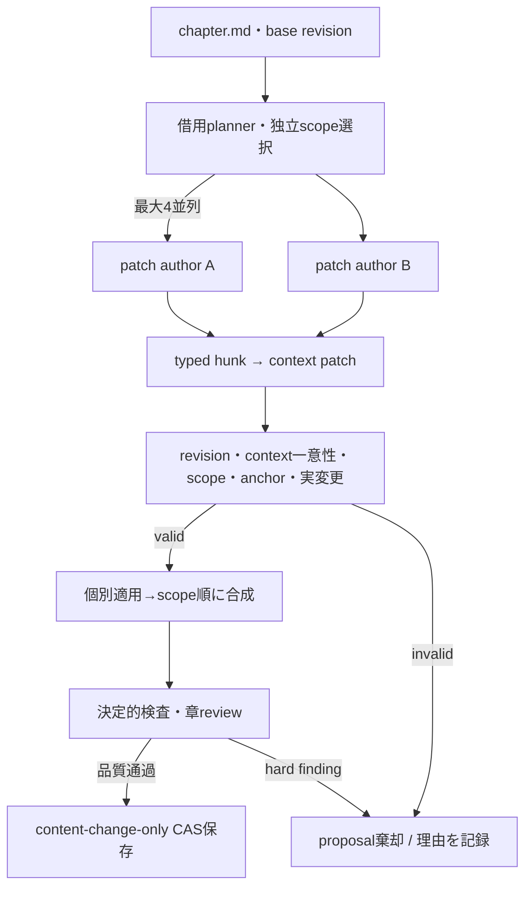
```mermaid
flowchart TB
    base["chapter.md・base revision"]
    scope["借用planner・独立scope選択"]
    p1["patch author A"]
    p2["patch author B"]
    typed["typed hunk → context patch"]
    validate["revision・context一意性・scope・anchor・実変更"]
    merge["個別適用→scope順に合成"]
    review["決定的検査・章review"]
    cas["content-change-only CAS保存"]
    reject["proposal棄却 / 理由を記録"]
    base --> scope
    scope -->|"最大4並列"| p1
    scope --> p2
    p1 --> typed
    p2 --> typed
    typed --> validate
    validate -->|"valid"| merge
    validate -->|"invalid"| reject
    merge --> review
    review -->|"品質通過"| cas
    review -->|"hard finding"| reject
```

根拠: [apps/backend/src/metis_backend/services/generation/chapter_patch.py](https://github.com/5B-Projects/metis/blob/efb532f74c383cd35c055d85d3f989ba643c3611/apps/backend/src/metis_backend/services/generation/chapter_patch.py) / [apps/backend/src/metis_backend/services/generation/chapter_harness.py](https://github.com/5B-Projects/metis/blob/efb532f74c383cd35c055d85d3f989ba643c3611/apps/backend/src/metis_backend/services/generation/chapter_harness.py) / [apps/backend/src/metis_backend/services/generation/borrow_planner.py](https://github.com/5B-Projects/metis/blob/efb532f74c383cd35c055d85d3f989ba643c3611/apps/backend/src/metis_backend/services/generation/borrow_planner.py) / [apps/backend/src/metis_backend/services/generation/chapter_document.py](https://github.com/5B-Projects/metis/blob/efb532f74c383cd35c055d85d3f989ba643c3611/apps/backend/src/metis_backend/services/generation/chapter_document.py)

この図の用語（12項目）

**GET / POST / PUT / PATCH** — GETは取得、POSTは作成や処理の開始、PUTは指定資源の置換、PATCHは部分的な更新に使うHTTPメソッド。 Metisでは: 図のGETは再取得、PATCHは進捗や既読状態の保存を示す。実際の意味は各API契約に従う。

**outline / chapter / step** — outlineはガイドの構成案、chapterは章、stepは章内の学習手順。 Metisでは: 利用者がoutlineを承認してから本文を生成し、学習中はstep単位で進捗を記録する。

**stage / scope** — stageは処理段階。scopeは操作や参照を許す範囲。 Metisでは: 構成案生成等のstageを記録し、patchが変更してよい章・節のscopeを限定する。

**revision** — 内容や契約の変更を区別する版。 Metisでは: 章の編集前提となるbase revisionと、jobのimplementation revisionは別々の版を指す。

**patch / hunk** — patchは変更差分。hunkは変更対象の文脈、削除行、追加行をまとめた差分の単位。 Metisでは: 章全文を毎回作り直さず、許可scopeだけを部分更新する。

**anchor / locator** — anchorは文書内の安定した目印、locatorは変更対象を探す指定。 Metisでは: 別の節を誤って書き換えたり、保護された構造を壊したりしないよう照合する。

**決定的処理** — 同じ入力と条件なら同じ結果になる処理。 Metisでは: タグ推薦、patch適用、構造・version検査など。AIの応答の揺れに依存しない部分を指す。

**CAS** — 現在値が想定した値と一致する場合だけ更新する方式。Compare-And-Swapの略。 Metisでは: 章revisionや実装default mapを照合し、古い処理による上書きを防ぐ。

**blocking / hard / major / minor** — blockingは完成を止める判定。hard、major、minorは品質findingの重さを分類する値。 Metisでは: 意味品質の指摘と構造・出力安全性を区別する。localの特定モードでも全ての検査を解除するわけではない。

**finding / reviewer** — findingは検査で見つかった指摘。reviewerは生成内容を点検する役割。 Metisでは: 影響scopeと重大度を記録し、修正または停止を判断する。教材の利用者レビューとは文脈が異なる。

**context / compaction** — contextはAIや処理へ渡す文脈。compactionは要点を残して文脈の量を減らす処理。 Metisでは: ガイドや過去の修正情報を整理し、長すぎる入力を避ける。

**原子的 / atomic** — 複数の変更が全て成功するか、全て反映されないかのどちらかになる性質。 Metisでは: 生成枠とguide骨格、購読と権利などが一部分だけ更新される状態を防ぐ。

## 図 16: 品質判定・RepairGroup・学習可能化

構造欠落、契約違反、出力安全性はblocking。意味品質はhard / major / minorを保持し、章をまたぐ修正は原子的RepairGroupで確定する。

注記: local/testかつDEBUGのreport_onlyはAI意味品質hardを警告化する。構造・patch・出力guardrailは解除しない。

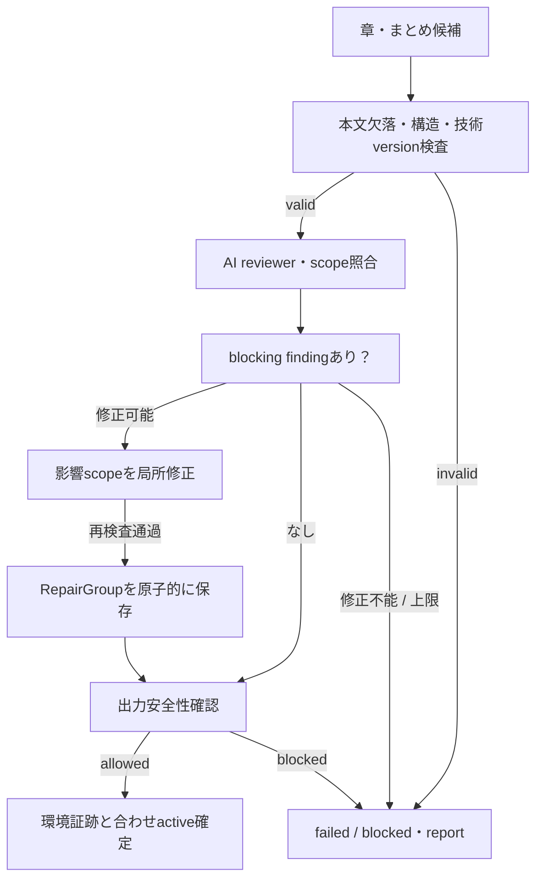
```mermaid
flowchart TB
    candidate["章・まとめ候補"]
    det["本文欠落・構造・技術version検査"]
    review["AI reviewer・scope照合"]
    hard["blocking findingあり？"]
    repair["影響scopeを局所修正"]
    group["RepairGroupを原子的に保存"]
    guard["出力安全性確認"]
    active["環境証跡と合わせactive確定"]
    failed["failed / blocked・report"]
    candidate --> det
    det -->|"valid"| review
    det -->|"invalid"| failed
    review --> hard
    hard -->|"修正可能"| repair
    repair -->|"再検査通過"| group
    group --> guard
    hard -->|"なし"| guard
    hard -->|"修正不能 / 上限"| failed
    guard -->|"allowed"| active
    guard -->|"blocked"| failed
```

根拠: [apps/backend/src/metis_backend/services/generation/quality_gate.py](https://github.com/5B-Projects/metis/blob/efb532f74c383cd35c055d85d3f989ba643c3611/apps/backend/src/metis_backend/services/generation/quality_gate.py) / [apps/backend/src/metis_backend/services/generation/quality_findings.py](https://github.com/5B-Projects/metis/blob/efb532f74c383cd35c055d85d3f989ba643c3611/apps/backend/src/metis_backend/services/generation/quality_findings.py) / [apps/backend/src/metis_backend/services/generation/guide_harness.py](https://github.com/5B-Projects/metis/blob/efb532f74c383cd35c055d85d3f989ba643c3611/apps/backend/src/metis_backend/services/generation/guide_harness.py) / [docs/adr/ADR-051-learning-guide-draft-progress-boundary.md](https://github.com/5B-Projects/metis/blob/efb532f74c383cd35c055d85d3f989ba643c3611/docs/adr/ADR-051-learning-guide-draft-progress-boundary.md)

この図の用語（10項目）

**GET / POST / PUT / PATCH** — GETは取得、POSTは作成や処理の開始、PUTは指定資源の置換、PATCHは部分的な更新に使うHTTPメソッド。 Metisでは: 図のGETは再取得、PATCHは進捗や既読状態の保存を示す。実際の意味は各API契約に従う。

**guardrail** — AIへ渡す入力や生成出力が、安全性の条件を満たすか検査する処理。 Metisでは: developではGuardrailDecisionの構造化応答でallowed等を検証し、判定と費用を記録する。blockされた内容を次工程へ進めない。ガイド専用gatewayのlocal/test・DEBUG省略と通常検査を区別する。

**stage / scope** — stageは処理段階。scopeは操作や参照を許す範囲。 Metisでは: 構成案生成等のstageを記録し、patchが変更してよい章・節のscopeを限定する。

**patch / hunk** — patchは変更差分。hunkは変更対象の文脈、削除行、追加行をまとめた差分の単位。 Metisでは: 章全文を毎回作り直さず、許可scopeだけを部分更新する。

**RepairGroup** — 複数箇所の修正を、一つの整合した変更群として扱う単位。 Metisでは: 章をまたぐ矛盾を直す際に、一部の章だけ保存される状態を避ける。

**blocking / hard / major / minor** — blockingは完成を止める判定。hard、major、minorは品質findingの重さを分類する値。 Metisでは: 意味品質の指摘と構造・出力安全性を区別する。localの特定モードでも全ての検査を解除するわけではない。

**finding / reviewer** — findingは検査で見つかった指摘。reviewerは生成内容を点検する役割。 Metisでは: 影響scopeと重大度を記録し、修正または停止を判断する。教材の利用者レビューとは文脈が異なる。

**draft / active / completed** — draftは未完成の下書き、activeは学習可能なガイド、completedは学習完了したガイド。 Metisでは: 表示能力を分離する。生成完了と学習完了は別の状態。

**evidence / binding** — evidenceは実行・確認した内容の記録。bindingは記録を対象のIDやfingerprintへ結び付ける照合。 Metisでは: 他のguideや環境で採った証跡を現在のstep評価に流用しない。

**原子的 / atomic** — 複数の変更が全て成功するか、全て反映されないかのどちらかになる性質。 Metisでは: 生成枠とguide骨格、購読と権利などが一部分だけ更新される状態を防ぐ。

## 図 17: 再開・冪等AI実行・費用ソフト上限

再開の正本は成果物revisionとAI実行台帳。論理callはsession・stage・入力hashで識別し、送信前に確認済実費を確認する。

注記: 費用不明はnull。送信済み並列分による超過があり、5 USDの厳密上限ではない。

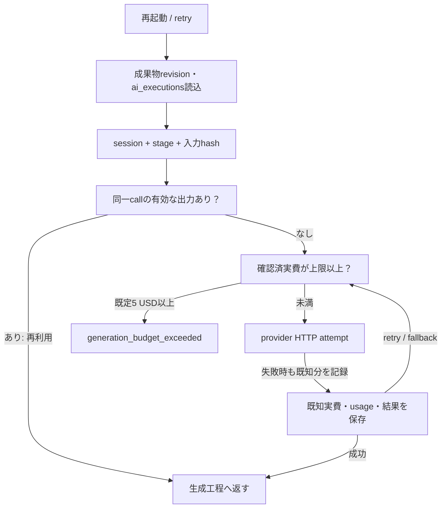
```mermaid
flowchart TB
    restart["再起動 / retry"]
    state["成果物revision・ai_executions読込"]
    key["session + stage + 入力hash"]
    reuse["同一callの有効な出力あり？"]
    cost["確認済実費が上限以上？"]
    http["provider HTTP attempt"]
    ledger["既知実費・usage・結果を保存"]
    result["生成工程へ返す"]
    stop["generation_budget_exceeded"]
    restart --> state
    state --> key
    key --> reuse
    reuse -->|"あり: 再利用"| result
    reuse -->|"なし"| cost
    cost -->|"既定5 USD以上"| stop
    cost -->|"未満"| http
    http -->|"失敗時も既知分を記録"| ledger
    ledger -->|"成功"| result
    ledger -->|"retry / fallback"| cost
```

根拠: [apps/backend/src/metis_backend/ai/execution_ledger.py](https://github.com/5B-Projects/metis/blob/efb532f74c383cd35c055d85d3f989ba643c3611/apps/backend/src/metis_backend/ai/execution_ledger.py) / [apps/backend/src/metis_backend/services/generation/harness_calls.py](https://github.com/5B-Projects/metis/blob/efb532f74c383cd35c055d85d3f989ba643c3611/apps/backend/src/metis_backend/services/generation/harness_calls.py) / [docs/adr/ADR-052-guide-confirmed-actual-cost-limit.md](https://github.com/5B-Projects/metis/blob/efb532f74c383cd35c055d85d3f989ba643c3611/docs/adr/ADR-052-guide-confirmed-actual-cost-limit.md)

この図の用語（10項目）

**HTTP** — 要求と応答をやり取りする通信方式。HTTPSは通信を暗号化する。 Metisでは: API呼出や外部AIへの要求で使う。

**hash / fingerprint** — 入力から作る要約値。fingerprintは対象を識別・照合するための指紋値。 Metisでは: 法務本文、入力、環境archive等の同一性を確認する。暗号化して内容を復元するものではない。

**OpenRouter / provider** — OpenRouterは複数のAIモデルへ要求を送る窓口。providerは実際にAI処理を提供する実行先。 Metisでは: 生成や安全判定の要求を送り、実費・token・遅延などを記録する。

**ソフト上限** — 上限に達した後の新規処理を止める方式。既に進行中の処理による超過はあり得る。 Metisでは: 確認済実費が既定5 USD以上なら次の送信を停止する。厳密に5 USD以内を保証する上限ではない。

**stage / scope** — stageは処理段階。scopeは操作や参照を許す範囲。 Metisでは: 構成案生成等のstageを記録し、patchが変更してよい章・節のscopeを限定する。

**revision** — 内容や契約の変更を区別する版。 Metisでは: 章の編集前提となるbase revisionと、jobのimplementation revisionは別々の版を指す。

**retry / fallback** — retryは同じ目的の処理の再試行、fallbackは代わりの方法へ切り替えること。 Metisでは: 一時的な通信失敗等からの回復に使う。全エラーを再送できるわけではなく、予算超過や所有権喪失は停止する。

**workspace / session** — workspaceは学習用の作業場所。sessionは処理や利用状態のひとまとまり。 Metisでは: 認証session、ガイド生成session、workspace sessionは別の対象で、同じ識別子として扱わない。

**attempt / claim** — attemptは1回の実行試行。claimはその仕事を処理する権利を取得する操作。 Metisでは: jobを受け取るたび、token・generation・期限を持つ実行権を確保する。

**冪等性 / 冪等キー** — 同じ要求を繰り返しても、重複した成果物や副作用を生まない性質。 Metisでは: 応答喪失や再送でも同じjob・相談応答・receiptを再利用する。例えば二重に生成枠を消費しない。

## 図 18: Grounded Docs・context圧縮・終端report

公式文書参照packetはoutlineと章scopeで固定再利用する。検索障害は参照なしで継続できるが、予算超過は停止する。

注記: reportにはcall数・token・実費・時間・patch件数等を保存。本文・prompt・秘密値は含めない。

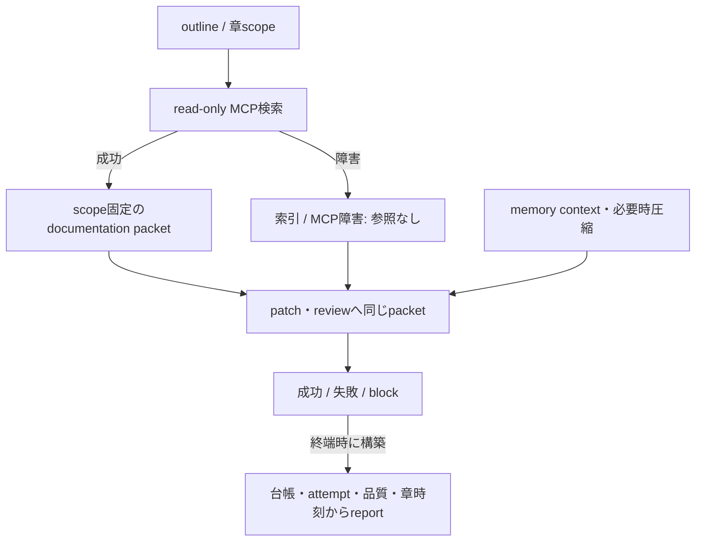
```mermaid
flowchart TB
    stage["outline / 章scope"]
    mcp["read-only MCP検索"]
    packet["scope固定のdocumentation packet"]
    author["patch・reviewへ同じpacket"]
    context["memory context・必要時圧縮"]
    terminal["成功 / 失敗 / block"]
    report["台帳・attempt・品質・章時刻からreport"]
    fallback["索引 / MCP障害: 参照なし"]
    stage --> mcp
    mcp -->|"成功"| packet
    mcp -->|"障害"| fallback
    packet --> author
    fallback --> author
    context --> author
    author --> terminal
    terminal -->|"終端時に構築"| report
```

根拠: [apps/backend/src/metis_backend/ai/grounded_docs.py](https://github.com/5B-Projects/metis/blob/efb532f74c383cd35c055d85d3f989ba643c3611/apps/backend/src/metis_backend/ai/grounded_docs.py) / [apps/backend/src/metis_backend/services/generation/harness_context.py](https://github.com/5B-Projects/metis/blob/efb532f74c383cd35c055d85d3f989ba643c3611/apps/backend/src/metis_backend/services/generation/harness_context.py) / [apps/backend/src/metis_backend/services/generation/harness_report.py](https://github.com/5B-Projects/metis/blob/efb532f74c383cd35c055d85d3f989ba643c3611/apps/backend/src/metis_backend/services/generation/harness_report.py) / [docs/adr/ADR-046-grounded-docs-mcp-generation-tool.md](https://github.com/5B-Projects/metis/blob/efb532f74c383cd35c055d85d3f989ba643c3611/docs/adr/ADR-046-grounded-docs-mcp-generation-tool.md)

この図の用語（11項目）

**GET / POST / PUT / PATCH** — GETは取得、POSTは作成や処理の開始、PUTは指定資源の置換、PATCHは部分的な更新に使うHTTPメソッド。 Metisでは: 図のGETは再取得、PATCHは進捗や既読状態の保存を示す。実際の意味は各API契約に従う。

**token** — AI文脈ではモデルが文章を処理する単位。認証文脈では権限を示す証票。 Metisでは: AI費用や入力上限のtokenと、JWTの認証tokenを混同しない。

**outline / chapter / step** — outlineはガイドの構成案、chapterは章、stepは章内の学習手順。 Metisでは: 利用者がoutlineを承認してから本文を生成し、学習中はstep単位で進捗を記録する。

**stage / scope** — stageは処理段階。scopeは操作や参照を許す範囲。 Metisでは: 構成案生成等のstageを記録し、patchが変更してよい章・節のscopeを限定する。

**patch / hunk** — patchは変更差分。hunkは変更対象の文脈、削除行、追加行をまとめた差分の単位。 Metisでは: 章全文を毎回作り直さず、許可scopeだけを部分更新する。

**finding / reviewer** — findingは検査で見つかった指摘。reviewerは生成内容を点検する役割。 Metisでは: 影響scopeと重大度を記録し、修正または停止を判断する。教材の利用者レビューとは文脈が異なる。

**context / compaction** — contextはAIや処理へ渡す文脈。compactionは要点を残して文脈の量を減らす処理。 Metisでは: ガイドや過去の修正情報を整理し、長すぎる入力を避ける。

**Grounded Docs / MCP** — Grounded Docsは公式文書の索引・参照機能。MCPは外部ツールを共通の方式で呼び出すための接続規約。 Metisでは: 読み取り専用検索から、章の生成・reviewに使う文書packetを作る。

**packet** — 関連情報を一つのまとまりにしたもの。ここでは通信の小分割単位の意味ではない。 Metisでは: 同じ章のpatchとreviewが同じ公式文書の参照材料を共有する。

**attempt / claim** — attemptは1回の実行試行。claimはその仕事を処理する権利を取得する操作。 Metisでは: jobを受け取るたび、token・generation・期限を持つ実行権を確保する。

**terminal / receipt** — terminalは処理が最終状態に達したこと。receiptは確定した操作結果を再確認するための記録。 Metisでは: 成功・失敗等を確定し、応答を失っても同じ結果を再利用する。

## 図 19: 環境成果物のimmutable公開

UUIDv5のobject identityからversioned keyを決め、DB台帳とStorage read-backを照合する。DBとStorageに2PCはないため、段階証跡で回復する。

注記: 404以外のread errorや証跡不一致は停止。active guide readerはread-only。資料上production activationは未実施。

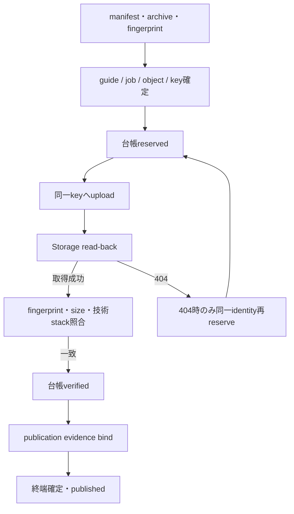
```mermaid
flowchart TB
    archive["manifest・archive・fingerprint"]
    identity["guide / job / object / key確定"]
    reserve["台帳reserved"]
    upload["同一keyへupload"]
    read["Storage read-back"]
    verify["fingerprint・size・技術stack照合"]
    confirmed["台帳verified"]
    evidence["publication evidence bind"]
    publish["終端確定・published"]
    retry["404時のみ同一identity再reserve"]
    archive --> identity
    identity --> reserve
    reserve --> upload
    upload --> read
    read -->|"取得成功"| verify
    read -->|"404"| retry
    retry --> reserve
    verify -->|"一致"| confirmed
    confirmed --> evidence
    evidence --> publish
```

根拠: [apps/backend/src/metis_backend/services/generation/environment_publication.py](https://github.com/5B-Projects/metis/blob/efb532f74c383cd35c055d85d3f989ba643c3611/apps/backend/src/metis_backend/services/generation/environment_publication.py) / [apps/backend/src/metis_backend/services/generation/environment_reader.py](https://github.com/5B-Projects/metis/blob/efb532f74c383cd35c055d85d3f989ba643c3611/apps/backend/src/metis_backend/services/generation/environment_reader.py) / [docs/architecture/module-contracts.md](https://github.com/5B-Projects/metis/blob/efb532f74c383cd35c055d85d3f989ba643c3611/docs/architecture/module-contracts.md)

この図の用語（12項目）

**401 / 403 / 404 / 409 / 422 / 500** — HTTP応答コード。401は認証不成立、403は操作禁止、404は対象不在、409は状態の競合、422は入力・処理条件の不備、500はサーバー側の失敗。 Metisでは: 他人の対象は情報を漏らさないため404として扱う経路がある。

**hash / fingerprint** — 入力から作る要約値。fingerprintは対象を識別・照合するための指紋値。 Metisでは: 法務本文、入力、環境archive等の同一性を確認する。暗号化して内容を復元するものではない。

**draft / active / completed** — draftは未完成の下書き、activeは学習可能なガイド、completedは学習完了したガイド。 Metisでは: 表示能力を分離する。生成完了と学習完了は別の状態。

**evidence / binding** — evidenceは実行・確認した内容の記録。bindingは記録を対象のIDやfingerprintへ結び付ける照合。 Metisでは: 他のguideや環境で採った証跡を現在のstep評価に流用しない。

**job / worker / handler** — jobは後で処理する仕事、workerはその仕事を受け取る実行プロセス、handlerは種類ごとの処理本体。 Metisでは: ガイド生成、教材化、export、退会などを画面の要求から切り離して実行する。

**terminal / receipt** — terminalは処理が最終状態に達したこと。receiptは確定した操作結果を再確認するための記録。 Metisでは: 成功・失敗等を確定し、応答を失っても同じ結果を再利用する。

**Storage / bucket / object key** — Storageはファイル保存サービス、bucketは保存先の区分、object keyは区分内のファイル識別名。 Metisでは: 教材本文・サムネイル・環境archiveを保存する。DBにはassetの参照や証跡を残す。

**asset / manifest / archive** — assetは保存されたファイル等、manifestは内容・構成・識別情報の一覧、archiveは複数ファイルをまとめたもの。 Metisでは: 学習環境の内容とguide/job/fingerprintの対応を確認して展開する。

**immutable / read-back / 2PC** — immutableは確定後に内容を変えないこと、read-backは書いたものを再取得して確認すること、2PCは複数システムを二段階で一括確定する方式。 Metisでは: 環境成果物は不変keyを使い、Storageへ書いた内容を再確認する。DBとStorageを一括確定する2PCは使っていない。

**reserved / verified / published** — 環境成果物台帳では、予約済み、内容検証済み、公開確定済みの段階。 Metisでは: DB台帳とStorage内容を段階的に照合する。AI台帳のreservedは実行権予約であり、金額予約ではない。

**activation / drain / rollback** — activationは新しい実装・設定の有効化、drainは処理中の仕事を収束させること、rollbackは以前の実装・状態へ戻すこと。 Metisでは: R09D切替は停止窓と完全mapのCASで行い、戻せるbinaryにも制約がある。

**UUID / UUIDv5** — 対象を識別するID。UUIDv5は決まった名前空間と入力から同じIDを生成する方式。 Metisでは: 環境object identityの再現や、job・guide・session等の識別に使う。ID一致だけで利用権があるとはみなさない。

## 図 20: 下書き・active・completedの能力判定

下書きpreviewと学習進捗を分離する。detailの完了能力は全step完了とprogress100%を必要とし、サーバーの完了commandはさらに品質を確認する。

関連: UC0010, UC0012

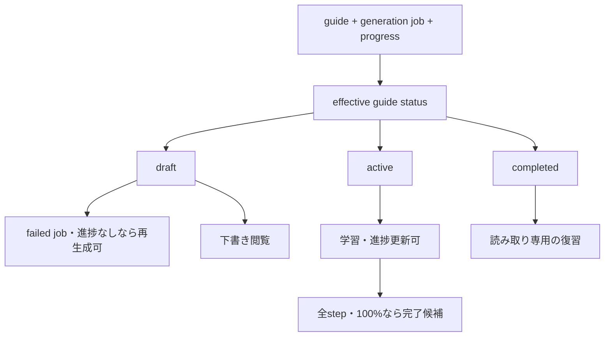
```mermaid
flowchart TB
    snapshot["guide + generation job + progress"]
    status["effective guide status"]
    draft["draft"]
    retry["failed job・進捗なしなら再生成可"]
    preview["下書き閲覧"]
    active["active"]
    progress["学習・進捗更新可"]
    complete["全step・100%なら完了候補"]
    completed["completed"]
    review["読み取り専用の復習"]
    snapshot --> status
    status --> draft
    draft --> preview
    draft --> retry
    status --> active
    active --> progress
    progress --> complete
    status --> completed
    completed --> review
```

根拠: [apps/backend/src/metis_backend/modules/guide_learning/domain/capabilities.py](https://github.com/5B-Projects/metis/blob/efb532f74c383cd35c055d85d3f989ba643c3611/apps/backend/src/metis_backend/modules/guide_learning/domain/capabilities.py) / [apps/backend/src/metis_backend/modules/guide_learning/domain/guide_status.py](https://github.com/5B-Projects/metis/blob/efb532f74c383cd35c055d85d3f989ba643c3611/apps/backend/src/metis_backend/modules/guide_learning/domain/guide_status.py) / [apps/desktop/src/renderer/src/modules/guide_learning/route-state.ts](https://github.com/5B-Projects/metis/blob/efb532f74c383cd35c055d85d3f989ba643c3611/apps/desktop/src/renderer/src/modules/guide_learning/route-state.ts)

この図の用語（6項目）

**command / query** — commandは状態を変える要求、queryは情報を読む要求。 Metisでは: 管理画面の参照と、停止・返金などの更新操作を分ける。SQL文のqueryという意味もあり、文脈で区別する。

**generation（世代）** — 新旧の処理を区別するための番号や識別値。 Metisでは: 画面の古い取得結果や、以前のjob attemptによる更新を現在の状態へ混入させない。

**outline / chapter / step** — outlineはガイドの構成案、chapterは章、stepは章内の学習手順。 Metisでは: 利用者がoutlineを承認してから本文を生成し、学習中はstep単位で進捗を記録する。

**draft / active / completed** — draftは未完成の下書き、activeは学習可能なガイド、completedは学習完了したガイド。 Metisでは: 表示能力を分離する。生成完了と学習完了は別の状態。

**capability** — その対象で、今どの操作が可能かを表す値。 Metisでは: preview、学習開始、進捗更新、完了などの可否をAPI側の状態から計算する。

**job / worker / handler** — jobは後で処理する仕事、workerはその仕事を受け取る実行プロセス、handlerは種類ごとの処理本体。 Metisでは: ガイド生成、教材化、export、退会などを画面の要求から切り離して実行する。

## 図 21: 進捗保存と古い応答の排除

URLはguide ID/view、QueryClientは保存済状態、画面は未保存UIとworkspace sessionを所有する。開始済保存は完遂し、離脱後の古い結果は現画面へ反映しない。

関連: UC0010, UC0012

```mermaid
flowchart TB
    ui["step選択・完了操作"]
    capture["guide / owner / 世代を捕捉"]
    save["progress PATCH"]
    server["本人・active・step整合を検証"]
    saved["DBの確定progress"]
    current["現在のguide・世代と一致？"]
    query["Queryへ確定結果を保存"]
    recover["応答喪失ならGETで回復"]
    ignore["旧UI・busyを変更しない"]
    ui --> capture
    capture --> save
    save --> server
    server --> saved
    saved --> current
    current -->|"はい"| query
    current -->|"いいえ"| ignore
    save -->|"応答喪失"| recover
    recover --> current
```

根拠: [apps/backend/src/metis_backend/modules/guide_learning/progress.py](https://github.com/5B-Projects/metis/blob/efb532f74c383cd35c055d85d3f989ba643c3611/apps/backend/src/metis_backend/modules/guide_learning/progress.py) / [apps/desktop/src/renderer/src/modules/guide_learning/services/learningGuideFlowService.ts](https://github.com/5B-Projects/metis/blob/efb532f74c383cd35c055d85d3f989ba643c3611/apps/desktop/src/renderer/src/modules/guide_learning/services/learningGuideFlowService.ts) / [apps/desktop/src/renderer/src/modules/guide_learning/query-ownership.ts](https://github.com/5B-Projects/metis/blob/efb532f74c383cd35c055d85d3f989ba643c3611/apps/desktop/src/renderer/src/modules/guide_learning/query-ownership.ts)

この図の用語（9項目）

**GET / POST / PUT / PATCH** — GETは取得、POSTは作成や処理の開始、PUTは指定資源の置換、PATCHは部分的な更新に使うHTTPメソッド。 Metisでは: 図のGETは再取得、PATCHは進捗や既読状態の保存を示す。実際の意味は各API契約に従う。

**command / query** — commandは状態を変える要求、queryは情報を読む要求。 Metisでは: 管理画面の参照と、停止・返金などの更新操作を分ける。SQL文のqueryという意味もあり、文脈で区別する。

**QueryClient** — TanStack Queryで取得済みサーバーデータを管理する主体。 Metisでは: 保存結果をキャッシュへ反映する。利用者が切り替わったら旧利用者のデータを消す。

**owner** — ある処理・データ・資源の所有者。 Metisでは: 認証図では現在の利用者、組織図では管理権限を持つ所属者、教材図では作者を指す。文脈ごとに意味が異なる。

**generation（世代）** — 新旧の処理を区別するための番号や識別値。 Metisでは: 画面の古い取得結果や、以前のjob attemptによる更新を現在の状態へ混入させない。

**outline / chapter / step** — outlineはガイドの構成案、chapterは章、stepは章内の学習手順。 Metisでは: 利用者がoutlineを承認してから本文を生成し、学習中はstep単位で進捗を記録する。

**patch / hunk** — patchは変更差分。hunkは変更対象の文脈、削除行、追加行をまとめた差分の単位。 Metisでは: 章全文を毎回作り直さず、許可scopeだけを部分更新する。

**draft / active / completed** — draftは未完成の下書き、activeは学習可能なガイド、completedは学習完了したガイド。 Metisでは: 表示能力を分離する。生成完了と学習完了は別の状態。

**workspace / session** — workspaceは学習用の作業場所。sessionは処理や利用状態のひとまとまり。 Metisでは: 認証session、ガイド生成session、workspace sessionは別の対象で、同じ識別子として扱わない。

## 図 22: step達成条件と実行証跡の評価

stepの保存済達成条件を検証し、mainが採取した実行証跡が同じguide・session・環境job・fingerprintに属することを照合する。

関連: UC0010, UC0011

```mermaid
flowchart TB
    step["本人guide・対象step取得"]
    criteria["completion criteriaを検証"]
    asset["署名済環境assetと証跡binding照合"]
    evidence["ファイル / command結果の証跡"]
    evaluate["保存済条件を評価"]
    pass["passed・次の学習へ"]
    fail["未達成・次のactions"]
    unknown["indeterminate・証跡を再取得"]
    error["execution_error"]
    step --> criteria
    criteria -->|"条件あり"| asset
    criteria -->|"条件なしの評価経路"| evaluate
    criteria -->|"不正"| error
    asset -->|"一致"| evidence
    asset -->|"不一致・asset不在"| error
    evidence --> evaluate
    evaluate -->|"達成 / 条件なし"| pass
    evaluate -->|"未達成"| fail
    evaluate -->|"未観測"| unknown
    evaluate -->|"step不一致 / 条件error"| error
```

根拠: [apps/backend/src/metis_backend/services/generation/guides.py](https://github.com/5B-Projects/metis/blob/efb532f74c383cd35c055d85d3f989ba643c3611/apps/backend/src/metis_backend/services/generation/guides.py) / [apps/backend/src/metis_backend/services/generation/completion_evaluation.py](https://github.com/5B-Projects/metis/blob/efb532f74c383cd35c055d85d3f989ba643c3611/apps/backend/src/metis_backend/services/generation/completion_evaluation.py) / [apps/desktop/src/renderer/src/modules/guide_learning/workspace-evidence.ts](https://github.com/5B-Projects/metis/blob/efb532f74c383cd35c055d85d3f989ba643c3611/apps/desktop/src/renderer/src/modules/guide_learning/workspace-evidence.ts)

この図の用語（10項目）

**main process** — ElectronでウィンドウやOS資源を管理する実行領域。 Metisでは: workspace、Docker、コマンド実行、ファイル保存を管理する。

**command / query** — commandは状態を変える要求、queryは情報を読む要求。 Metisでは: 管理画面の参照と、停止・返金などの更新操作を分ける。SQL文のqueryという意味もあり、文脈で区別する。

**hash / fingerprint** — 入力から作る要約値。fingerprintは対象を識別・照合するための指紋値。 Metisでは: 法務本文、入力、環境archive等の同一性を確認する。暗号化して内容を復元するものではない。

**outline / chapter / step** — outlineはガイドの構成案、chapterは章、stepは章内の学習手順。 Metisでは: 利用者がoutlineを承認してから本文を生成し、学習中はstep単位で進捗を記録する。

**workspace / session** — workspaceは学習用の作業場所。sessionは処理や利用状態のひとまとまり。 Metisでは: 認証session、ガイド生成session、workspace sessionは別の対象で、同じ識別子として扱わない。

**evidence / binding** — evidenceは実行・確認した内容の記録。bindingは記録を対象のIDやfingerprintへ結び付ける照合。 Metisでは: 他のguideや環境で採った証跡を現在のstep評価に流用しない。

**indeterminate / execution_error** — indeterminateは観測材料不足で判定不能、execution_errorは実行や証跡・条件の処理に不備がある状態。 Metisでは: 「条件未達成」と区別して表示し、再取得・環境確認を促す。

**job / worker / handler** — jobは後で処理する仕事、workerはその仕事を受け取る実行プロセス、handlerは種類ごとの処理本体。 Metisでは: ガイド生成、教材化、export、退会などを画面の要求から切り離して実行する。

**asset / manifest / archive** — assetは保存されたファイル等、manifestは内容・構成・識別情報の一覧、archiveは複数ファイルをまとめたもの。 Metisでは: 学習環境の内容とguide/job/fingerprintの対応を確認して展開する。

**署名URL** — 署名と期限により、対象へのアクセスを限定したURL。 Metisでは: 非公開Storage成果物を、権限確認後に必要な時間だけ取得可能にする。

## 図 23: AI相談・選択テキスト・workspace文脈

ガイド所有権と環境証跡を確認して、相談requestを原子的に予約する。冪等requestは保存済応答を再利用し、制限超過はAIを呼ばない。

関連: UC0011

```mermaid
flowchart TB
    request["message・選択text・contexts"]
    auth["guide本人・環境binding確認"]
    reserve["request hash・冪等キーで予約"]
    reuse["既存応答あり？"]
    prompt["直近最大8件・文脈をマスク"]
    workflow["入力guardrail→AI相談→出力guardrail"]
    save["マスクした会話・execution ID保存"]
    finish["succeeded / blocked確定"]
    failed["timed_out / failed確定"]
    limited["rate / concurrency / quota拒否"]
    request --> auth
    auth --> reserve
    reserve --> reuse
    reuse -->|"保存済み"| finish
    reuse -->|"新規予約"| prompt
    reserve -->|"制限超過"| limited
    prompt --> workflow
    workflow -->|"成功 / block応答"| save
    save --> finish
    workflow -->|"timeout / error"| failed
```

根拠: [apps/backend/src/metis_backend/modules/learning_assistance/application.py](https://github.com/5B-Projects/metis/blob/efb532f74c383cd35c055d85d3f989ba643c3611/apps/backend/src/metis_backend/modules/learning_assistance/application.py) / [apps/backend/src/metis_backend/ai/consultation_workflow.py](https://github.com/5B-Projects/metis/blob/efb532f74c383cd35c055d85d3f989ba643c3611/apps/backend/src/metis_backend/ai/consultation_workflow.py) / [apps/backend/src/metis_backend/ai/redaction.py](https://github.com/5B-Projects/metis/blob/efb532f74c383cd35c055d85d3f989ba643c3611/apps/backend/src/metis_backend/ai/redaction.py) / [docs/adr/ADR-039-guide-chat-abuse-privacy-controls.md](https://github.com/5B-Projects/metis/blob/efb532f74c383cd35c055d85d3f989ba643c3611/docs/adr/ADR-039-guide-chat-abuse-privacy-controls.md)

この図の用語（8項目）

**hash / fingerprint** — 入力から作る要約値。fingerprintは対象を識別・照合するための指紋値。 Metisでは: 法務本文、入力、環境archive等の同一性を確認する。暗号化して内容を復元するものではない。

**guardrail** — AIへ渡す入力や生成出力が、安全性の条件を満たすか検査する処理。 Metisでは: developではGuardrailDecisionの構造化応答でallowed等を検証し、判定と費用を記録する。blockされた内容を次工程へ進めない。ガイド専用gatewayのlocal/test・DEBUG省略と通常検査を区別する。

**quota** — 利用できる回数・量の割当。 Metisでは: プランに応じたガイド生成枠を確認・消費する。providerの実費上限とは別。

**冪等性 / 冪等キー** — 同じ要求を繰り返しても、重複した成果物や副作用を生まない性質。 Metisでは: 応答喪失や再送でも同じjob・相談応答・receiptを再利用する。例えば二重に生成枠を消費しない。

**workspace / session** — workspaceは学習用の作業場所。sessionは処理や利用状態のひとまとまり。 Metisでは: 認証session、ガイド生成session、workspace sessionは別の対象で、同じ識別子として扱わない。

**evidence / binding** — evidenceは実行・確認した内容の記録。bindingは記録を対象のIDやfingerprintへ結び付ける照合。 Metisでは: 他のguideや環境で採った証跡を現在のstep評価に流用しない。

**原子的 / atomic** — 複数の変更が全て成功するか、全て反映されないかのどちらかになる性質。 Metisでは: 生成枠とguide骨格、購読と権利などが一部分だけ更新される状態を防ぐ。

**匿名化 / マスキング** — 匿名化は個人との結び付きを取り除く処理、マスキングは秘密や識別情報を伏せる処理。 Metisでは: 退会時の保持取引データと、AI相談の短期保存文脈で使う。単にログに出さないこととは別。

## 図 24: ガイド完了・評価attempt・教材化可能性

完了確定と完了評価の生成は別段階。品質通過・全step一致・progress100%で完了を記録し、評価はlease付きattemptで生成・再取得する。

関連: UC0010, UC0019

```mermaid
flowchart TB
    request["完了POST"]
    valid["本人・active・品質・全step・100%"]
    stored["完了record作成 / 再利用"]
    claim["評価attempt claim"]
    ai["完了評価を生成"]
    ready["評価summary保存・ready"]
    failure["failed / lease切れ"]
    get["GETで保存済結果確認"]
    material["本人の完了から教材化"]
    request -->|"未完了"| valid
    valid -->|"条件を満たす"| stored
    request -->|"既存completed"| stored
    stored -->|"summaryなし"| claim
    claim -->|"claim成功"| ai
    claim -->|"他attemptあり"| get
    ai -->|"300秒以内の成功"| ready
    ai -->|"error / timeout"| failure
    ready --> get
    failure --> get
    stored --> material
```

根拠: [apps/backend/src/metis_backend/modules/guide_learning/application.py](https://github.com/5B-Projects/metis/blob/efb532f74c383cd35c055d85d3f989ba643c3611/apps/backend/src/metis_backend/modules/guide_learning/application.py) / [apps/backend/src/metis_backend/modules/guide_learning/domain/completion.py](https://github.com/5B-Projects/metis/blob/efb532f74c383cd35c055d85d3f989ba643c3611/apps/backend/src/metis_backend/modules/guide_learning/domain/completion.py) / [apps/backend/src/metis_backend/services/materials/materialization.py](https://github.com/5B-Projects/metis/blob/efb532f74c383cd35c055d85d3f989ba643c3611/apps/backend/src/metis_backend/services/materials/materialization.py)

この図の用語（6項目）

**GET / POST / PUT / PATCH** — GETは取得、POSTは作成や処理の開始、PUTは指定資源の置換、PATCHは部分的な更新に使うHTTPメソッド。 Metisでは: 図のGETは再取得、PATCHは進捗や既読状態の保存を示す。実際の意味は各API契約に従う。

**outline / chapter / step** — outlineはガイドの構成案、chapterは章、stepは章内の学習手順。 Metisでは: 利用者がoutlineを承認してから本文を生成し、学習中はstep単位で進捗を記録する。

**draft / active / completed** — draftは未完成の下書き、activeは学習可能なガイド、completedは学習完了したガイド。 Metisでは: 表示能力を分離する。生成完了と学習完了は別の状態。

**materialization（教材化）** — 学習済ガイドの内容を、再利用できる教材の構造へ変換する処理。 Metisでは: 本人の完了と品質を確認し、章本文、sample code、検索タグ等を保存する。

**attempt / claim** — attemptは1回の実行試行。claimはその仕事を処理する権利を取得する操作。 Metisでは: jobを受け取るたび、token・generation・期限を持つ実行権を確保する。

**lease / heartbeat / visibility timeout** — leaseは処理権の期限。heartbeatは実行継続の通知。visibility timeoutは受領したqueueメッセージを他の受取者から一時的に隠す期間。 Metisでは: 長時間jobの実行権とメッセージの非表示期間を延長する。教材の公開範囲を指すvisibilityとは別。

## 図 25: 学習履歴・MyPage・お気に入り

履歴・作成教材・取得教材・技術お気に入りは本人APIで取得する。cursorは対象filterとviewerに結びつき、別条件のcursorを混用しない。

関連: UC0006, UC0013, UC0014

```mermaid
flowchart TB
    n0["ホーム / MyPageを開く"]
    n1["guide・教材・取得・お気に入りquery"]
    n2["本人scopeとcursor条件を検証"]
    n3["DB page / count取得"]
    n4["loading・empty・errorを区別"]
    n5["次page取得 / 履歴削除command"]
    n0 --> n1
    n1 --> n2
    n2 --> n3
    n3 --> n4
    n4 --> n5
```

根拠: [apps/backend/src/metis_backend/routers/account.py](https://github.com/5B-Projects/metis/blob/efb532f74c383cd35c055d85d3f989ba643c3611/apps/backend/src/metis_backend/routers/account.py) / [apps/desktop/src/renderer/src/modules/account_lists/useAccountLists.ts](https://github.com/5B-Projects/metis/blob/efb532f74c383cd35c055d85d3f989ba643c3611/apps/desktop/src/renderer/src/modules/account_lists/useAccountLists.ts) / [apps/desktop/src/renderer/src/pages/home/HomePage.tsx](https://github.com/5B-Projects/metis/blob/efb532f74c383cd35c055d85d3f989ba643c3611/apps/desktop/src/renderer/src/pages/home/HomePage.tsx)

この図の用語（4項目）

**API** — アプリやサービスが処理を依頼したり、結果を受け取ったりするための窓口。 Metisでは: 画面からバックエンドへ、ガイド取得や進捗保存などを依頼する。

**command / query** — commandは状態を変える要求、queryは情報を読む要求。 Metisでは: 管理画面の参照と、停止・返金などの更新操作を分ける。SQL文のqueryという意味もあり、文脈で区別する。

**stage / scope** — stageは処理段階。scopeは操作や参照を許す範囲。 Metisでは: 構成案生成等のstageを記録し、patchが変更してよい章・節のscopeを限定する。

**cursor / keyset** — cursorは一覧の続きを指定する値。keysetは最後に表示した項目の並び順の値から次を取得する方式。 Metisでは: 検索条件・viewerをcursorに結び付け、別条件の一覧へ使い回さない。

## 図 26: 完了ガイドから教材化

本人の完了ガイドと品質を確認して教材化を投入する。workerは入力manifestを検証し、保存済み教材・sample・タグの状態から再開位置を選ぶ。新規教材では本文を最大8並列で保存し、完成イメージの失敗を記録しても教材化は成功する。

関連: UC0019

注記: 検索タグの入力は各step本文の先頭1,200文字を含む抜粋と章/メタ情報。構成案で選んだタグの自動転記ではない。完成イメージの未実装fieldと、図29のmaterial_thumbnail_generationは別機能。manifest検証後、教材ID/sample保存済み/tagsが揃う再実行はguide品質の再読込前に成功を返す。

```mermaid
flowchart TB
    input["本人のguide_completion・品質確認"]
    enqueue["job・入力sample snapshotを固定"]
    manifest["manifest件数をworkerで検証"]
    done["教材ID + sample保存済 + tagsあり？"]
    read["guide detail存在・品質passedを検証"]
    existing["既存教材IDあり？"]
    upload["本文を変換・最大8並列Storage upload"]
    create["教材・version・章を作成しIDをjobへ保存"]
    sample["sample codeを保存・保存済みなら再利用"]
    tags["構造化AI応答で検索タグ付与（図54）"]
    fresh["今回新規作成した教材？"]
    image["完成イメージ未実装: image_status=failed"]
    success["教材化succeeded・非公開教材準備画面"]
    error["manifest・guide・品質の不正で失敗"]
    input --> enqueue
    enqueue --> manifest
    manifest -->|"一致"| done
    manifest -->|"不一致"| error
    done -->|"全て保存済み"| success
    done -->|"未完了"| read
    read -->|"有効"| existing
    read -->|"不在/品質不合格"| error
    existing -->|"あり: 後処理を再開"| sample
    existing -->|"なし"| upload
    upload --> create
    create --> sample
    sample --> tags
    tags --> fresh
    fresh -->|"新規作成経路"| image
    fresh -->|"再開経路"| success
    image -->|"イメージ失敗でjobを失敗させない"| success
```

根拠: [apps/backend/src/metis_backend/services/materials/materialization.py](https://github.com/5B-Projects/metis/blob/efb532f74c383cd35c055d85d3f989ba643c3611/apps/backend/src/metis_backend/services/materials/materialization.py) / [apps/backend/src/metis_backend/workers/materialization.py](https://github.com/5B-Projects/metis/blob/efb532f74c383cd35c055d85d3f989ba643c3611/apps/backend/src/metis_backend/workers/materialization.py) / [docs/architecture/module-contracts.md](https://github.com/5B-Projects/metis/blob/efb532f74c383cd35c055d85d3f989ba643c3611/docs/architecture/module-contracts.md)

この図の用語（9項目）

**snapshot** — ある時点の情報を固定して保存した写し。 Metisでは: 生成時の設定、教材化入力、法務公開本文を固定し、後の設定変更で処理の意味が変わらないようにする。

**metadata** — 本文そのもの以外の、データを説明する情報。 Metisでは: 作成時刻、設定有無、版、実行件数など。秘密本文や教材本文とは分けて扱う。

**冪等性 / 冪等キー** — 同じ要求を繰り返しても、重複した成果物や副作用を生まない性質。 Metisでは: 応答喪失や再送でも同じjob・相談応答・receiptを再利用する。例えば二重に生成枠を消費しない。

**materialization（教材化）** — 学習済ガイドの内容を、再利用できる教材の構造へ変換する処理。 Metisでは: 本人の完了と品質を確認し、章本文、sample code、検索タグ等を保存する。

**job / worker / handler** — jobは後で処理する仕事、workerはその仕事を受け取る実行プロセス、handlerは種類ごとの処理本体。 Metisでは: ガイド生成、教材化、export、退会などを画面の要求から切り離して実行する。

**Storage / bucket / object key** — Storageはファイル保存サービス、bucketは保存先の区分、object keyは区分内のファイル識別名。 Metisでは: 教材本文・サムネイル・環境archiveを保存する。DBにはassetの参照や証跡を残す。

**asset / manifest / archive** — assetは保存されたファイル等、manifestは内容・構成・識別情報の一覧、archiveは複数ファイルをまとめたもの。 Metisでは: 学習環境の内容とguide/job/fingerprintの対応を確認して展開する。

**技術タグ** — 教材やゴールに関連する技術を分類する目印。 Metisでは: PythonやFastAPIなどのタグmasterと照合して推薦する。利用者が選ぶ生成タグと、教材検索タグの付与は別の処理。

**outline / chapter / step** — outlineはガイドの構成案、chapterは章、stepは章内の学習手順。 Metisでは: 利用者がoutlineを承認してから本文を生成し、学習中はstep単位で進捗を記録する。

## 図 27: 閲覧・学習・exportの権限判定

作者・状態・利用権・操作種別の順に判断する。publicな無料教材も、学習/exportには取得手続きによる利用権が必要。

関連: UC0016, UC0017, UC0024

注記: 作者の終端状態ではdetail以外を拒否。reviewは別のauthorize_review判断を使用する。

```mermaid
flowchart TB
    subject["教材・viewer・操作"]
    owner["作者本人？"]
    terminal["suspended / deleted？"]
    detail["detailのみ・本文なし"]
    full["全文・許可操作"]
    hidden["pending_delete / suspended / deleted？"]
    right["有効な取得 / 購入権あり？"]
    public["public？"]
    operation["learn / export？"]
    preview["previewのみ"]
    deny["403: 取得 / 購入が必要"]
    notfound["404"]
    subject --> owner
    owner -->|"はい"| terminal
    terminal -->|"はい"| detail
    terminal -->|"いいえ"| full
    owner -->|"いいえ"| hidden
    hidden -->|"はい"| notfound
    hidden -->|"いいえ"| right
    right -->|"あり"| full
    right -->|"なし"| public
    public -->|"いいえ"| notfound
    public -->|"はい"| operation
    operation -->|"はい"| deny
    operation -->|"いいえ"| preview
```

根拠: [apps/backend/src/metis_backend/modules/materials/access_policy.py](https://github.com/5B-Projects/metis/blob/efb532f74c383cd35c055d85d3f989ba643c3611/apps/backend/src/metis_backend/modules/materials/access_policy.py) / [apps/backend/src/metis_backend/modules/materials/content_application.py](https://github.com/5B-Projects/metis/blob/efb532f74c383cd35c055d85d3f989ba643c3611/apps/backend/src/metis_backend/modules/materials/content_application.py) / [apps/backend/src/metis_backend/modules/commerce/material_entitlement_application.py](https://github.com/5B-Projects/metis/blob/efb532f74c383cd35c055d85d3f989ba643c3611/apps/backend/src/metis_backend/modules/commerce/material_entitlement_application.py)

この図の用語（5項目）

**401 / 403 / 404 / 409 / 422 / 500** — HTTP応答コード。401は認証不成立、403は操作禁止、404は対象不在、409は状態の競合、422は入力・処理条件の不備、500はサーバー側の失敗。 Metisでは: 他人の対象は情報を漏らさないため404として扱う経路がある。

**finding / reviewer** — findingは検査で見つかった指摘。reviewerは生成内容を点検する役割。 Metisでは: 影響scopeと重大度を記録し、修正または停止を判断する。教材の利用者レビューとは文脈が異なる。

**entitlement（利用権）** — 対象の機能や教材を利用してよいことを示す権利。 Metisでは: プラン権利と教材の取得・購入権を確認する。教材がpublicかどうかとは別に判断する。

**pending_delete / suspended / deleted** — 教材では順に削除要求中、停止中、削除済みの状態。 Metisでは: 状態ごとに作者・他利用者の操作を制限する。単一の公開フラグとして扱わない。

**terminal / receipt** — terminalは処理が最終状態に達したこと。receiptは確定した操作結果を再確認するための記録。 Metisでは: 成功・失敗等を確定し、応答を失っても同じ結果を再利用する。

## 図 28: 作者メモ・公開・非公開・削除要求

作者が編集できる業務本文はメモ。公開状態は許可された遷移のみを使い、有効な購入権がある教材の削除要求は拒否する。

関連: UC0020, UC0021, UC0022

```mermaid
flowchart TB
    owner["教材存在・作者確認"]
    note["author note更新"]
    state["private / public / pending_delete"]
    target["変更先を選択"]
    allow["許可遷移？"]
    purchase["pending_deleteで有効権利あり？"]
    save["状態を更新"]
    deny["Conflict / Forbidden"]
    owner -->|"メモ"| note
    owner -->|"公開状態"| state
    state --> target
    target --> allow
    allow -->|"許可"| purchase
    allow -->|"不許可"| deny
    purchase -->|"あり"| deny
    purchase -->|"なし / 削除以外"| save
```

根拠: [apps/backend/src/metis_backend/modules/materials/authoring_application.py](https://github.com/5B-Projects/metis/blob/efb532f74c383cd35c055d85d3f989ba643c3611/apps/backend/src/metis_backend/modules/materials/authoring_application.py) / [docs/adr/ADR-014-material-edit-scope-by-role.md](https://github.com/5B-Projects/metis/blob/efb532f74c383cd35c055d85d3f989ba643c3611/docs/adr/ADR-014-material-edit-scope-by-role.md) / [docs/adr/ADR-009-material-visibility-deletion-purchase-access.md](https://github.com/5B-Projects/metis/blob/efb532f74c383cd35c055d85d3f989ba643c3611/docs/adr/ADR-009-material-visibility-deletion-purchase-access.md)

この図の用語（3項目）

**entitlement（利用権）** — 対象の機能や教材を利用してよいことを示す権利。 Metisでは: プラン権利と教材の取得・購入権を確認する。教材がpublicかどうかとは別に判断する。

**visibility** — 対象を誰に見せるかを表す状態。 Metisでは: 教材のprivate、public、pending_delete、suspended、deletedと利用権を組み合わせて判定する。

**pending_delete / suspended / deleted** — 教材では順に削除要求中、停止中、削除済みの状態。 Metisでは: 状態ごとに作者・他利用者の操作を制限する。単一の公開フラグとして扱わない。

## 図 29: サムネイル準備・生成・合成・確定

初回公開前のprivate教材だけ準備可能。無料の固定合成と有料背景生成を分け、候補revisionとasset IDを照合して作者が確定する。

関連: UC0019

注記: 生成仕様は1枚0.04 USD以下・1200×750 PNG。既存thumbnail_htmlは表示fallbackとして残る。

```mermaid
flowchart TB
    editable["作者・private・準備未終了"]
    mode["固定背景 / AI背景を選択"]
    default["固定背景を合成"]
    enqueue["回数・revisionを検証しjob投入"]
    image["文字なし背景を1枚生成"]
    compose["タイトル・最大3タグを固定合成"]
    draft["private bucketへ候補保存"]
    confirm["candidate ID・expected revision確認"]
    asset["thumbnail_image_id更新"]
    closed["初回公開で準備終了"]
    editable --> mode
    mode -->|"無料合成"| default
    mode -->|"有料生成"| enqueue
    enqueue -->|"最大3回・自動有料再送なし"| image
    image --> compose
    default --> draft
    compose --> draft
    draft --> confirm
    confirm -->|"一致"| asset
    asset -->|"公開"| closed
```

根拠: [apps/backend/src/metis_backend/services/materials/thumbnail.py](https://github.com/5B-Projects/metis/blob/efb532f74c383cd35c055d85d3f989ba643c3611/apps/backend/src/metis_backend/services/materials/thumbnail.py) / [apps/backend/src/metis_backend/services/materials/thumbnail_composition.py](https://github.com/5B-Projects/metis/blob/efb532f74c383cd35c055d85d3f989ba643c3611/apps/backend/src/metis_backend/services/materials/thumbnail_composition.py) / [apps/backend/src/metis_backend/workers/material_thumbnail_generation.py](https://github.com/5B-Projects/metis/blob/efb532f74c383cd35c055d85d3f989ba643c3611/apps/backend/src/metis_backend/workers/material_thumbnail_generation.py) / [docs/adr/ADR-055-material-thumbnail-image-fixed-layout.md](https://github.com/5B-Projects/metis/blob/efb532f74c383cd35c055d85d3f989ba643c3611/docs/adr/ADR-055-material-thumbnail-image-fixed-layout.md)

この図の用語（6項目）

**revision** — 内容や契約の変更を区別する版。 Metisでは: 章の編集前提となるbase revisionと、jobのimplementation revisionは別々の版を指す。

**retry / fallback** — retryは同じ目的の処理の再試行、fallbackは代わりの方法へ切り替えること。 Metisでは: 一時的な通信失敗等からの回復に使う。全エラーを再送できるわけではなく、予算超過や所有権喪失は停止する。

**job / worker / handler** — jobは後で処理する仕事、workerはその仕事を受け取る実行プロセス、handlerは種類ごとの処理本体。 Metisでは: ガイド生成、教材化、export、退会などを画面の要求から切り離して実行する。

**Storage / bucket / object key** — Storageはファイル保存サービス、bucketは保存先の区分、object keyは区分内のファイル識別名。 Metisでは: 教材本文・サムネイル・環境archiveを保存する。DBにはassetの参照や証跡を残す。

**asset / manifest / archive** — assetは保存されたファイル等、manifestは内容・構成・識別情報の一覧、archiveは複数ファイルをまとめたもの。 Metisでは: 学習環境の内容とguide/job/fingerprintの対応を確認して展開する。

**技術タグ** — 教材やゴールに関連する技術を分類する目印。 Metisでは: PythonやFastAPIなどのタグmasterと照合して推薦する。利用者が選ぶ生成タグと、教材検索タグの付与は別の処理。

## 図 30: 教材学習・sample code・AI質問

教材本文の権限を確認して学習sessionを開始する。進捗と質問は教材sessionへ結びつけ、sample codeは章指定に応じて取得する。

関連: UC0017

```mermaid
flowchart TB
    n0["利用権・教材状態を確認"]
    n1["material learning session作成 / 再利用"]
    n2["本文・章別sample code取得"]
    n3["step進行と進捗保存"]
    n4["教材文脈のAI相談・マスク保存"]
    n5["学習履歴へ反映"]
    n0 --> n1
    n1 --> n2
    n2 --> n3
    n3 --> n4
    n4 --> n5
```

根拠: [apps/backend/src/metis_backend/modules/materials/learning_application.py](https://github.com/5B-Projects/metis/blob/efb532f74c383cd35c055d85d3f989ba643c3611/apps/backend/src/metis_backend/modules/materials/learning_application.py) / [apps/backend/src/metis_backend/modules/materials/content_application.py](https://github.com/5B-Projects/metis/blob/efb532f74c383cd35c055d85d3f989ba643c3611/apps/backend/src/metis_backend/modules/materials/content_application.py) / [apps/backend/src/metis_backend/services/materials/ai.py](https://github.com/5B-Projects/metis/blob/efb532f74c383cd35c055d85d3f989ba643c3611/apps/backend/src/metis_backend/services/materials/ai.py) / [apps/desktop/src/renderer/src/pages/user-screens/MaterialLearningPage.tsx](https://github.com/5B-Projects/metis/blob/efb532f74c383cd35c055d85d3f989ba643c3611/apps/desktop/src/renderer/src/pages/user-screens/MaterialLearningPage.tsx)

この図の用語（4項目）

**outline / chapter / step** — outlineはガイドの構成案、chapterは章、stepは章内の学習手順。 Metisでは: 利用者がoutlineを承認してから本文を生成し、学習中はstep単位で進捗を記録する。

**workspace / session** — workspaceは学習用の作業場所。sessionは処理や利用状態のひとまとまり。 Metisでは: 認証session、ガイド生成session、workspace sessionは別の対象で、同じ識別子として扱わない。

**entitlement（利用権）** — 対象の機能や教材を利用してよいことを示す権利。 Metisでは: プラン権利と教材の取得・購入権を確認する。教材がpublicかどうかとは別に判断する。

**匿名化 / マスキング** — 匿名化は個人との結び付きを取り除く処理、マスキングは秘密や識別情報を伏せる処理。 Metisでは: 退会時の保持取引データと、AI相談の短期保存文脈で使う。単にログに出さないこととは別。

## 図 31: レビュー・評価・おすすめ

reviewの可視性に加え、作者本人の投稿を拒否し、学習開始済みの利用者だけが投稿できる。星・コメントはDTO/DBでも検証し、投稿と集計を分ける。

関連: UC0018

注記: 作者はreview一覧の参照が可能でも、自分の教材への投稿はできない。

```mermaid
flowchart TB
    n0["教材・review可視性を確認"]
    n1["作者本人の投稿を拒否"]
    n2["教材学習開始済みかを確認"]
    n3["rating・commentを検証しupsert"]
    n4["評価件数・平均・要約を参照"]
    n5["教材詳細・類似教材推薦へ反映"]
    n0 --> n1
    n1 --> n2
    n2 --> n3
    n3 --> n4
    n4 --> n5
```

根拠: [apps/backend/src/metis_backend/modules/materials/review_application.py](https://github.com/5B-Projects/metis/blob/efb532f74c383cd35c055d85d3f989ba643c3611/apps/backend/src/metis_backend/modules/materials/review_application.py) / [apps/backend/src/metis_backend/modules/materials/catalog_application.py](https://github.com/5B-Projects/metis/blob/efb532f74c383cd35c055d85d3f989ba643c3611/apps/backend/src/metis_backend/modules/materials/catalog_application.py) / [apps/backend/src/metis_backend/services/materials/mutations.py](https://github.com/5B-Projects/metis/blob/efb532f74c383cd35c055d85d3f989ba643c3611/apps/backend/src/metis_backend/services/materials/mutations.py) / [docs/adr/ADR-015-review-rating-comment-summary.md](https://github.com/5B-Projects/metis/blob/efb532f74c383cd35c055d85d3f989ba643c3611/docs/adr/ADR-015-review-rating-comment-summary.md)

この図の用語（4項目）

**DTO** — 通信で受け渡す情報の形を定めたデータ。Data Transfer Objectの略。 Metisでは: DB内部の情報をそのまま出さず、画面へ返してよい項目に変換する。

**finding / reviewer** — findingは検査で見つかった指摘。reviewerは生成内容を点検する役割。 Metisでは: 影響scopeと重大度を記録し、修正または停止を判断する。教材の利用者レビューとは文脈が異なる。

**enrollment** — 利用者が教材学習を開始したことを表す記録。 Metisでは: review投稿には作者でないことに加えて、この開始記録が必要。

**upsert** — 対象がなければ追加し、あれば更新する操作。 Metisでは: 同じ利用者の教材reviewを重複投稿せず更新する。

## 図 32: 非同期exportとファイル保存

要求時とダウンロード時の両方で利用権を確認する。workerは指定形式へ変換し、期限付きURLをmainの保存処理へ渡す。

関連: UC0024

```mermaid
flowchart TB
    request["export形式を指定"]
    access["要求時の権限確認"]
    queue["export job作成"]
    render["worker変換・成果物保存"]
    status["job状態を取得"]
    recheck["取得時の権限・成果物再確認"]
    url["期限付き署名URL"]
    save["mainで保存先選択・保存"]
    request --> access
    access -->|"許可"| queue
    queue --> render
    render --> status
    status -->|"succeeded"| recheck
    recheck -->|"許可"| url
    url --> save
```

根拠: [apps/backend/src/metis_backend/modules/materials/export_application.py](https://github.com/5B-Projects/metis/blob/efb532f74c383cd35c055d85d3f989ba643c3611/apps/backend/src/metis_backend/modules/materials/export_application.py) / [apps/backend/src/metis_backend/modules/materials/export_delivery_application.py](https://github.com/5B-Projects/metis/blob/efb532f74c383cd35c055d85d3f989ba643c3611/apps/backend/src/metis_backend/modules/materials/export_delivery_application.py) / [apps/backend/src/metis_backend/workers/export.py](https://github.com/5B-Projects/metis/blob/efb532f74c383cd35c055d85d3f989ba643c3611/apps/backend/src/metis_backend/workers/export.py) / [apps/desktop/src/main/export-file-save.ts](https://github.com/5B-Projects/metis/blob/efb532f74c383cd35c055d85d3f989ba643c3611/apps/desktop/src/main/export-file-save.ts)

この図の用語（4項目）

**main process** — ElectronでウィンドウやOS資源を管理する実行領域。 Metisでは: workspace、Docker、コマンド実行、ファイル保存を管理する。

**entitlement（利用権）** — 対象の機能や教材を利用してよいことを示す権利。 Metisでは: プラン権利と教材の取得・購入権を確認する。教材がpublicかどうかとは別に判断する。

**job / worker / handler** — jobは後で処理する仕事、workerはその仕事を受け取る実行プロセス、handlerは種類ごとの処理本体。 Metisでは: ガイド生成、教材化、export、退会などを画面の要求から切り離して実行する。

**署名URL** — 署名と期限により、対象へのアクセスを限定したURL。 Metisでは: 非公開Storage成果物を、権限確認後に必要な時間だけ取得可能にする。

## 図 33: Windows 11検証バリアント

教材の現versionから検証者付きバリアントを作る。提出時に検証者と状態を照合し、変換済asset・確認環境を保存する。

関連: UC0019

注記: 通常workerの6種にWindows11変換handlerはない。queued表示を自動変換処理の実装済み証拠として扱わない。

```mermaid
flowchart TB
    n0["教材・現version確認"]
    n1["Windows11 variant作成"]
    n2["verification_requested / running"]
    n3["検証者が変換結果を提出"]
    n4["検証者本人・未提出状態を確認"]
    n5["環境と変換assetを保存"]
    n6["APIはsucceededを返す"]
    n0 --> n1
    n1 --> n2
    n2 --> n3
    n3 --> n4
    n4 --> n5
    n5 --> n6
```

根拠: [apps/backend/src/metis_backend/services/materials/win11.py](https://github.com/5B-Projects/metis/blob/efb532f74c383cd35c055d85d3f989ba643c3611/apps/backend/src/metis_backend/services/materials/win11.py) / [apps/backend/src/metis_backend/routers/materials.py](https://github.com/5B-Projects/metis/blob/efb532f74c383cd35c055d85d3f989ba643c3611/apps/backend/src/metis_backend/routers/materials.py)

この図の用語（3項目）

**API** — アプリやサービスが処理を依頼したり、結果を受け取ったりするための窓口。 Metisでは: 画面からバックエンドへ、ガイド取得や進捗保存などを依頼する。

**job / worker / handler** — jobは後で処理する仕事、workerはその仕事を受け取る実行プロセス、handlerは種類ごとの処理本体。 Metisでは: ガイド生成、教材化、export、退会などを画面の要求から切り離して実行する。

**asset / manifest / archive** — assetは保存されたファイル等、manifestは内容・構成・識別情報の一覧、archiveは複数ファイルをまとめたもの。 Metisでは: 学習環境の内容とguide/job/fingerprintの対応を確認して展開する。

## 図 34: 教材・ユーザー・技術の横断検索

検索語・tag・filterを正規化し、viewerとfilterをcursor scopeに含める。DBが公開範囲・sort・keyset・countを決める。

関連: UC0015

```mermaid
flowchart TB
    input["検索語・tag・難易度・種別"]
    normalize["正規化・scope生成"]
    cursor["署名cursorを検証"]
    rpc["search_entities_page RPC"]
    rows["materials / users / tags・DB count"]
    url["DTO・Storage署名URL"]
    log["検索ログをDB countで記録"]
    page["結果・候補・次cursor"]
    input --> normalize
    normalize --> cursor
    cursor --> rpc
    rpc --> rows
    rows --> url
    rows --> log
    url --> page
```

根拠: [apps/backend/src/metis_backend/modules/discovery/public.py](https://github.com/5B-Projects/metis/blob/efb532f74c383cd35c055d85d3f989ba643c3611/apps/backend/src/metis_backend/modules/discovery/public.py) / [apps/backend/src/metis_backend/services/search.py](https://github.com/5B-Projects/metis/blob/efb532f74c383cd35c055d85d3f989ba643c3611/apps/backend/src/metis_backend/services/search.py) / [apps/backend/src/metis_backend/routers/search.py](https://github.com/5B-Projects/metis/blob/efb532f74c383cd35c055d85d3f989ba643c3611/apps/backend/src/metis_backend/routers/search.py)

この図の用語（7項目）

**DTO** — 通信で受け渡す情報の形を定めたデータ。Data Transfer Objectの略。 Metisでは: DB内部の情報をそのまま出さず、画面へ返してよい項目に変換する。

**stage / scope** — stageは処理段階。scopeは操作や参照を許す範囲。 Metisでは: 構成案生成等のstageを記録し、patchが変更してよい章・節のscopeを限定する。

**cursor / keyset** — cursorは一覧の続きを指定する値。keysetは最後に表示した項目の並び順の値から次を取得する方式。 Metisでは: 検索条件・viewerをcursorに結び付け、別条件の一覧へ使い回さない。

**RPC** — 名前付きの処理を、離れた場所から呼び出す方式。Remote Procedure Callの略。 Metisでは: ここでは主にPostgres関数を呼び、権限・lock・複数行更新をDB内で確定する。

**Storage / bucket / object key** — Storageはファイル保存サービス、bucketは保存先の区分、object keyは区分内のファイル識別名。 Metisでは: 教材本文・サムネイル・環境archiveを保存する。DBにはassetの参照や証跡を残す。

**技術タグ** — 教材やゴールに関連する技術を分類する目印。 Metisでは: PythonやFastAPIなどのタグmasterと照合して推薦する。利用者が選ぶ生成タグと、教材検索タグの付与は別の処理。

**署名URL** — 署名と期限により、対象へのアクセスを限定したURL。 Metisでは: 非公開Storage成果物を、権限確認後に必要な時間だけ取得可能にする。

## 図 35: フォローと通知の原子性

画面のfollow状態は最大100件の対象IDを本人scopeでqueryする。作成は関係と任意通知を同一transactionで確定する。

関連: UC0025

```mermaid
flowchart TB
    targets["表示対象user IDs"]
    query["重複除去・本人からの関係query"]
    ui["true / false・取得失敗を表示"]
    click["follow / unfollow操作"]
    validate["自己follow・存在・関係確認"]
    follow["follow + 設定付き通知RPC"]
    unfollow["本人関係を削除"]
    result["関係状態を再反映"]
    targets --> query
    query --> ui
    ui -->|"状態取得成功後"| click
    click --> validate
    validate -->|"follow"| follow
    validate -->|"unfollow"| unfollow
    follow --> result
    unfollow --> result
```

根拠: [apps/backend/src/metis_backend/modules/social/public.py](https://github.com/5B-Projects/metis/blob/efb532f74c383cd35c055d85d3f989ba643c3611/apps/backend/src/metis_backend/modules/social/public.py) / [apps/backend/src/metis_backend/services/social_write.py](https://github.com/5B-Projects/metis/blob/efb532f74c383cd35c055d85d3f989ba643c3611/apps/backend/src/metis_backend/services/social_write.py) / [apps/backend/src/metis_backend/routers/social.py](https://github.com/5B-Projects/metis/blob/efb532f74c383cd35c055d85d3f989ba643c3611/apps/backend/src/metis_backend/routers/social.py) / [docs/adr/ADR-042-follow-notification-atomicity.md](https://github.com/5B-Projects/metis/blob/efb532f74c383cd35c055d85d3f989ba643c3611/docs/adr/ADR-042-follow-notification-atomicity.md)

この図の用語（5項目）

**command / query** — commandは状態を変える要求、queryは情報を読む要求。 Metisでは: 管理画面の参照と、停止・返金などの更新操作を分ける。SQL文のqueryという意味もあり、文脈で区別する。

**stage / scope** — stageは処理段階。scopeは操作や参照を許す範囲。 Metisでは: 構成案生成等のstageを記録し、patchが変更してよい章・節のscopeを限定する。

**transaction（トランザクション）** — DBでは一連の変更をまとめて成功または失敗させる単位。決済文脈では取引記録も指す。 Metisでは: followと通知、jobとqueueなどを一括確定する。図の「取引」とDB原子更新を区別する。

**原子的 / atomic** — 複数の変更が全て成功するか、全て反映されないかのどちらかになる性質。 Metisでは: 生成枠とguide骨格、購読と権利などが一部分だけ更新される状態を防ぐ。

**RPC** — 名前付きの処理を、離れた場所から呼び出す方式。Remote Procedure Callの略。 Metisでは: ここでは主にPostgres関数を呼び、権限・lock・複数行更新をDB内で確定する。

## 図 36: 共有・公開プロフィール・通報・問い合わせ

共有は対応route / linkを生成して外部へ渡す。公開プロフィールは公開read model。通報と問い合わせはGoogleフォームへの導線。

関連: UC0023, UC0026, UC0027, UC0028

注記: 通報受付は専用アプリ内ticket workflowではなく外部フォーム。

```mermaid
flowchart TB
    n0["教材 / アカウント / 対象を選択"]
    n1["公開プロフィール・共有可能情報を取得"]
    n2["対応link / form linkを構築"]
    n3["main経由で外部URLを開く / linkをコピー"]
    n4["受信側がログイン・公開範囲を再確認"]
    n0 --> n1
    n1 --> n2
    n2 --> n3
    n3 --> n4
```

根拠: [apps/backend/src/metis_backend/services/reports.py](https://github.com/5B-Projects/metis/blob/efb532f74c383cd35c055d85d3f989ba643c3611/apps/backend/src/metis_backend/services/reports.py) / [apps/backend/src/metis_backend/routers/reports.py](https://github.com/5B-Projects/metis/blob/efb532f74c383cd35c055d85d3f989ba643c3611/apps/backend/src/metis_backend/routers/reports.py) / [apps/backend/src/metis_backend/services/social.py](https://github.com/5B-Projects/metis/blob/efb532f74c383cd35c055d85d3f989ba643c3611/apps/backend/src/metis_backend/services/social.py) / [docs/adr/ADR-023-report-contact-google-forms-initially.md](https://github.com/5B-Projects/metis/blob/efb532f74c383cd35c055d85d3f989ba643c3611/docs/adr/ADR-023-report-contact-google-forms-initially.md)

この図の用語（2項目）

**main process** — ElectronでウィンドウやOS資源を管理する実行領域。 Metisでは: workspace、Docker、コマンド実行、ファイル保存を管理する。

**read model** — 画面や一覧の表示に適した形へまとめた読み取り用データ。 Metisでは: 検索・管理dashboard・取引詳細の横断参照を提供する。

## 図 37: 通知生成・抑止・購読・既読化

followed / guide_completed / material_published / review_receivedは任意設定で抑止する。billing / systemは必須通知でOFF不可。

```mermaid
flowchart TB
    event["業務イベント"]
    kind["必須通知？"]
    pref["任意通知設定をRPC内で確認"]
    insert["通知INSERT"]
    skip["作成を抑止"]
    realtime["本人Realtime購読"]
    query["通知query・未読件数・keyset"]
    read["本人通知を既読PATCH"]
    dispose["owner変更 / disposeで購読解除"]
    event --> kind
    kind -->|"billing / system"| insert
    kind -->|"任意"| pref
    pref -->|"enabled"| insert
    pref -->|"disabled"| skip
    insert --> realtime
    realtime -->|"更新を取得"| query
    query --> read
    dispose -->|"解除"| realtime
```

根拠: [apps/backend/src/metis_backend/modules/notifications/application.py](https://github.com/5B-Projects/metis/blob/efb532f74c383cd35c055d85d3f989ba643c3611/apps/backend/src/metis_backend/modules/notifications/application.py) / [apps/backend/src/metis_backend/modules/notifications/domain.py](https://github.com/5B-Projects/metis/blob/efb532f74c383cd35c055d85d3f989ba643c3611/apps/backend/src/metis_backend/modules/notifications/domain.py) / [apps/desktop/src/renderer/src/modules/notifications/realtime.ts](https://github.com/5B-Projects/metis/blob/efb532f74c383cd35c055d85d3f989ba643c3611/apps/desktop/src/renderer/src/modules/notifications/realtime.ts) / [docs/adr/ADR-053-in-app-notification-preferences.md](https://github.com/5B-Projects/metis/blob/efb532f74c383cd35c055d85d3f989ba643c3611/docs/adr/ADR-053-in-app-notification-preferences.md)

この図の用語（7項目）

**GET / POST / PUT / PATCH** — GETは取得、POSTは作成や処理の開始、PUTは指定資源の置換、PATCHは部分的な更新に使うHTTPメソッド。 Metisでは: 図のGETは再取得、PATCHは進捗や既読状態の保存を示す。実際の意味は各API契約に従う。

**command / query** — commandは状態を変える要求、queryは情報を読む要求。 Metisでは: 管理画面の参照と、停止・返金などの更新操作を分ける。SQL文のqueryという意味もあり、文脈で区別する。

**owner** — ある処理・データ・資源の所有者。 Metisでは: 認証図では現在の利用者、組織図では管理権限を持つ所属者、教材図では作者を指す。文脈ごとに意味が異なる。

**lifecycle / dispose** — 処理や部品の開始から終了までの期間。disposeは終了時に購読・資源を解放する操作。 Metisでは: 画面離脱やHMR終了後のcallback、通知購読、古い認証検証結果を無効化する。

**patch / hunk** — patchは変更差分。hunkは変更対象の文脈、削除行、追加行をまとめた差分の単位。 Metisでは: 章全文を毎回作り直さず、許可scopeだけを部分更新する。

**cursor / keyset** — cursorは一覧の続きを指定する値。keysetは最後に表示した項目の並び順の値から次を取得する方式。 Metisでは: 検索条件・viewerをcursorに結び付け、別条件の一覧へ使い回さない。

**RPC** — 名前付きの処理を、離れた場所から呼び出す方式。Remote Procedure Callの略。 Metisでは: ここでは主にPostgres関数を呼び、権限・lock・複数行更新をDB内で確定する。

## 図 38: 無料取得・カート・購入可能性

無料取得もサーバーが利用権を作成する。有料教材は教材状態・価格・既存権利を検査してカート / checkoutへ進める。

関連: UC0016, UC0017, UC0029

```mermaid
flowchart TB
    n0["教材を選択"]
    n1["公開状態・作者・既存権利を確認"]
    n2["無料: acquire / 有料: cart追加"]
    n3["サーバーが価格・購入可能性を再確認"]
    n4["無料権利確定 / Stripe checkout作成"]
    n5["取得済一覧と学習を更新"]
    n0 --> n1
    n1 --> n2
    n2 --> n3
    n3 --> n4
    n4 --> n5
```

根拠: [apps/backend/src/metis_backend/routers/material_acquisition.py](https://github.com/5B-Projects/metis/blob/efb532f74c383cd35c055d85d3f989ba643c3611/apps/backend/src/metis_backend/routers/material_acquisition.py) / [apps/backend/src/metis_backend/services/commerce/cart.py](https://github.com/5B-Projects/metis/blob/efb532f74c383cd35c055d85d3f989ba643c3611/apps/backend/src/metis_backend/services/commerce/cart.py) / [apps/backend/src/metis_backend/modules/commerce/material_checkout_application.py](https://github.com/5B-Projects/metis/blob/efb532f74c383cd35c055d85d3f989ba643c3611/apps/backend/src/metis_backend/modules/commerce/material_checkout_application.py) / [apps/backend/src/metis_backend/modules/commerce/material_entitlement_application.py](https://github.com/5B-Projects/metis/blob/efb532f74c383cd35c055d85d3f989ba643c3611/apps/backend/src/metis_backend/modules/commerce/material_entitlement_application.py)

この図の用語（3項目）

**entitlement（利用権）** — 対象の機能や教材を利用してよいことを示す権利。 Metisでは: プラン権利と教材の取得・購入権を確認する。教材がpublicかどうかとは別に判断する。

**visibility** — 対象を誰に見せるかを表す状態。 Metisでは: 教材のprivate、public、pending_delete、suspended、deletedと利用権を組み合わせて判定する。

**Stripe / checkout / portal** — Stripeは決済サービス。checkoutは決済画面、portalは購読・請求情報などを管理する画面。 Metisでは: サーバーの価格・商品snapshotから外部決済を開始する。

## 図 39: 課金主体・プラン・利用権

個人 / 組織の課金主体とactor権限を解決する。プラン・購読・overrideから利用権を投影し、checkoutはサーバー価格snapshotから作る。

関連: UC0029

```mermaid
flowchart TB
    actor["利用者・所属・owner"]
    account["billing actor / account解決"]
    plan["plan選択・購読状態"]
    price["サーバー価格・商品snapshot"]
    checkout["Stripe checkout / portal"]
    entitlement["有効subscription・override"]
    quota["生成枠・教材利用権"]
    ui["現在plan・決済結果UI"]
    actor --> account
    account --> plan
    plan -->|"変更要求"| price
    price --> checkout
    account -->|"現在状態"| entitlement
    entitlement --> quota
    quota --> ui
    checkout -->|"外部決済から復帰"| ui
```

根拠: [apps/backend/src/metis_backend/modules/commerce/billing_actor_application.py](https://github.com/5B-Projects/metis/blob/efb532f74c383cd35c055d85d3f989ba643c3611/apps/backend/src/metis_backend/modules/commerce/billing_actor_application.py) / [apps/backend/src/metis_backend/modules/commerce/checkout_application.py](https://github.com/5B-Projects/metis/blob/efb532f74c383cd35c055d85d3f989ba643c3611/apps/backend/src/metis_backend/modules/commerce/checkout_application.py) / [apps/backend/src/metis_backend/modules/commerce/billing_entitlement_application.py](https://github.com/5B-Projects/metis/blob/efb532f74c383cd35c055d85d3f989ba643c3611/apps/backend/src/metis_backend/modules/commerce/billing_entitlement_application.py) / [docs/adr/ADR-010-billing-plan-material-entitlement-model.md](https://github.com/5B-Projects/metis/blob/efb532f74c383cd35c055d85d3f989ba643c3611/docs/adr/ADR-010-billing-plan-material-entitlement-model.md)

この図の用語（7項目）

**owner** — ある処理・データ・資源の所有者。 Metisでは: 認証図では現在の利用者、組織図では管理権限を持つ所属者、教材図では作者を指す。文脈ごとに意味が異なる。

**snapshot** — ある時点の情報を固定して保存した写し。 Metisでは: 生成時の設定、教材化入力、法務公開本文を固定し、後の設定変更で処理の意味が変わらないようにする。

**quota** — 利用できる回数・量の割当。 Metisでは: プランに応じたガイド生成枠を確認・消費する。providerの実費上限とは別。

**entitlement（利用権）** — 対象の機能や教材を利用してよいことを示す権利。 Metisでは: プラン権利と教材の取得・購入権を確認する。教材がpublicかどうかとは別に判断する。

**Stripe / checkout / portal** — Stripeは決済サービス。checkoutは決済画面、portalは購読・請求情報などを管理する画面。 Metisでは: サーバーの価格・商品snapshotから外部決済を開始する。

**override** — 通常の設定や計算結果に対する、明示的な上書き指定。 Metisでは: 管理者による生成枠等の上書きや、一回の生成条件の変更を指す。何を・いつまで上書きするかは対象の契約で異なる。

**membership** — 利用者と組織の所属関係を表す記録。 Metisでは: 組織内のroleとmember IDを保持し、メンバー削除・脱退・最終owner保護の対象になる。

## 図 40: Stripe Webhookの重複・再送・確定

署名検証を先に行い、external event IDで受信を登録する。received / failedは処理対象、処理済みはskipする。失敗は500でStripe再送を可能にする。

関連: UC0029

```mermaid
flowchart TB
    webhook["Stripe署名付き生body"]
    verify["署名・event形式検証"]
    register["payment_events登録・重複照合"]
    eligible["received / failed？"]
    skip["重複skip・202"]
    kind["イベント種別dispatch"]
    checkout["支払額・通貨確認→取引・権利確定"]
    subscription["購読・権利・processedを原子的更新"]
    processed["processed・202"]
    failed["failed記録・500"]
    webhook --> verify
    verify -->|"valid"| register
    register --> eligible
    eligible -->|"いいえ"| skip
    eligible -->|"はい"| kind
    kind -->|"checkout"| checkout
    kind -->|"subscription"| subscription
    checkout -->|"成功"| processed
    subscription -->|"成功"| processed
    kind -->|"処理失敗"| failed
    failed -->|"Stripe再送"| register
```

根拠: [apps/backend/src/metis_backend/services/commerce/webhook.py](https://github.com/5B-Projects/metis/blob/efb532f74c383cd35c055d85d3f989ba643c3611/apps/backend/src/metis_backend/services/commerce/webhook.py) / [apps/backend/src/metis_backend/modules/commerce/payment_event_application.py](https://github.com/5B-Projects/metis/blob/efb532f74c383cd35c055d85d3f989ba643c3611/apps/backend/src/metis_backend/modules/commerce/payment_event_application.py) / [apps/backend/src/metis_backend/modules/commerce/checkout_completion_application.py](https://github.com/5B-Projects/metis/blob/efb532f74c383cd35c055d85d3f989ba643c3611/apps/backend/src/metis_backend/modules/commerce/checkout_completion_application.py) / [apps/backend/src/metis_backend/modules/commerce/subscription_event_application.py](https://github.com/5B-Projects/metis/blob/efb532f74c383cd35c055d85d3f989ba643c3611/apps/backend/src/metis_backend/modules/commerce/subscription_event_application.py)

この図の用語（5項目）

**401 / 403 / 404 / 409 / 422 / 500** — HTTP応答コード。401は認証不成立、403は操作禁止、404は対象不在、409は状態の競合、422は入力・処理条件の不備、500はサーバー側の失敗。 Metisでは: 他人の対象は情報を漏らさないため404として扱う経路がある。

**202 Accepted** — 要求を受け付けたことを示すHTTP応答。処理の完了を意味しない。 Metisでは: 生成ジョブの受付やStripeイベントの受信成功に使う。後続の状態確認が必要な経路もある。

**Stripe / checkout / portal** — Stripeは決済サービス。checkoutは決済画面、portalは購読・請求情報などを管理する画面。 Metisでは: サーバーの価格・商品snapshotから外部決済を開始する。

**Webhook** — 外部サービスからイベント発生を通知するHTTP要求。 Metisでは: Stripeの支払いや購読変更を署名検証後に受け取り、重複・再送を扱う。

**原子的 / atomic** — 複数の変更が全て成功するか、全て反映されないかのどちらかになる性質。 Metisでは: 生成枠とguide骨格、購読と権利などが一部分だけ更新される状態を防ぐ。

## 図 41: 管理者command・監査・終端状態

管理者認可・理由・自己変更禁止を確認し、所有Moduleのcommandへ渡す。成功と失敗の両方をappend-only監査へ記録する。

関連: UC0032, UC0033

```mermaid
flowchart TB
    admin["管理画面command"]
    auth["管理者認可・自己変更禁止"]
    reason["理由必須・対象存在確認"]
    terminal["終端状態 / 許可遷移を確認"]
    command["account / materials / commerce所有command"]
    success["成功監査"]
    fail["失敗監査・元例外維持"]
    result["操作結果・read model再取得"]
    admin --> auth
    auth --> reason
    reason --> terminal
    terminal -->|"許可"| command
    command -->|"成功"| success
    command -->|"失敗"| fail
    success --> result
    fail -->|"エラー表示"| result
```

根拠: [apps/backend/src/metis_backend/routers/admin.py](https://github.com/5B-Projects/metis/blob/efb532f74c383cd35c055d85d3f989ba643c3611/apps/backend/src/metis_backend/routers/admin.py) / [apps/backend/src/metis_backend/modules/administration/public.py](https://github.com/5B-Projects/metis/blob/efb532f74c383cd35c055d85d3f989ba643c3611/apps/backend/src/metis_backend/modules/administration/public.py) / [apps/backend/src/metis_backend/modules/account_administration/public.py](https://github.com/5B-Projects/metis/blob/efb532f74c383cd35c055d85d3f989ba643c3611/apps/backend/src/metis_backend/modules/account_administration/public.py) / [apps/backend/src/metis_backend/modules/materials/admin_application.py](https://github.com/5B-Projects/metis/blob/efb532f74c383cd35c055d85d3f989ba643c3611/apps/backend/src/metis_backend/modules/materials/admin_application.py) / [apps/backend/src/metis_backend/modules/commerce/admin_application.py](https://github.com/5B-Projects/metis/blob/efb532f74c383cd35c055d85d3f989ba643c3611/apps/backend/src/metis_backend/modules/commerce/admin_application.py)

この図の用語（6項目）

**Module** — 一つの機能の判断・処理・更新責任をまとめた単位。 Metisでは: 教材、決済、通知などが、それぞれの公開入口を持つ。

**command / query** — commandは状態を変える要求、queryは情報を読む要求。 Metisでは: 管理画面の参照と、停止・返金などの更新操作を分ける。SQL文のqueryという意味もあり、文脈で区別する。

**read model** — 画面や一覧の表示に適した形へまとめた読み取り用データ。 Metisでは: 検索・管理dashboard・取引詳細の横断参照を提供する。

**認証 / 認可** — 認証は「誰か」を確認すること。認可は「その人がこの操作をできるか」を判断すること。 Metisでは: 有効なログインでも、他人の進捗更新やowner限定操作は許可されない。

**terminal / receipt** — terminalは処理が最終状態に達したこと。receiptは確定した操作結果を再確認するための記録。 Metisでは: 成功・失敗等を確定し、応答を失っても同じ結果を再利用する。

**audit / append-only** — auditは誰が何をしたかを追跡する記録。append-onlyは既存記録を上書きせず追加する方式。 Metisでは: 管理commandの成功・失敗と理由を保存する。

## 図 42: dashboard・教材管理・取引詳細・返品例外

横断read modelでdashboard、利用者、教材、review、売上、取引を読む。管理操作はread modelのwriterへ直接書かず、所有commandを使用する。

関連: UC0032, UC0033

```mermaid
flowchart TB
    n0["管理者route / filter"]
    n1["administration query application"]
    n2["service-role横断read model"]
    n3["dashboard / 詳細 / audit表示"]
    n4["停止・価格変更・moderation・返金例外command"]
    n5["監査と最新状態を再取得"]
    n0 --> n1
    n1 --> n2
    n2 --> n3
    n3 --> n4
    n4 --> n5
```

根拠: [apps/backend/src/metis_backend/modules/administration/public.py](https://github.com/5B-Projects/metis/blob/efb532f74c383cd35c055d85d3f989ba643c3611/apps/backend/src/metis_backend/modules/administration/public.py) / [apps/backend/src/metis_backend/modules/commerce/admin_transaction_detail_application.py](https://github.com/5B-Projects/metis/blob/efb532f74c383cd35c055d85d3f989ba643c3611/apps/backend/src/metis_backend/modules/commerce/admin_transaction_detail_application.py) / [apps/backend/src/metis_backend/routers/admin.py](https://github.com/5B-Projects/metis/blob/efb532f74c383cd35c055d85d3f989ba643c3611/apps/backend/src/metis_backend/routers/admin.py) / [docs/adr/ADR-031-material-return-admin-exception.md](https://github.com/5B-Projects/metis/blob/efb532f74c383cd35c055d85d3f989ba643c3611/docs/adr/ADR-031-material-return-admin-exception.md)

この図の用語（5項目）

**command / query** — commandは状態を変える要求、queryは情報を読む要求。 Metisでは: 管理画面の参照と、停止・返金などの更新操作を分ける。SQL文のqueryという意味もあり、文脈で区別する。

**read model** — 画面や一覧の表示に適した形へまとめた読み取り用データ。 Metisでは: 検索・管理dashboard・取引詳細の横断参照を提供する。

**finding / reviewer** — findingは検査で見つかった指摘。reviewerは生成内容を点検する役割。 Metisでは: 影響scopeと重大度を記録し、修正または停止を判断する。教材の利用者レビューとは文脈が異なる。

**service_role** — 通常利用者より強い権限を持つ、サーバー側処理用の役割。 Metisでは: workerや限定RPC adapter等で使う。利用者向けrendererへ秘密キーを渡さない。

**audit / append-only** — auditは誰が何をしたかを追跡する記録。append-onlyは既存記録を上書きせず追加する方式。 Metisでは: 管理commandの成功・失敗と理由を保存する。

## 図 43: ローカルworkspace準備・起動

rendererは環境assetを検証してmainへ要求する。mainは入力・session binding・workspace pathを検査し、Docker互換engineとDev Containers CLIを操作する。

関連: UC0010

注記: 製品runtimeはremote contextとWindows Engineを拒否し、global Docker contextを変更しない。Docker Desktop停止時は利用者へ手動起動を案内する。開発/CI起動補助の自動起動とは別経路。

```mermaid
flowchart TB
    ui["環境パネル・学習操作"]
    asset["guide・job・fingerprint付環境asset"]
    ipc["preload→IPC入力検証"]
    session["session・許可path・manifest照合"]
    prepare["archive展開・workspace準備"]
    runtime["Docker context・Linux engine検出"]
    up["Dev Containers CLI起動"]
    store["session storeへ状態永続化"]
    code["明示操作でVS Codeを開く"]
    ui --> asset
    asset --> ipc
    ipc --> session
    session --> prepare
    prepare --> runtime
    runtime --> up
    up -->|"container ID / state"| store
    store -->|"必要時"| code
```

根拠: [apps/desktop/src/main/modules/local_execution/ipc.ts](https://github.com/5B-Projects/metis/blob/efb532f74c383cd35c055d85d3f989ba643c3611/apps/desktop/src/main/modules/local_execution/ipc.ts) / [apps/desktop/src/main/workspace.ts](https://github.com/5B-Projects/metis/blob/efb532f74c383cd35c055d85d3f989ba643c3611/apps/desktop/src/main/workspace.ts) / [apps/desktop/src/main/workspace-runtime/runtime-provider.ts](https://github.com/5B-Projects/metis/blob/efb532f74c383cd35c055d85d3f989ba643c3611/apps/desktop/src/main/workspace-runtime/runtime-provider.ts) / [apps/desktop/src/main/workspace-session.ts](https://github.com/5B-Projects/metis/blob/efb532f74c383cd35c055d85d3f989ba643c3611/apps/desktop/src/main/workspace-session.ts) / [docs/adr/ADR-049-docker-compatible-local-linux-engine.md](https://github.com/5B-Projects/metis/blob/efb532f74c383cd35c055d85d3f989ba643c3611/docs/adr/ADR-049-docker-compatible-local-linux-engine.md)

この図の用語（13項目）

**renderer** — Electronで画面を表示し、利用者の操作を受け取る実行領域。 Metisでは: React UIとAPI呼出を担当する。OS操作はpreload経由でmainへ依頼する。

**main process** — ElectronでウィンドウやOS資源を管理する実行領域。 Metisでは: workspace、Docker、コマンド実行、ファイル保存を管理する。

**preload** — 画面に公開してよい機能だけを橋渡しするElectronのスクリプト。 Metisでは: contextBridgeで製品固有APIを公開し、rendererからmainへの入口を限定する。

**IPC** — 別々のプロセス間で要求・結果をやり取りする仕組み。Inter-Process Communicationの略。 Metisでは: rendererからmainへ、workspace準備やコマンド実行を依頼する。

**hash / fingerprint** — 入力から作る要約値。fingerprintは対象を識別・照合するための指紋値。 Metisでは: 法務本文、入力、環境archive等の同一性を確認する。暗号化して内容を復元するものではない。

**context / compaction** — contextはAIや処理へ渡す文脈。compactionは要点を残して文脈の量を減らす処理。 Metisでは: ガイドや過去の修正情報を整理し、長すぎる入力を避ける。

**workspace / session** — workspaceは学習用の作業場所。sessionは処理や利用状態のひとまとまり。 Metisでは: 認証session、ガイド生成session、workspace sessionは別の対象で、同じ識別子として扱わない。

**Dev Container / Docker** — Dev Containerはコンテナ内の開発環境。Dockerはコンテナを動かすための基盤の一つ。 Metisでは: 利用者のコードはローカルのコンテナ内で実行し、ホストOSで直接実行する経路と分ける。

**CLI** — 文字のコマンドで操作するための入口。Command-Line Interfaceの略。 Metisでは: mainがDev Containers CLI等を呼び出して環境を準備・起動する。

**evidence / binding** — evidenceは実行・確認した内容の記録。bindingは記録を対象のIDやfingerprintへ結び付ける照合。 Metisでは: 他のguideや環境で採った証跡を現在のstep評価に流用しない。

**job / worker / handler** — jobは後で処理する仕事、workerはその仕事を受け取る実行プロセス、handlerは種類ごとの処理本体。 Metisでは: ガイド生成、教材化、export、退会などを画面の要求から切り離して実行する。

**asset / manifest / archive** — assetは保存されたファイル等、manifestは内容・構成・識別情報の一覧、archiveは複数ファイルをまとめたもの。 Metisでは: 学習環境の内容とguide/job/fingerprintの対応を確認して展開する。

**CI / E2E / smoke** — CIは変更を継続的に自動検証する仕組み、E2Eは利用者操作から処理結果までの検証、smokeは起動など重要な最小経路の確認。 Metisでは: dev:ptestとOS別CI、配布物の起動検証を使い分ける。

## 図 44: 実行・中断・再接続・workspace削除

任意OS権限はmainに閉じ込める。実行はsessionに結びついたcontainer内で行い、process supervisorが短命processの終了と出力を管理する。

関連: UC0010, UC0011

注記: 保存状態はunprepared / preparing / ready / running / exec_capable / stopped / crashed / reconnectable。図は保存値全部を一方向の状態遷移とはみなさない。

```mermaid
flowchart TB
    request["command / files / reconnect / close要求"]
    binding["guide・session・pathを検証"]
    exec["container内exec・証跡収集"]
    process["process supervisor・timeout・出力制御"]
    reconcile["保存container IDと実状態を照合"]
    stop["closeでcontainer停止"]
    delete["停止成功・管理path確認後削除"]
    state["session状態・ログを返す"]
    request --> binding
    binding -->|"command"| exec
    exec --> process
    process --> state
    binding -->|"再接続"| reconcile
    reconcile --> state
    binding -->|"close"| stop
    stop -->|"削除要求かつ停止成功"| delete
    stop -->|"保持 / 停止失敗"| state
    delete --> state
```

根拠: [apps/desktop/src/main/workspace-command.ts](https://github.com/5B-Projects/metis/blob/efb532f74c383cd35c055d85d3f989ba643c3611/apps/desktop/src/main/workspace-command.ts) / [apps/desktop/src/main/process-supervisor.ts](https://github.com/5B-Projects/metis/blob/efb532f74c383cd35c055d85d3f989ba643c3611/apps/desktop/src/main/process-supervisor.ts) / [apps/desktop/src/main/workspace-reconciliation.ts](https://github.com/5B-Projects/metis/blob/efb532f74c383cd35c055d85d3f989ba643c3611/apps/desktop/src/main/workspace-reconciliation.ts) / [apps/desktop/src/main/modules/local_execution/ipc.ts](https://github.com/5B-Projects/metis/blob/efb532f74c383cd35c055d85d3f989ba643c3611/apps/desktop/src/main/modules/local_execution/ipc.ts)

この図の用語（5項目）

**main process** — ElectronでウィンドウやOS資源を管理する実行領域。 Metisでは: workspace、Docker、コマンド実行、ファイル保存を管理する。

**command / query** — commandは状態を変える要求、queryは情報を読む要求。 Metisでは: 管理画面の参照と、停止・返金などの更新操作を分ける。SQL文のqueryという意味もあり、文脈で区別する。

**workspace / session** — workspaceは学習用の作業場所。sessionは処理や利用状態のひとまとまり。 Metisでは: 認証session、ガイド生成session、workspace sessionは別の対象で、同じ識別子として扱わない。

**process supervisor** — 子プロセスの開始・出力・終了・時間制限を管理する部品。 Metisでは: mainでコマンド実行の寿命を管理し、残留processや出力の扱いを制御する。

**evidence / binding** — evidenceは実行・確認した内容の記録。bindingは記録を対象のIDやfingerprintへ結び付ける照合。 Metisでは: 他のguideや環境で採った証跡を現在のstep評価に流用しない。

## 図 45: 6種job・2キュー・実装revision

SQL job typeとAPI表示enumを区別する。現在のworker registryは実装revisionとruntime snapshotを照合してhandlerを選択する。

注記: code_evaluationはNotImplementedErrorを送出。AI相談、step評価、完了評価は別経路であり、このplaceholderの実装済みを意味しない。

```mermaid
flowchart TB
    enqueue["job command・冪等キー"]
    db["job + 詳細 + PGMQの原子作成"]
    cpu["cpu_bound poller"]
    io["io_bound poller"]
    registry["job_type + implementation_revision照合"]
    guide["guide_generation"]
    material["materialization"]
    export["export"]
    delete["account_deletion"]
    image["material_thumbnail_generation"]
    eval["code_evaluation: placeholder"]
    enqueue --> db
    db -->|"キュー割当"| cpu
    db -->|"キュー割当"| io
    cpu --> registry
    io --> registry
    registry --> guide
    registry --> material
    registry --> export
    registry --> delete
    registry --> image
    registry --> eval
```

根拠: [apps/backend/src/metis_backend/composition/worker.py](https://github.com/5B-Projects/metis/blob/efb532f74c383cd35c055d85d3f989ba643c3611/apps/backend/src/metis_backend/composition/worker.py) / [apps/backend/src/metis_backend/modules/jobs/implementation_contracts.py](https://github.com/5B-Projects/metis/blob/efb532f74c383cd35c055d85d3f989ba643c3611/apps/backend/src/metis_backend/modules/jobs/implementation_contracts.py) / [apps/backend/src/metis_backend/modules/jobs/registry.py](https://github.com/5B-Projects/metis/blob/efb532f74c383cd35c055d85d3f989ba643c3611/apps/backend/src/metis_backend/modules/jobs/registry.py) / [apps/backend/src/metis_backend/workers/code_evaluation.py](https://github.com/5B-Projects/metis/blob/efb532f74c383cd35c055d85d3f989ba643c3611/apps/backend/src/metis_backend/workers/code_evaluation.py)

この図の用語（14項目）

**API** — アプリやサービスが処理を依頼したり、結果を受け取ったりするための窓口。 Metisでは: 画面からバックエンドへ、ガイド取得や進捗保存などを依頼する。

**command / query** — commandは状態を変える要求、queryは情報を読む要求。 Metisでは: 管理画面の参照と、停止・返金などの更新操作を分ける。SQL文のqueryという意味もあり、文脈で区別する。

**snapshot** — ある時点の情報を固定して保存した写し。 Metisでは: 生成時の設定、教材化入力、法務公開本文を固定し、後の設定変更で処理の意味が変わらないようにする。

**outline / chapter / step** — outlineはガイドの構成案、chapterは章、stepは章内の学習手順。 Metisでは: 利用者がoutlineを承認してから本文を生成し、学習中はstep単位で進捗を記録する。

**revision** — 内容や契約の変更を区別する版。 Metisでは: 章の編集前提となるbase revisionと、jobのimplementation revisionは別々の版を指す。

**冪等性 / 冪等キー** — 同じ要求を繰り返しても、重複した成果物や副作用を生まない性質。 Metisでは: 応答喪失や再送でも同じjob・相談応答・receiptを再利用する。例えば二重に生成枠を消費しない。

**materialization（教材化）** — 学習済ガイドの内容を、再利用できる教材の構造へ変換する処理。 Metisでは: 本人の完了と品質を確認し、章本文、sample code、検索タグ等を保存する。

**原子的 / atomic** — 複数の変更が全て成功するか、全て反映されないかのどちらかになる性質。 Metisでは: 生成枠とguide骨格、購読と権利などが一部分だけ更新される状態を防ぐ。

**job / worker / handler** — jobは後で処理する仕事、workerはその仕事を受け取る実行プロセス、handlerは種類ごとの処理本体。 Metisでは: ガイド生成、教材化、export、退会などを画面の要求から切り離して実行する。

**queue / PGMQ / poller** — queueは仕事の待ち行列、PGMQはPostgresベースのキュー機能、pollerは仕事の到着を繰り返し確認する処理。 Metisでは: cpu_boundとio_boundの2キューをworkerが並行して確認する。

**cpu_bound / io_bound** — 処理特性に応じたキュー名。CPU計算寄りか、外部通信・入出力待ち寄りかを分ける。 Metisでは: 2 pollerに仕事を振り分ける。名前だけで各handlerの実装済みを判断しない。

**placeholder / stub** — 構造や入口だけあり、実処理がまだ完成していない部分。 Metisでは: code_evaluation handlerの存在は、コード評価機能が動作することを意味しない。

**SQL / DDL / migration** — SQLはDB操作言語、DDLはテーブル等の定義変更、migrationは変更を順序付きで適用する履歴。 Metisでは: supabase/migrationsのSQLをDB実装の正本とする。

**registry** — 種類や名前と、対応する処理を登録した一覧。 Metisでは: workerがjob typeとimplementation revisionに対応するhandlerを探す。未対応の組合せは自動的に別処理へ置き換えない。

## 図 46: attempt lease・heartbeat・retry・安全停止

claim token・generation・leaseが書込権を示す。古いattemptはfencingで拒否し、所有権を失ったworkerは終端更新せずreaperへ委ねる。

```mermaid
flowchart TB
    poll["PGMQ poll / claim_job_attempt_v2"]
    valid["queue・支持revision・runtime検証"]
    context["ExecutionContextを作成"]
    handler["handler実行 + heartbeat / visibility延長"]
    outcome["handler結果・terminal receipt"]
    complete["complete_job_attempt"]
    retry["retry_job_attempt・backoff"]
    lost["所有権喪失・安全停止"]
    reaper["期限切れattempt回収"]
    poll -->|"jobあり"| valid
    valid -->|"valid"| context
    context --> handler
    handler -->|"完了"| outcome
    outcome -->|"success / terminal failure"| complete
    outcome -->|"再試行可能failure"| retry
    retry --> poll
    handler -->|"ownership lost"| lost
    lost --> reaper
    reaper -->|"条件付き再配信"| poll
```

根拠: [apps/backend/src/metis_backend/modules/jobs/application.py](https://github.com/5B-Projects/metis/blob/efb532f74c383cd35c055d85d3f989ba643c3611/apps/backend/src/metis_backend/modules/jobs/application.py) / [apps/backend/src/metis_backend/modules/jobs/execution.py](https://github.com/5B-Projects/metis/blob/efb532f74c383cd35c055d85d3f989ba643c3611/apps/backend/src/metis_backend/modules/jobs/execution.py) / [docs/design/10-database-schema/job-attempt-fencing.md](https://github.com/5B-Projects/metis/blob/efb532f74c383cd35c055d85d3f989ba643c3611/docs/design/10-database-schema/job-attempt-fencing.md)

この図の用語（12項目）

**generation（世代）** — 新旧の処理を区別するための番号や識別値。 Metisでは: 画面の古い取得結果や、以前のjob attemptによる更新を現在の状態へ混入させない。

**token** — AI文脈ではモデルが文章を処理する単位。認証文脈では権限を示す証票。 Metisでは: AI費用や入力上限のtokenと、JWTの認証tokenを混同しない。

**revision** — 内容や契約の変更を区別する版。 Metisでは: 章の編集前提となるbase revisionと、jobのimplementation revisionは別々の版を指す。

**retry / fallback** — retryは同じ目的の処理の再試行、fallbackは代わりの方法へ切り替えること。 Metisでは: 一時的な通信失敗等からの回復に使う。全エラーを再送できるわけではなく、予算超過や所有権喪失は停止する。

**visibility** — 対象を誰に見せるかを表す状態。 Metisでは: 教材のprivate、public、pending_delete、suspended、deletedと利用権を組み合わせて判定する。

**job / worker / handler** — jobは後で処理する仕事、workerはその仕事を受け取る実行プロセス、handlerは種類ごとの処理本体。 Metisでは: ガイド生成、教材化、export、退会などを画面の要求から切り離して実行する。

**queue / PGMQ / poller** — queueは仕事の待ち行列、PGMQはPostgresベースのキュー機能、pollerは仕事の到着を繰り返し確認する処理。 Metisでは: cpu_boundとio_boundの2キューをworkerが並行して確認する。

**attempt / claim** — attemptは1回の実行試行。claimはその仕事を処理する権利を取得する操作。 Metisでは: jobを受け取るたび、token・generation・期限を持つ実行権を確保する。

**lease / heartbeat / visibility timeout** — leaseは処理権の期限。heartbeatは実行継続の通知。visibility timeoutは受領したqueueメッセージを他の受取者から一時的に隠す期間。 Metisでは: 長時間jobの実行権とメッセージの非表示期間を延長する。教材の公開範囲を指すvisibilityとは別。

**fencing** — 古い実行者が後から状態を書き換えることを防ぐ仕組み。 Metisでは: attemptのtoken・世代・期限をRPCで照合し、所有権を失ったworkerの更新を拒否する。

**reaper / backoff** — reaperは期限切れの実行等を回収する処理。backoffは再試行・確認間隔を徐々に長くする待機方式。 Metisでは: 停止したworkerのattemptを回収し、空queueや通信障害で無駄に連続要求しない。

**terminal / receipt** — terminalは処理が最終状態に達したこと。receiptは確定した操作結果を再確認するための記録。 Metisでは: 成功・失敗等を確定し、応答を失っても同じ結果を再利用する。

## 図 47: DBの整合性・RLS・RPC

API認可とDB制約は役割が異なる。本人/組織/RLS、UNIQUE/FK/CHECK、lock、fenced RPC、監査で複数行更新の整合性を守る。

```mermaid
flowchart TB
    n0["API principal・operation判定"]
    n1["JWT/RLSまたはservice-role adapter"]
    n2["RPCのactor・owner・attempt検証"]
    n3["行lockとUNIQUE / FK / CHECK"]
    n4["複数行・receipt・queueをtransaction確定"]
    n5["DTO・公開可能情報へ投影"]
    n0 --> n1
    n1 --> n2
    n2 --> n3
    n3 --> n4
    n4 --> n5
```

根拠: [supabase/migrations/20250101019000_rls.sql](https://github.com/5B-Projects/metis/blob/efb532f74c383cd35c055d85d3f989ba643c3611/supabase/migrations/20250101019000_rls.sql) / [docs/design/10-database-schema/README.md](https://github.com/5B-Projects/metis/blob/efb532f74c383cd35c055d85d3f989ba643c3611/docs/design/10-database-schema/README.md) / [apps/backend/src/metis_backend/db/client.py](https://github.com/5B-Projects/metis/blob/efb532f74c383cd35c055d85d3f989ba643c3611/apps/backend/src/metis_backend/db/client.py)

この図の用語（17項目）

**API** — アプリやサービスが処理を依頼したり、結果を受け取ったりするための窓口。 Metisでは: 画面からバックエンドへ、ガイド取得や進捗保存などを依頼する。

**DTO** — 通信で受け渡す情報の形を定めたデータ。Data Transfer Objectの略。 Metisでは: DB内部の情報をそのまま出さず、画面へ返してよい項目に変換する。

**adapter** — 能力のインターフェースを、具体的な外部サービスや実装に接続する部品。 Metisでは: 業務portをSupabase RPC、Storage、AI providerなどへつなぐ。

**owner** — ある処理・データ・資源の所有者。 Metisでは: 認証図では現在の利用者、組織図では管理権限を持つ所属者、教材図では作者を指す。文脈ごとに意味が異なる。

**JWT / Bearer** — JWTは署名付きの情報を持つtoken。Bearerはtokenを持つ者としてAPIへ提示する認証方式。 Metisでは: APIで署名・期限・発行元・対象・利用者IDを検証する。

**principal** — 認証結果を業務処理で使える形にまとめた利用者情報。 Metisでは: user ID、role、account status等を持ち、APIの認可判断に使う。

**transaction（トランザクション）** — DBでは一連の変更をまとめて成功または失敗させる単位。決済文脈では取引記録も指す。 Metisでは: followと通知、jobとqueueなどを一括確定する。図の「取引」とDB原子更新を区別する。

**queue / PGMQ / poller** — queueは仕事の待ち行列、PGMQはPostgresベースのキュー機能、pollerは仕事の到着を繰り返し確認する処理。 Metisでは: cpu_boundとio_boundの2キューをworkerが並行して確認する。

**attempt / claim** — attemptは1回の実行試行。claimはその仕事を処理する権利を取得する操作。 Metisでは: jobを受け取るたび、token・generation・期限を持つ実行権を確保する。

**fencing** — 古い実行者が後から状態を書き換えることを防ぐ仕組み。 Metisでは: attemptのtoken・世代・期限をRPCで照合し、所有権を失ったworkerの更新を拒否する。

**terminal / receipt** — terminalは処理が最終状態に達したこと。receiptは確定した操作結果を再確認するための記録。 Metisでは: 成功・失敗等を確定し、応答を失っても同じ結果を再利用する。

**RPC** — 名前付きの処理を、離れた場所から呼び出す方式。Remote Procedure Callの略。 Metisでは: ここでは主にPostgres関数を呼び、権限・lock・複数行更新をDB内で確定する。

**RLS** — DBの行単位で読み書きを制限する仕組み。Row Level Securityの略。 Metisでは: 本人・組織等のscopeをDBで制限する。教材の利用権等の業務認可はAPI側でも確認する。

**service_role** — 通常利用者より強い権限を持つ、サーバー側処理用の役割。 Metisでは: workerや限定RPC adapter等で使う。利用者向けrendererへ秘密キーを渡さない。

**UNIQUE / FK / CHECK / lock** — UNIQUEは重複禁止、FKは参照先の整合性、CHECKは値の条件、lockは競合する更新の調整。 Metisでは: 同じ購入・follow・進捗の重複や、同時更新で不整合が起きることを防ぐ。

**audit / append-only** — auditは誰が何をしたかを追跡する記録。append-onlyは既存記録を上書きせず追加する方式。 Metisでは: 管理commandの成功・失敗と理由を保存する。

**認証 / 認可** — 認証は「誰か」を確認すること。認可は「その人がこの操作をできるか」を判断すること。 Metisでは: 有効なログインでも、他人の進捗更新やowner限定操作は許可されない。

## 図 48: Storage GC・保持期限・再観測

定期workerはpolicy/controlと参照状態を確認して対象をclaimする。削除対象は台帳のexact managed keyに限定し、観測結果とclaim世代をDBへ返す。

```mermaid
flowchart TB
    loop["worker保守loop"]
    policy["GC / retention policy・control"]
    candidate["候補・保持期限・参照を確認"]
    claim["token / generation付きclaim"]
    dry["dry-runならinventoryのみ"]
    remove["exact managed key削除"]
    observe["存在 / 404 / errorを観測"]
    db["claim条件付き完了・tombstone"]
    reconcile["tombstone再観測"]
    retain["未解決objectはjob削除を阻止"]
    loop --> policy
    policy --> candidate
    candidate -->|"dry-run"| dry
    candidate -->|"実行許可"| claim
    claim --> remove
    remove --> observe
    observe --> db
    db -->|"後続保守"| reconcile
    candidate -->|"未解決ledger"| retain
```

根拠: [apps/backend/src/metis_backend/maintenance/guide_environment_gc.py](https://github.com/5B-Projects/metis/blob/efb532f74c383cd35c055d85d3f989ba643c3611/apps/backend/src/metis_backend/maintenance/guide_environment_gc.py) / [apps/backend/src/metis_backend/maintenance/job_retention_cleanup.py](https://github.com/5B-Projects/metis/blob/efb532f74c383cd35c055d85d3f989ba643c3611/apps/backend/src/metis_backend/maintenance/job_retention_cleanup.py) / [supabase/migrations/20260909100000_guide_environment_gc_retention.sql](https://github.com/5B-Projects/metis/blob/efb532f74c383cd35c055d85d3f989ba643c3611/supabase/migrations/20260909100000_guide_environment_gc_retention.sql)

この図の用語（9項目）

**401 / 403 / 404 / 409 / 422 / 500** — HTTP応答コード。401は認証不成立、403は操作禁止、404は対象不在、409は状態の競合、422は入力・処理条件の不備、500はサーバー側の失敗。 Metisでは: 他人の対象は情報を漏らさないため404として扱う経路がある。

**generation（世代）** — 新旧の処理を区別するための番号や識別値。 Metisでは: 画面の古い取得結果や、以前のjob attemptによる更新を現在の状態へ混入させない。

**token** — AI文脈ではモデルが文章を処理する単位。認証文脈では権限を示す証票。 Metisでは: AI費用や入力上限のtokenと、JWTの認証tokenを混同しない。

**job / worker / handler** — jobは後で処理する仕事、workerはその仕事を受け取る実行プロセス、handlerは種類ごとの処理本体。 Metisでは: ガイド生成、教材化、export、退会などを画面の要求から切り離して実行する。

**attempt / claim** — attemptは1回の実行試行。claimはその仕事を処理する権利を取得する操作。 Metisでは: jobを受け取るたび、token・generation・期限を持つ実行権を確保する。

**trigger / policy** — triggerはDB更新等に応じて自動実行する処理。policyは許可条件や運用方針。 Metisでは: SQL索引のpolicyは主にRLS許可条件。GC policyやguardrail policyは別の方針を示す。

**Storage / bucket / object key** — Storageはファイル保存サービス、bucketは保存先の区分、object keyは区分内のファイル識別名。 Metisでは: 教材本文・サムネイル・環境archiveを保存する。DBにはassetの参照や証跡を残す。

**GC / retention / tombstone** — GCは不要資源の回収、retentionは保持期間、tombstoneは削除後も対象や結果を追跡するための記録。 Metisでは: 未解決の環境objectを誤って消さず、削除対象をclaimして観測結果を保存する。

**dry-run / inventory / reconciliation** — dry-runは変更せず対象・結果を確認する実行。inventoryは状態一覧。reconciliationは記録と実状態の照合。 Metisでは: GCやactivation前に候補とblockerを確認し、削除済objectの実状態も再観測する。

## 図 49: 観測・ログ・provider metrics

desktop / API / workerのlogs・traces・metricsをOTelへ集約する。prompt・教材本文・秘密・直接識別子をreportとtelemetryに入れず、件数・時間・usageを追跡する。

```mermaid
flowchart TB
    n0["desktop / API / worker"]
    n1["OTel logs・traces・metrics"]
    n2["OTel Collector"]
    n3["ClickHouse保存"]
    n4["HyperDXでrequest / jobを関連付け"]
    n5["AI実行台帳・終端reportと照合"]
    n0 --> n1
    n1 --> n2
    n2 --> n3
    n3 --> n4
    n4 --> n5
```

根拠: [apps/backend/src/metis_backend/core/observability.py](https://github.com/5B-Projects/metis/blob/efb532f74c383cd35c055d85d3f989ba643c3611/apps/backend/src/metis_backend/core/observability.py) / [apps/desktop/src/main/desktop-observability.ts](https://github.com/5B-Projects/metis/blob/efb532f74c383cd35c055d85d3f989ba643c3611/apps/desktop/src/main/desktop-observability.ts) / [infra/observability/compose.yaml](https://github.com/5B-Projects/metis/blob/efb532f74c383cd35c055d85d3f989ba643c3611/infra/observability/compose.yaml) / [docs/adr/ADR-043-clickstack-unified-observability.md](https://github.com/5B-Projects/metis/blob/efb532f74c383cd35c055d85d3f989ba643c3611/docs/adr/ADR-043-clickstack-unified-observability.md)

この図の用語（7項目）

**API** — アプリやサービスが処理を依頼したり、結果を受け取ったりするための窓口。 Metisでは: 画面からバックエンドへ、ガイド取得や進捗保存などを依頼する。

**OpenRouter / provider** — OpenRouterは複数のAIモデルへ要求を送る窓口。providerは実際にAI処理を提供する実行先。 Metisでは: 生成や安全判定の要求を送り、実費・token・遅延などを記録する。

**job / worker / handler** — jobは後で処理する仕事、workerはその仕事を受け取る実行プロセス、handlerは種類ごとの処理本体。 Metisでは: ガイド生成、教材化、export、退会などを画面の要求から切り離して実行する。

**OTel / Collector / telemetry** — OpenTelemetryは観測データを統一して収集する仕組み。Collectorはその集約・転送先、telemetryは観測情報。 Metisでは: desktop・API・workerのログ、処理の追跡、件数・時間を関連付ける。

**logs / traces / metrics** — logsは出来事の記録、tracesは処理が複数段階を通る経路、metricsは件数・時間などの集計値。 Metisでは: requestやjobの失敗を、provider待ちやDB処理と結び付けて調べる。

**ClickHouse / HyperDX** — ClickHouseは観測データの保存・集計に使うDB、HyperDXはログや処理経路を検索・表示するツール。 Metisでは: OTelの観測情報を保存し、横断的な障害調査に使う。

**terminal / receipt** — terminalは処理が最終状態に達したこと。receiptは確定した操作結果を再確認するための記録。 Metisでは: 成功・失敗等を確定し、応答を失っても同じ結果を再利用する。

## 図 50: 開発起動・品質チェック・配布

dev:pstartとdev:ptestは別ライフサイクル。ptestは専用Supabase・portを用意し、そのrunが作った資源だけを削除する。外部API付き検証は明示実行。

注記: 開発/CIの起動補助はDocker Desktopを起動して待てる。製品の学習用runtimeは手動起動案内を行う。CI runnerの配置とpreflightは図55。OAuth設定診断は図04。

```mermaid
flowchart TB
    start["dev:pstart"]
    fingerprint["SQL fingerprint・local activation検証"]
    dev["開発Supabase・API・worker・desktop"]
    ptest["dev:ptest"]
    isolated["UUID・別portの専用Supabase"]
    gates["backend / desktop / root / architecture / E2E"]
    cleanup["今回の検証資源だけcleanup"]
    api["dev:ptest:api・明示実行"]
    package["配布build・packaged smoke・CI"]
    docker["Linux Engine応答・docker psを確認"]
    fingerprint -->|"必要な時だけDB再構築"| dev
    ptest --> isolated
    isolated --> gates
    gates -->|"子process終了後"| cleanup
    api -->|"外部APIの任意検証"| gates
    gates -->|"品質・配布検証"| package
    start -->|"起動補助"| docker
    docker -->|"ready"| fingerprint
```

根拠: [README.md](https://github.com/5B-Projects/metis/blob/efb532f74c383cd35c055d85d3f989ba643c3611/README.md) / [scripts/dev-perfect-test.mjs](https://github.com/5B-Projects/metis/blob/efb532f74c383cd35c055d85d3f989ba643c3611/scripts/dev-perfect-test.mjs) / [scripts/dev-local.mjs](https://github.com/5B-Projects/metis/blob/efb532f74c383cd35c055d85d3f989ba643c3611/scripts/dev-local.mjs) / [apps/desktop/src/main/index.ts](https://github.com/5B-Projects/metis/blob/efb532f74c383cd35c055d85d3f989ba643c3611/apps/desktop/src/main/index.ts) / [scripts/ensure-docker-runtime.mjs](https://github.com/5B-Projects/metis/blob/efb532f74c383cd35c055d85d3f989ba643c3611/scripts/ensure-docker-runtime.mjs) / [scripts/local-env.mjs](https://github.com/5B-Projects/metis/blob/efb532f74c383cd35c055d85d3f989ba643c3611/scripts/local-env.mjs)

この図の用語（12項目）

**API** — アプリやサービスが処理を依頼したり、結果を受け取ったりするための窓口。 Metisでは: 画面からバックエンドへ、ガイド取得や進捗保存などを依頼する。

**port** — 必要な能力を表すインターフェース。通信のポート番号とは別の意味。 Metisでは: 業務処理は「保存する」「AIへ依頼する」等の能力に依存し、具体的なSupabaseやAI実装から分離する。

**hash / fingerprint** — 入力から作る要約値。fingerprintは対象を識別・照合するための指紋値。 Metisでは: 法務本文、入力、環境archive等の同一性を確認する。暗号化して内容を復元するものではない。

**job / worker / handler** — jobは後で処理する仕事、workerはその仕事を受け取る実行プロセス、handlerは種類ごとの処理本体。 Metisでは: ガイド生成、教材化、export、退会などを画面の要求から切り離して実行する。

**Supabase / Postgres** — Supabaseは認証・DB・Storage等を提供する基盤。PostgresはそのDBの中心となるデータベース。 Metisでは: 利用者、ガイド、教材、権利、job等を保存し、認証・ファイル管理とも接続する。

**SQL / DDL / migration** — SQLはDB操作言語、DDLはテーブル等の定義変更、migrationは変更を順序付きで適用する履歴。 Metisでは: supabase/migrationsのSQLをDB実装の正本とする。

**activation / drain / rollback** — activationは新しい実装・設定の有効化、drainは処理中の仕事を収束させること、rollbackは以前の実装・状態へ戻すこと。 Metisでは: R09D切替は停止窓と完全mapのCASで行い、戻せるbinaryにも制約がある。

**CI / E2E / smoke** — CIは変更を継続的に自動検証する仕組み、E2Eは利用者操作から処理結果までの検証、smokeは起動など重要な最小経路の確認。 Metisでは: dev:ptestとOS別CI、配布物の起動検証を使い分ける。

**UUID / UUIDv5** — 対象を識別するID。UUIDv5は決まった名前空間と入力から同じIDを生成する方式。 Metisでは: 環境object identityの再現や、job・guide・session等の識別に使う。ID一致だけで利用権があるとはみなさない。

**OAuth** — 利用者が外部サービスへ認証・許可を委ね、結果をアプリに戻す仕組み。 Metisでは: ソーシャルログインや外部identityの追加に使う。ログインでは外部サービス側の認証の仕組みと組み合わせる。

**Dev Container / Docker** — Dev Containerはコンテナ内の開発環境。Dockerはコンテナを動かすための基盤の一つ。 Metisでは: 利用者のコードはローカルのコンテナ内で実行し、ホストOSで直接実行する経路と分ける。

**preflight（事前検査）** — 本処理を始める前に、必要な環境と条件を確認すること。 Metisでは: CIではDocker起動前後のcontext、Linux Engine、コンテナ一覧を検査して診断JSONを残す。DBのactivation前検査とは検査対象が違う。

## 図 51: 構造化応答による入出力ガードレール

OpenRouter互換APIへGuardrailDecisionの構造化応答を要求し、allowed・categories・reason等を検証して台帳に保存する。ガイド専用gatewayと共通workflowは呼出経路が異なる。Jevの長文chunk・固定確率閾値はdevelopの実装ではない。

注記: 既定guardrail modelはconfig上openai/gpt-5.6-luna。運用設定やjob runtime snapshotを優先する。GuardrailDecisionのcategoriesは文字列配列で、固定5カテゴリのenumでも確率値でもない。専用gatewayは最大2回の構造化試行、共通workflowも形式不備を最大2回まで検査する。transportの一時障害retryは別。DEBUG省略はガイド専用gatewayに限定し、品質report_onlyとは別の設定。

```mermaid
flowchart TB
    text["ゴール / 入力 / 生成出力"]
    route["ガイド専用gatewayか？"]
    debug["local/test・DEBUG省略対象？"]
    skip["allowed・skipped・request0の台帳"]
    model["設定したguardrail modelへ構造化要求"]
    validate["GuardrailDecisionを検証"]
    retry["形式不備は最大1回補正 / 再要求"]
    decision["allowedの値は？"]
    block["blocked・表示/生成を停止"]
    allow["allowed・次工程"]
    save["AI execution・guardrail trace保存"]
    error["補正不能 / 通信エラーを失敗として伝播"]
    text --> route
    route -->|"専用gateway"| debug
    debug -->|"省略対象"| skip
    skip --> save
    debug -->|"通常"| model
    route -->|"共通workflow"| model
    model -->|"成功"| validate
    model -->|"通信等・provider retry後も失敗"| error
    validate -->|"形式不備"| retry
    retry -->|"残り試行あり"| model
    retry -->|"試行終了"| error
    validate -->|"有効"| decision
    decision -->|"allowed / blockedを記録"| save
    save -->|"blocked"| block
    save -->|"allowed"| allow
```

根拠: [apps/backend/src/metis_backend/services/generation/guide_model_gateway.py](https://github.com/5B-Projects/metis/blob/efb532f74c383cd35c055d85d3f989ba643c3611/apps/backend/src/metis_backend/services/generation/guide_model_gateway.py) / [apps/backend/src/metis_backend/ai/workflow_base.py](https://github.com/5B-Projects/metis/blob/efb532f74c383cd35c055d85d3f989ba643c3611/apps/backend/src/metis_backend/ai/workflow_base.py) / [apps/backend/src/metis_backend/ai/workflow_types.py](https://github.com/5B-Projects/metis/blob/efb532f74c383cd35c055d85d3f989ba643c3611/apps/backend/src/metis_backend/ai/workflow_types.py) / [apps/backend/src/metis_backend/ai/openrouter_transport.py](https://github.com/5B-Projects/metis/blob/efb532f74c383cd35c055d85d3f989ba643c3611/apps/backend/src/metis_backend/ai/openrouter_transport.py) / [apps/backend/src/metis_backend/ai/workflow_factory.py](https://github.com/5B-Projects/metis/blob/efb532f74c383cd35c055d85d3f989ba643c3611/apps/backend/src/metis_backend/ai/workflow_factory.py) / [apps/backend/src/metis_backend/config.py](https://github.com/5B-Projects/metis/blob/efb532f74c383cd35c055d85d3f989ba643c3611/apps/backend/src/metis_backend/config.py)

この図の用語（7項目）

**API** — アプリやサービスが処理を依頼したり、結果を受け取ったりするための窓口。 Metisでは: 画面からバックエンドへ、ガイド取得や進捗保存などを依頼する。

**guardrail** — AIへ渡す入力や生成出力が、安全性の条件を満たすか検査する処理。 Metisでは: developではGuardrailDecisionの構造化応答でallowed等を検証し、判定と費用を記録する。blockされた内容を次工程へ進めない。ガイド専用gatewayのlocal/test・DEBUG省略と通常検査を区別する。

**OpenRouter / provider** — OpenRouterは複数のAIモデルへ要求を送る窓口。providerは実際にAI処理を提供する実行先。 Metisでは: 生成や安全判定の要求を送り、実費・token・遅延などを記録する。

**snapshot** — ある時点の情報を固定して保存した写し。 Metisでは: 生成時の設定、教材化入力、法務公開本文を固定し、後の設定変更で処理の意味が変わらないようにする。

**structured output（構造化応答）** — 決めたschemaに従うJSON等の形式でAIから結果を受け取り、型と項目を検証する方式。 Metisでは: ガードレールの許可判断、構成案、教材タグなどで利用する。OpenRouter adapterはstrict schema対応を確認し、対応しないrouteではfallback後もPydanticで検証する。Jev専用Decisions APIは対象developに含まれない。

**retry / fallback** — retryは同じ目的の処理の再試行、fallbackは代わりの方法へ切り替えること。 Metisでは: 一時的な通信失敗等からの回復に使う。全エラーを再送できるわけではなく、予算超過や所有権喪失は停止する。

**job / worker / handler** — jobは後で処理する仕事、workerはその仕事を受け取る実行プロセス、handlerは種類ごとの処理本体。 Metisでは: ガイド生成、教材化、export、退会などを画面の要求から切り離して実行する。

## 図 52: ドメイン別データの接続

これは業務上の参照関係をまとめた概念図。物理FK・削除規則・最新DDLはSQL索引から確認する。

注記: CREATE TABLE索引は履歴定義であり、後続DROP/ALTERを適用したDB実在一覧ではない。

```mermaid
flowchart TB
    user["users・profile・学習設定"]
    org["organizations・members"]
    legal["legal snapshot・consents"]
    job["jobs・attempts・type詳細"]
    guide["guides・chapters・steps"]
    progress["guide progress・completion・評価"]
    material["materials・versions・reviews"]
    billing["billing account・checkout・transaction"]
    rights["subscription・material entitlement"]
    storage["asset path・environment ledger"]
    notify["notifications・preferences"]
    ai["ai_executions・guardrail results"]
    user -->|"所属"| org
    user -->|"同意"| legal
    user -->|"要求者"| job
    job -->|"生成"| guide
    guide -->|"本人学習"| progress
    progress -->|"教材化"| material
    user -->|"課金主体"| billing
    org -->|"組織課金"| billing
    billing -->|"権利確定"| rights
    rights -->|"利用許可"| material
    guide -->|"環境"| storage
    material -->|"本文・画像・export"| storage
    job -->|"実行監査"| ai
    user -->|"通知"| notify
```

根拠: [docs/design/10-database-schema/README.md](https://github.com/5B-Projects/metis/blob/efb532f74c383cd35c055d85d3f989ba643c3611/docs/design/10-database-schema/README.md) / [supabase/migrations/20250101016500_cross_domain_fk.sql](https://github.com/5B-Projects/metis/blob/efb532f74c383cd35c055d85d3f989ba643c3611/supabase/migrations/20250101016500_cross_domain_fk.sql)

この図の用語（11項目）

**snapshot** — ある時点の情報を固定して保存した写し。 Metisでは: 生成時の設定、教材化入力、法務公開本文を固定し、後の設定変更で処理の意味が変わらないようにする。

**guardrail** — AIへ渡す入力や生成出力が、安全性の条件を満たすか検査する処理。 Metisでは: developではGuardrailDecisionの構造化応答でallowed等を検証し、判定と費用を記録する。blockされた内容を次工程へ進めない。ガイド専用gatewayのlocal/test・DEBUG省略と通常検査を区別する。

**materialization（教材化）** — 学習済ガイドの内容を、再利用できる教材の構造へ変換する処理。 Metisでは: 本人の完了と品質を確認し、章本文、sample code、検索タグ等を保存する。

**entitlement（利用権）** — 対象の機能や教材を利用してよいことを示す権利。 Metisでは: プラン権利と教材の取得・購入権を確認する。教材がpublicかどうかとは別に判断する。

**Stripe / checkout / portal** — Stripeは決済サービス。checkoutは決済画面、portalは購読・請求情報などを管理する画面。 Metisでは: サーバーの価格・商品snapshotから外部決済を開始する。

**transaction（トランザクション）** — DBでは一連の変更をまとめて成功または失敗させる単位。決済文脈では取引記録も指す。 Metisでは: followと通知、jobとqueueなどを一括確定する。図の「取引」とDB原子更新を区別する。

**SQL / DDL / migration** — SQLはDB操作言語、DDLはテーブル等の定義変更、migrationは変更を順序付きで適用する履歴。 Metisでは: supabase/migrationsのSQLをDB実装の正本とする。

**UNIQUE / FK / CHECK / lock** — UNIQUEは重複禁止、FKは参照先の整合性、CHECKは値の条件、lockは競合する更新の調整。 Metisでは: 同じ購入・follow・進捗の重複や、同時更新で不整合が起きることを防ぐ。

**asset / manifest / archive** — assetは保存されたファイル等、manifestは内容・構成・識別情報の一覧、archiveは複数ファイルをまとめたもの。 Metisでは: 学習環境の内容とguide/job/fingerprintの対応を確認して展開する。

**audit / append-only** — auditは誰が何をしたかを追跡する記録。append-onlyは既存記録を上書きせず追加する方式。 Metisでは: 管理commandの成功・失敗と理由を保存する。

**membership** — 利用者と組織の所属関係を表す記録。 Metisでは: 組織内のroleとmember IDを保持し、メンバー削除・脱退・最終owner保護の対象になる。

## 図 53: タグ推薦の決定アルゴリズム

AIへタグを選ばせず、表示可能なマスターに対して正規化した技術名・slug・別名・関連技術・回答intentを照合し、最大5件を推薦する。

関連: UC0008

注記: 推薦の存在は自動選択を意味しない。選択tagsは0〜5件。

```mermaid
flowchart TB
    n0["ゴール・確定回答intent"]
    n1["表示可能タグmaster"]
    n2["技術名 / slug / 別名の正規化照合"]
    n3["関連技術rule・能力カテゴリ対応表"]
    n4["順序・重複・上限を決定"]
    n5["最大5件を提示・利用者が選択"]
    n0 --> n1
    n1 --> n2
    n2 --> n3
    n3 --> n4
    n4 --> n5
```

根拠: [apps/backend/src/metis_backend/services/generation/guides.py](https://github.com/5B-Projects/metis/blob/efb532f74c383cd35c055d85d3f989ba643c3611/apps/backend/src/metis_backend/services/generation/guides.py) / [docs/adr/ADR-045-goal-based-deterministic-tag-recommendation.md](https://github.com/5B-Projects/metis/blob/efb532f74c383cd35c055d85d3f989ba643c3611/docs/adr/ADR-045-goal-based-deterministic-tag-recommendation.md)

この図の用語（3項目）

**技術タグ** — 教材やゴールに関連する技術を分類する目印。 Metisでは: PythonやFastAPIなどのタグmasterと照合して推薦する。利用者が選ぶ生成タグと、教材検索タグの付与は別の処理。

**intent（能力カテゴリ）** — 要件回答から分かる、必要な実装能力の分類。 Metisでは: Web、認証、ローカル保存などを固定カテゴリにし、アプリの決定ルールで技術タグ候補へ変換する。

**slug / alias** — slugは対象を識別しやすい短い表記、aliasは同じ対象を表す別の名前。 Metisでは: タグ推薦では技術の正式名・slug・代表的な別名を正規化して照合する。importのaliasはコード上の別名やパス指定を指す。

## 図 54: 教材検索タグの構造化生成とID解決

完成教材から検索用タグを分類する。AIの候補名を既存technology_tagsのIDへ解決し、priority順に並べて重複や未知名を除き、教材のタグを置き換える。

関連: UC0019

注記: 図26のhandle先頭で既存教材・sample保存・tagsが全て揃えば再利用する。タグだけを無条件に再利用する判定ではない。本文入力は各step先頭1,200文字の抜粋。冪等キーはmaterial:{material_id}:tags、prompt版はv1。候補labelの完全一致を指示するが、ID照合は正規化後。全て未知名なら失敗し、一部だけ既知ならそのIDを保存する。

```mermaid
flowchart TB
    start["教材化job・material ID"]
    existing["既存教材 + sample保存済 + tagsあり？"]
    candidates["visibleな候補タグ一覧"]
    empty["候補0件: warning・生成省略"]
    prompt["完成教材の章/本文抜粋 + availableTags名"]
    model["run_structured・通常生成model"]
    valid["summary + tags1〜5件のschema検証"]
    resolve["labelをNFKC・trim・casefoldで正規化"]
    order["core→support→optional順・未知名/重複除外"]
    ids["解決済IDが1件以上？"]
    save["replace_material_tags・保存"]
    error["不正応答 / 解決0件: 失敗"]
    done["保存済タグを再利用・次工程"]
    start --> existing
    existing -->|"あり"| done
    existing -->|"なし"| candidates
    candidates -->|"0件"| empty
    empty --> done
    candidates -->|"候補あり"| prompt
    prompt --> model
    model --> valid
    valid -->|"有効"| resolve
    valid -->|"補正後も不正"| error
    resolve --> order
    order --> ids
    ids -->|"あり"| save
    ids -->|"0件"| error
    save --> done
```

根拠: [apps/backend/src/metis_backend/workers/materialization.py](https://github.com/5B-Projects/metis/blob/efb532f74c383cd35c055d85d3f989ba643c3611/apps/backend/src/metis_backend/workers/materialization.py) / [apps/backend/src/metis_backend/services/generation/prompts.py](https://github.com/5B-Projects/metis/blob/efb532f74c383cd35c055d85d3f989ba643c3611/apps/backend/src/metis_backend/services/generation/prompts.py) / [apps/backend/src/metis_backend/services/generation/structured_outputs.py](https://github.com/5B-Projects/metis/blob/efb532f74c383cd35c055d85d3f989ba643c3611/apps/backend/src/metis_backend/services/generation/structured_outputs.py) / [apps/backend/src/metis_backend/services/generation/prompt_registry.py](https://github.com/5B-Projects/metis/blob/efb532f74c383cd35c055d85d3f989ba643c3611/apps/backend/src/metis_backend/services/generation/prompt_registry.py) / [apps/backend/src/metis_backend/services/generation/prompt_templates/material_tag_generation.md](https://github.com/5B-Projects/metis/blob/efb532f74c383cd35c055d85d3f989ba643c3611/apps/backend/src/metis_backend/services/generation/prompt_templates/material_tag_generation.md)

この図の用語（7項目）

**schema（スキーマ）** — データの項目・型・制約を定めた構造。DBではテーブル等をまとめる名前空間の意味もある。 Metisでは: APIの入力・出力型や、生成内容の形式検査に使う。

**outline / chapter / step** — outlineはガイドの構成案、chapterは章、stepは章内の学習手順。 Metisでは: 利用者がoutlineを承認してから本文を生成し、学習中はstep単位で進捗を記録する。

**revision** — 内容や契約の変更を区別する版。 Metisでは: 章の編集前提となるbase revisionと、jobのimplementation revisionは別々の版を指す。

**冪等性 / 冪等キー** — 同じ要求を繰り返しても、重複した成果物や副作用を生まない性質。 Metisでは: 応答喪失や再送でも同じjob・相談応答・receiptを再利用する。例えば二重に生成枠を消費しない。

**materialization（教材化）** — 学習済ガイドの内容を、再利用できる教材の構造へ変換する処理。 Metisでは: 本人の完了と品質を確認し、章本文、sample code、検索タグ等を保存する。

**job / worker / handler** — jobは後で処理する仕事、workerはその仕事を受け取る実行プロセス、handlerは種類ごとの処理本体。 Metisでは: ガイド生成、教材化、export、退会などを画面の要求から切り離して実行する。

**技術タグ** — 教材やゴールに関連する技術を分類する目印。 Metisでは: PythonやFastAPIなどのタグmasterと照合して推薦する。利用者が選ぶ生成タグと、教材検索タグの付与は別の処理。

## 図 55: CI runner配置とDocker preflight

Workflow定義ではLinux jobを一時的にGitHub-hosted Ubuntuへ配置し、Windows/macOSのDesktop検証はself-hostedで行う。runtime smokeの前にLinux Engineとcontext維持を確認し、診断を保存する。

注記: renderer E2EはWindows2 shard/macOS1 shard。Linuxには現在のapp-ciでrenderer E2E jobはない。runtime smokeは3 OS。preflightはcontextやAPIバージョンを変更せず、Windows backendログは本文ではなくエラー分類の件数を保存する。図はWorkflow定義であり今回CIを実行した証拠ではない。

```mermaid
flowchart TB
    change["PR / push・変更範囲判定"]
    linux["Linux: ubuntu-latest"]
    desktop["Windows/macOS: self-hosted"]
    checks["対象の生成整合・型・単体・build等"]
    runtime["runtime smoke: Linux/Windows/macOS"]
    before["起動前context・CLI/APIを採取"]
    start["Docker起動補助・最大120秒待機"]
    after["Linux Engine・docker ps・context維持？"]
    report["診断JSONを保存"]
    smoke["Dev Container / stack実環境smoke"]
    fail["CI失敗・診断artifact"]
    gate["Application quality gates集約"]
    change --> linux
    change --> desktop
    linux --> checks
    desktop --> checks
    change -->|"runtime関連差分"| runtime
    runtime --> before
    before --> start
    start --> after
    after -->|"成功/失敗とも保存"| report
    report -->|"ready"| smoke
    report -->|"未ready"| fail
    smoke -->|"失敗"| fail
    checks -->|"対象checkを集約"| gate
    smoke -->|"runtime結果も集約"| gate
```

根拠: [.github/workflows/app-ci.yml](https://github.com/5B-Projects/metis/blob/efb532f74c383cd35c055d85d3f989ba643c3611/.github/workflows/app-ci.yml) / [.github/workflows/backend-ci.yml](https://github.com/5B-Projects/metis/blob/efb532f74c383cd35c055d85d3f989ba643c3611/.github/workflows/backend-ci.yml) / [.github/workflows/renovate-license-autofix.yml](https://github.com/5B-Projects/metis/blob/efb532f74c383cd35c055d85d3f989ba643c3611/.github/workflows/renovate-license-autofix.yml) / [scripts/ci-docker-preflight.mjs](https://github.com/5B-Projects/metis/blob/efb532f74c383cd35c055d85d3f989ba643c3611/scripts/ci-docker-preflight.mjs) / [scripts/ensure-docker-runtime.mjs](https://github.com/5B-Projects/metis/blob/efb532f74c383cd35c055d85d3f989ba643c3611/scripts/ensure-docker-runtime.mjs) / [scripts/ci-paths-filter.mjs](https://github.com/5B-Projects/metis/blob/efb532f74c383cd35c055d85d3f989ba643c3611/scripts/ci-paths-filter.mjs) / [README.md](https://github.com/5B-Projects/metis/blob/efb532f74c383cd35c055d85d3f989ba643c3611/README.md)

この図の用語（8項目）

**API** — アプリやサービスが処理を依頼したり、結果を受け取ったりするための窓口。 Metisでは: 画面からバックエンドへ、ガイド取得や進捗保存などを依頼する。

**renderer** — Electronで画面を表示し、利用者の操作を受け取る実行領域。 Metisでは: React UIとAPI呼出を担当する。OS操作はpreload経由でmainへ依頼する。

**context / compaction** — contextはAIや処理へ渡す文脈。compactionは要点を残して文脈の量を減らす処理。 Metisでは: ガイドや過去の修正情報を整理し、長すぎる入力を避ける。

**Dev Container / Docker** — Dev Containerはコンテナ内の開発環境。Dockerはコンテナを動かすための基盤の一つ。 Metisでは: 利用者のコードはローカルのコンテナ内で実行し、ホストOSで直接実行する経路と分ける。

**CLI** — 文字のコマンドで操作するための入口。Command-Line Interfaceの略。 Metisでは: mainがDev Containers CLI等を呼び出して環境を準備・起動する。

**job / worker / handler** — jobは後で処理する仕事、workerはその仕事を受け取る実行プロセス、handlerは種類ごとの処理本体。 Metisでは: ガイド生成、教材化、export、退会などを画面の要求から切り離して実行する。

**CI / E2E / smoke** — CIは変更を継続的に自動検証する仕組み、E2Eは利用者操作から処理結果までの検証、smokeは起動など重要な最小経路の確認。 Metisでは: dev:ptestとOS別CI、配布物の起動検証を使い分ける。

**preflight（事前検査）** — 本処理を始める前に、必要な環境と条件を確認すること。 Metisでは: CIではDocker起動前後のcontext、Linux Engine、コンテナ一覧を検査して診断JSONを残す。DBのactivation前検査とは検査対象が違う。

## 図 56: GitHub ProjectsからDiscordへ日次担当一覧

09:00 JSTの定期実行と手動実行で、その時点のopen Issue・予定・担当者を取得し、activeメンバーごとの一覧を作る。GitHub IssueとProjectsの権限を分離し、同日・同じ通知先の送信を履歴キーで抑止する。

注記: 期限まで1〜3日を間近とする。区分内はpriority(P0→P3、未設定P2)→予定完了日→Issue番号。schedule:manualの通常Issueも対象。担当0件でも原則投稿し、excludeZeroIssueで除外できる。送信後・履歴記録前に停止すると再送重複があり得るため、厳密なexactly-once配送ではない。

```mermaid
flowchart TB
    schedule["09:00 JST / 手動・concurrency直列化"]
    issues["GITHUB_TOKENでopen Issueを全ページ取得"]
    project["PROJECTS_TOKENで予定・Status取得"]
    join["Issue IDを照合・Project項目を一意解決"]
    unknown["Project未登録は予定未設定として含める"]
    filter["open・未完了・親Epic以外・active担当者"]
    sort["期限超過→本日→間近→作業→確認→今後"]
    format["担当者ごとに区切り・Issueタイトルリンク"]
    dry["dry-runか？"]
    summary["Step Summaryへ候補本文・送信なし"]
    key["日付 + login + Discord IDのhash"]
    sent["通知履歴に同じキーあり？"]
    skip["同日の再送省略"]
    discord["Discord webhook送信・長文は添付"]
    ledger["成功後に履歴Issueへコメント記録"]
    error["取得不整合 / 送信 / 履歴失敗でworkflow失敗"]
    schedule -->|"Projectのフィールド型を確認"| project
    project --> issues
    issues -->|"Projectsの項目・予定も取得"| join
    join -->|"未登録"| unknown
    unknown --> filter
    join -->|"一意一致"| filter
    join -->|"曖昧・二重結合・API不正"| error
    filter --> sort
    sort --> format
    format --> dry
    dry -->|"はい"| summary
    dry -->|"いいえ"| key
    key --> sent
    sent -->|"あり"| skip
    sent -->|"なし"| discord
    discord -->|"成功"| ledger
    discord -->|"失敗"| error
    ledger -->|"記録失敗"| error
```

根拠: [.github/scripts/notify-issue-schedule.mjs](https://github.com/5B-Projects/metis/blob/efb532f74c383cd35c055d85d3f989ba643c3611/.github/scripts/notify-issue-schedule.mjs) / [.github/workflows/notify-issue-schedule.yml](https://github.com/5B-Projects/metis/blob/efb532f74c383cd35c055d85d3f989ba643c3611/.github/workflows/notify-issue-schedule.yml) / [docs/PROJECT_MANAGEMENT.md](https://github.com/5B-Projects/metis/blob/efb532f74c383cd35c055d85d3f989ba643c3611/docs/PROJECT_MANAGEMENT.md)

この図の用語（6項目）

**hash / fingerprint** — 入力から作る要約値。fingerprintは対象を識別・照合するための指紋値。 Metisでは: 法務本文、入力、環境archive等の同一性を確認する。暗号化して内容を復元するものではない。

**outline / chapter / step** — outlineはガイドの構成案、chapterは章、stepは章内の学習手順。 Metisでは: 利用者がoutlineを承認してから本文を生成し、学習中はstep単位で進捗を記録する。

**draft / active / completed** — draftは未完成の下書き、activeは学習可能なガイド、completedは学習完了したガイド。 Metisでは: 表示能力を分離する。生成完了と学習完了は別の状態。

**Webhook** — 外部サービスからイベント発生を通知するHTTP要求。 Metisでは: Stripeの支払いや購読変更を署名検証後に受け取り、重複・再送を扱う。

**dry-run / inventory / reconciliation** — dry-runは変更せず対象・結果を確認する実行。inventoryは状態一覧。reconciliationは記録と実状態の照合。 Metisでは: GCやactivation前に候補とblockerを確認し、削除済objectの実状態も再観測する。

**GitHub Projects / Discord日次通知** — GitHub ProjectsはIssueの予定や進捗を管理する場所。Discordは担当一覧の通知先。 Metisでは: 毎日09:00 JSTにactiveメンバーの担当Issueを分類し、同日・同じ通知先の再送を履歴hashで抑止する。アプリ内notificationsの配信とは別の開発運用。

## 照合で参照した入口

共通入口はAGENTS.md、CODEBASE_MAP.md、README.md、docs/AGENTS.md、docs/README.md、docs/project/README.md、docs/adr/README.md、Module契約、Backend/Desktop/API-client README。変更に関係するADR-001/006/033/043/049/050、全面ハーネス設計、PROJECT_MANAGEMENT、manifest/lockfile、実装コード、Workflow、マイグレーションを追跡した。個別の根拠は各図と[技術スタック](tech-stack.md)、[照合記録](verification.md)に記載する。
