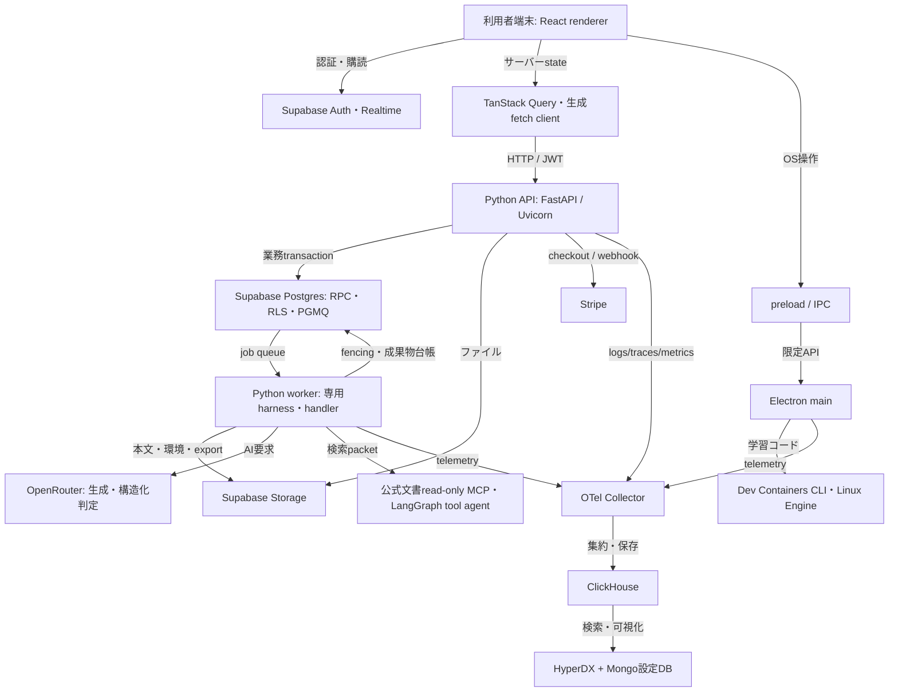

# Metisの技術スタック

対象: fetchしたdevelop `efb532f74c383cd35c055d85d3f989ba643c3611` / 2026-10-06。

[説明ページ](tech-stack.html) · [ロジック図解](index.html) · [用語集](glossary.md) · [照合記録](verification.md) · [データ](tech-stack.json)

MetisはElectronの画面、FastAPIのAPI、非同期worker、Supabase、利用者端末のDev Containerで構成する。各技術の目的・動く場所・実装上の役割を以下にまとめた。

バージョンは対象commitのlockfileを優先した。Node/pnpm/Pythonの要求、外部サービスやDocker imageの設定は種類を明示し、実行中の導入済み版とは区別する。^や>=を含むmanifestの指定とlockfileの解決版は一致するとは限らない。

## 技術の接続

## 読み違えやすい点

- OpenAI SDKの送信先はOpenRouter。モデルは設定・profile・job runtime snapshotによって変わる。
- Orval生成物はfetch request/DTO。React Queryの機能hookはDesktopが持つ。
- ガイド本生成は専用harness。実際のLangGraphは公式文書tool agentにある。Jev専用経路はこのdevelopに含まれない。
- Postgresは業務DB、ClickHouseは観測データ、MongoはHyperDX設定保存。
- 製品runtimeのDocker手動起動案内と、dev/CIのDocker自動起動補助は別。
- pypdfはdev依存。PDF生成はReportLab。

## 技術一覧

### 言語・開発基盤

#### Node.js / pnpm

**目的:** JavaScriptを端末で実行し、複数packageの依存とコマンドを管理する。

**動く場所:** 開発端末・CI・Electron main

**Metisでの役割:** pnpm workspaceでdesktop/api-clientをまとめ、起動・生成・検証スクリプトを実行する。

**版・設定:** Node.js 26.5.0 / pnpm@11.25.0

**補足:** Node指定は開発コマンドの契約。Electron内蔵Nodeの版はElectron自身に従う。

根拠: [package.json](https://github.com/5B-Projects/metis/blob/efb532f74c383cd35c055d85d3f989ba643c3611/package.json) / [.node-version](https://github.com/5B-Projects/metis/blob/efb532f74c383cd35c055d85d3f989ba643c3611/.node-version) / [pnpm-workspace.yaml](https://github.com/5B-Projects/metis/blob/efb532f74c383cd35c055d85d3f989ba643c3611/pnpm-workspace.yaml)

関連図: [図50](index.html#diagram-50) / [図55](index.html#diagram-55)

#### TypeScript

**目的:** JavaScriptに型を付け、実行前に値や呼出の不整合を検出する。

**動く場所:** Desktop main / preload / renderer・生成API client

**Metisでの役割:** strictな設定でIPC入力型、画面データ、API DTOを共有し、main用とweb用を別設定で検証する。

**版・設定:** typescript 6.0.3

**補足:** 型検査だけでは実行時の不正入力は防げないため、IPCやAPI境界でも検証する。

根拠: [apps/desktop/package.json](https://github.com/5B-Projects/metis/blob/efb532f74c383cd35c055d85d3f989ba643c3611/apps/desktop/package.json) / [apps/desktop/tsconfig.node.json](https://github.com/5B-Projects/metis/blob/efb532f74c383cd35c055d85d3f989ba643c3611/apps/desktop/tsconfig.node.json) / [apps/desktop/tsconfig.web.json](https://github.com/5B-Projects/metis/blob/efb532f74c383cd35c055d85d3f989ba643c3611/apps/desktop/tsconfig.web.json) / [apps/api-client/tsconfig.json](https://github.com/5B-Projects/metis/blob/efb532f74c383cd35c055d85d3f989ba643c3611/apps/api-client/tsconfig.json)

関連図: [図02](index.html#diagram-02) / [図43](index.html#diagram-43)

#### Python / uv

**目的:** PythonはBackendの実装言語。uvは依存の解決・固定と仮想環境での実行を管理する。

**動く場所:** API・worker・MCP server・CI

**Metisでの役割:** pyproject.tomlとuv.lockから環境を再現し、uv runでAPI/workerと品質チェックを動かす。

**版・設定:** Python要求 >=3.13 / uvの実行版はrepoで固定なし

**補足:** requires-pythonは要求範囲で、起動済みプロセスのPython版を確認した値ではない。

根拠: [apps/backend/pyproject.toml](https://github.com/5B-Projects/metis/blob/efb532f74c383cd35c055d85d3f989ba643c3611/apps/backend/pyproject.toml) / [apps/backend/uv.lock](https://github.com/5B-Projects/metis/blob/efb532f74c383cd35c055d85d3f989ba643c3611/apps/backend/uv.lock) / [.github/actions/setup-backend-uv/action.yml](https://github.com/5B-Projects/metis/blob/efb532f74c383cd35c055d85d3f989ba643c3611/.github/actions/setup-backend-uv/action.yml)

関連図: [図02](index.html#diagram-02) / [図50](index.html#diagram-50)

#### Vite / electron-vite / electron-builder

**目的:** 開発時の更新と配布用のビルド・パッケージ作成を行う。

**動く場所:** 開発端末・CI

**Metisでの役割:** electron-viteがmain/preload/rendererを分けてViteでbuildし、electron-builderがOS別配布物を作る。

**版・設定:** vite 7.3.6 / electron-vite 5.0.0 / electron-builder 26.15.3

**補足:** 配布物のbuildと、配布したアプリの動作確認smokeは別の検証。

根拠: [apps/desktop/package.json](https://github.com/5B-Projects/metis/blob/efb532f74c383cd35c055d85d3f989ba643c3611/apps/desktop/package.json) / [apps/desktop/electron.vite.config.ts](https://github.com/5B-Projects/metis/blob/efb532f74c383cd35c055d85d3f989ba643c3611/apps/desktop/electron.vite.config.ts)

関連図: [図50](index.html#diagram-50) / [図55](index.html#diagram-55)

### Desktop・画面

#### Electron / preload / IPC

**目的:** Web技術でデスクトップ画面を作り、限定された窓口を通してOS操作へ接続する。

**動く場所:** 利用者端末

**Metisでの役割:** React rendererからpreloadの製品APIを介してmainへ要求し、workspace・ファイル保存・OAuth callback等を扱う。

**版・設定:** electron 43.6.0 / @electron-toolkit/preload 3.0.2 / @electron-toolkit/utils 4.0.0

**補足:** rendererの画面処理とmainのOS操作は別プロセスの責任。

根拠: [apps/desktop/package.json](https://github.com/5B-Projects/metis/blob/efb532f74c383cd35c055d85d3f989ba643c3611/apps/desktop/package.json) / [apps/desktop/src/preload/index.ts](https://github.com/5B-Projects/metis/blob/efb532f74c383cd35c055d85d3f989ba643c3611/apps/desktop/src/preload/index.ts) / [apps/desktop/src/main/index.ts](https://github.com/5B-Projects/metis/blob/efb532f74c383cd35c055d85d3f989ba643c3611/apps/desktop/src/main/index.ts)

関連図: [図02](index.html#diagram-02) / [図04](index.html#diagram-04) / [図32](index.html#diagram-32) / [図43](index.html#diagram-43) / [図44](index.html#diagram-44)

#### React / React DOM

**目的:** 画面を再利用可能なcomponentとstateで組み立てる。

**動く場所:** Electron renderer

**Metisでの役割:** ゴール入力、承認画面、学習、教材、決済等の画面を描画する。

**版・設定:** react 19.2.8 / react-dom 19.2.8

根拠: [apps/desktop/package.json](https://github.com/5B-Projects/metis/blob/efb532f74c383cd35c055d85d3f989ba643c3611/apps/desktop/package.json) / [apps/desktop/src/renderer/src/render-app.tsx](https://github.com/5B-Projects/metis/blob/efb532f74c383cd35c055d85d3f989ba643c3611/apps/desktop/src/renderer/src/render-app.tsx)

関連図: [図01](index.html#diagram-01) / [図13](index.html#diagram-13) / [図20](index.html#diagram-20)

#### React Router

**目的:** URLや画面の関係を管理し、表示する画面を選ぶ。

**動く場所:** Electron renderer

**Metisでの役割:** HashRouterを入口に、ログイン状態や法務同意などの条件と画面遷移を組み合わせる。

**版・設定:** react-router 8.3.1

根拠: [apps/desktop/package.json](https://github.com/5B-Projects/metis/blob/efb532f74c383cd35c055d85d3f989ba643c3611/apps/desktop/package.json) / [apps/desktop/src/renderer/src/render-app.tsx](https://github.com/5B-Projects/metis/blob/efb532f74c383cd35c055d85d3f989ba643c3611/apps/desktop/src/renderer/src/render-app.tsx)

関連図: [図05](index.html#diagram-05) / [図06](index.html#diagram-06) / [図13](index.html#diagram-13)

#### TanStack Query

**目的:** サーバーから取得したデータをcacheし、再取得や更新後の整合を管理する。

**動く場所:** Electron renderer

**Metisでの役割:** QueryClientと機能hookでAPI query/mutationを管理し、owner変更時には旧利用者のcacheを消去する。

**版・設定:** @tanstack/react-query 5.102.8

**補足:** OpenAPI生成物はfetch request関数。業務ごとのquery hookは画面側が持つ。

根拠: [apps/desktop/package.json](https://github.com/5B-Projects/metis/blob/efb532f74c383cd35c055d85d3f989ba643c3611/apps/desktop/package.json) / [apps/desktop/src/renderer/src/lib/query-client.ts](https://github.com/5B-Projects/metis/blob/efb532f74c383cd35c055d85d3f989ba643c3611/apps/desktop/src/renderer/src/lib/query-client.ts) / [apps/desktop/src/renderer/src/render-app.tsx](https://github.com/5B-Projects/metis/blob/efb532f74c383cd35c055d85d3f989ba643c3611/apps/desktop/src/renderer/src/render-app.tsx)

関連図: [図02](index.html#diagram-02) / [図10](index.html#diagram-10) / [図21](index.html#diagram-21)

#### HeroUI / Tailwind CSS / Motion

**目的:** 画面部品、見た目の調整、アニメーションを提供する。

**動く場所:** Electron renderer・build

**Metisでの役割:** HeroUI部品とToast、TailwindのCSS、MotionConfigのreducedMotion設定で画面を構成する。

**版・設定:** @heroui/react 3.2.4 / tailwindcss 4.3.3 / motion 12.43.0

根拠: [apps/desktop/package.json](https://github.com/5B-Projects/metis/blob/efb532f74c383cd35c055d85d3f989ba643c3611/apps/desktop/package.json) / [apps/desktop/electron.vite.config.ts](https://github.com/5B-Projects/metis/blob/efb532f74c383cd35c055d85d3f989ba643c3611/apps/desktop/electron.vite.config.ts) / [apps/desktop/src/renderer/src/render-app.tsx](https://github.com/5B-Projects/metis/blob/efb532f74c383cd35c055d85d3f989ba643c3611/apps/desktop/src/renderer/src/render-app.tsx)

関連図: [図02](index.html#diagram-02)

#### react-markdown / GFM / Shiki / Mermaid

**目的:** Markdown本文、表やコード、図を画面へ表示する。

**動く場所:** Electron renderer

**Metisでの役割:** 教材・学習ガイドの本文を描画し、コードのsyntax highlightとMermaid図の表示を支える。

**版・設定:** react-markdown 10.1.0 / remark-gfm 4.0.1 / rehype-pretty-code 0.14.5 / shiki 4.4.3 / mermaid 11.17.2

**補足:** この説明ページとロジック図解の閲覧版は、SVGを埋め込んだ静的HTMLで閲覧できる。

根拠: [apps/desktop/package.json](https://github.com/5B-Projects/metis/blob/efb532f74c383cd35c055d85d3f989ba643c3611/apps/desktop/package.json)

関連図: [図20](index.html#diagram-20) / [図27](index.html#diagram-27) / [図30](index.html#diagram-30)

#### FilePond / React FilePond

**目的:** ファイル選択、形式やサイズの検査、画像previewや変換を行う。

**動く場所:** Electron renderer

**Metisでの役割:** プロフィールなどの画像入力に使う。file-validate-size/type、crop、EXIF、preview、resize、transformのpluginを採用する。

**版・設定:** filepond 4.32.12 / react-filepond 7.1.3

**補足:** 画面の入力補助に加え、Backendでも画像を検証する。

根拠: [apps/desktop/package.json](https://github.com/5B-Projects/metis/blob/efb532f74c383cd35c055d85d3f989ba643c3611/apps/desktop/package.json)

関連図: [図07](index.html#diagram-07)

#### React Icons / Vertical Timeline

**目的:** アイコンと時間順の出来事の表示部品を提供する。

**動く場所:** Electron renderer

**Metisでの役割:** 機能のアイコンや学習等の履歴表示を構成する補助UI依存。

**版・設定:** react-icons 5.7.0 / react-vertical-timeline-component 4.0.0

根拠: [apps/desktop/package.json](https://github.com/5B-Projects/metis/blob/efb532f74c383cd35c055d85d3f989ba643c3611/apps/desktop/package.json)

関連図: [図25](index.html#diagram-25)

### API・Backend

#### FastAPI / Uvicorn

**目的:** FastAPIがHTTP APIと入力検証を定義し、UvicornがASGIアプリを起動する。

**動く場所:** Backend API process

**Metisでの役割:** routerを公開し、認証・法務gate・Module applicationへ処理を渡す。FastAPIからOpenAPIを生成する。

**版・設定:** fastapi 0.139.0 / uvicorn 0.49.0

根拠: [apps/backend/pyproject.toml](https://github.com/5B-Projects/metis/blob/efb532f74c383cd35c055d85d3f989ba643c3611/apps/backend/pyproject.toml) / [apps/backend/src/metis_backend/main.py](https://github.com/5B-Projects/metis/blob/efb532f74c383cd35c055d85d3f989ba643c3611/apps/backend/src/metis_backend/main.py)

関連図: [図02](index.html#diagram-02) / [図05](index.html#diagram-05)

#### Pydantic / pydantic-settings

**目的:** データをschemaに沿って検証し、設定値を型として読み込む。

**動く場所:** Backend API・worker

**Metisでの役割:** API DTO、AI構造化出力、runtime snapshot、環境設定を検査する。

**版・設定:** pydantic 2.13.4 / pydantic-settings 2.14.2

根拠: [apps/backend/pyproject.toml](https://github.com/5B-Projects/metis/blob/efb532f74c383cd35c055d85d3f989ba643c3611/apps/backend/pyproject.toml) / [apps/backend/src/metis_backend/config.py](https://github.com/5B-Projects/metis/blob/efb532f74c383cd35c055d85d3f989ba643c3611/apps/backend/src/metis_backend/config.py) / [apps/backend/src/metis_backend/services/generation/structured_outputs.py](https://github.com/5B-Projects/metis/blob/efb532f74c383cd35c055d85d3f989ba643c3611/apps/backend/src/metis_backend/services/generation/structured_outputs.py)

関連図: [図13](index.html#diagram-13) / [図51](index.html#diagram-51) / [図54](index.html#diagram-54)

#### HTTPX / orjson / python-multipart

**目的:** 外部HTTP通信、高速なJSON処理、multipartの受信を支える。

**動く場所:** Backend

**Metisでの役割:** 外部API・文書検索通信、JSON応答や画像等のアップロード境界の補助ライブラリ。

**版・設定:** httpx 0.28.1 / orjson 3.11.9 / python-multipart 0.0.32

根拠: [apps/backend/pyproject.toml](https://github.com/5B-Projects/metis/blob/efb532f74c383cd35c055d85d3f989ba643c3611/apps/backend/pyproject.toml)

関連図: [図07](index.html#diagram-07) / [図18](index.html#diagram-18)

#### PyJWT / cryptography / truststore

**目的:** 署名tokenの検証、暗号処理、OSの証明書storeを使うTLS通信を支える。

**動く場所:** Backend

**Metisでの役割:** JWTのclaims/署名と利用者principalを検証する。秘密値自体を図解やログに載せない。

**版・設定:** pyjwt 2.15.1 / cryptography 50.0.0 / truststore 0.10.4

**補足:** PyJWT lock版は2.15.1。依存更新commitのタイトルと、最終lockfileの解決版を区別した。

根拠: [apps/backend/pyproject.toml](https://github.com/5B-Projects/metis/blob/efb532f74c383cd35c055d85d3f989ba643c3611/apps/backend/pyproject.toml) / [apps/backend/src/metis_backend/config.py](https://github.com/5B-Projects/metis/blob/efb532f74c383cd35c055d85d3f989ba643c3611/apps/backend/src/metis_backend/config.py)

関連図: [図05](index.html#diagram-05)

#### OpenAPI / Orval / custom fetcher

**目的:** APIの契約からTypeScriptの型とHTTP呼出関数を生成する。

**動く場所:** 生成は開発端末/CI・呼出はrenderer

**Metisでの役割:** FastAPI→openapi.generated.yaml→Orvalのtags-split/fetch生成→customInstance。認証tokenとApiErrorの正規化は手書きfetcherに集約する。

**版・設定:** orval 8.29.0

**補足:** 生成React Query hooksの設定ではない。機能hookはDesktopが実装する。

根拠: [package.json](https://github.com/5B-Projects/metis/blob/efb532f74c383cd35c055d85d3f989ba643c3611/package.json) / [apps/api-client/orval.config.ts](https://github.com/5B-Projects/metis/blob/efb532f74c383cd35c055d85d3f989ba643c3611/apps/api-client/orval.config.ts) / [apps/api-client/README.md](https://github.com/5B-Projects/metis/blob/efb532f74c383cd35c055d85d3f989ba643c3611/apps/api-client/README.md) / [apps/api-client/src/api-fetcher.ts](https://github.com/5B-Projects/metis/blob/efb532f74c383cd35c055d85d3f989ba643c3611/apps/api-client/src/api-fetcher.ts)

関連図: [図02](index.html#diagram-02) / [図55](index.html#diagram-55)

### データ・認証

#### Supabase / client SDK / CLI

**目的:** Database、Auth、Storage、Realtime等をまとめた基盤と、その操作窓口。

**動く場所:** devではSupabase local・SDKはrenderer/Backend

**Metisでの役割:** JS/Python SDKで認証・データ・Storageを利用し、CLIでローカル起動とmigration適用を行う。

**版・設定:** @supabase/supabase-js 2.110.0 / Python supabase 2.31.0 / CLI 2.116.0

**補足:** 同じsupabaseという名前でも、Python packageとNodeのCLI packageは別の版。

根拠: [apps/desktop/package.json](https://github.com/5B-Projects/metis/blob/efb532f74c383cd35c055d85d3f989ba643c3611/apps/desktop/package.json) / [apps/backend/pyproject.toml](https://github.com/5B-Projects/metis/blob/efb532f74c383cd35c055d85d3f989ba643c3611/apps/backend/pyproject.toml) / [package.json](https://github.com/5B-Projects/metis/blob/efb532f74c383cd35c055d85d3f989ba643c3611/package.json) / [supabase/config.toml](https://github.com/5B-Projects/metis/blob/efb532f74c383cd35c055d85d3f989ba643c3611/supabase/config.toml)

関連図: [図02](index.html#diagram-02) / [図05](index.html#diagram-05) / [図47](index.html#diagram-47) / [図50](index.html#diagram-50)

#### PostgreSQL / SQL migrations

**目的:** 表・制約・transactionで永続データを管理する。

**動く場所:** Supabase Database

**Metisでの役割:** 正本のsupabase/migrations/*.sqlでFK・UNIQUE・CHECK、状態、履歴、RPCを定義する。

**版・設定:** local config: PostgreSQL major 17

**補足:** major_versionはlocalの要求設定。実DBの稼働版やmigration適用状態は今回未確認。

根拠: [supabase/config.toml](https://github.com/5B-Projects/metis/blob/efb532f74c383cd35c055d85d3f989ba643c3611/supabase/config.toml) / [docs/design/10-database-schema/README.md](https://github.com/5B-Projects/metis/blob/efb532f74c383cd35c055d85d3f989ba643c3611/docs/design/10-database-schema/README.md) / [supabase/migrations/20250101000000_extensions.sql](https://github.com/5B-Projects/metis/blob/efb532f74c383cd35c055d85d3f989ba643c3611/supabase/migrations/20250101000000_extensions.sql)

関連図: [図47](index.html#diagram-47) / [図52](index.html#diagram-52)

#### RLS / RPC / lock / CAS

**目的:** 行単位のアクセス制御と、DB内の原子的な処理・競合検出。

**動く場所:** PostgreSQL

**Metisでの役割:** RLSで主体ごとの行アクセスを制限し、RPCのlock/CASで承認、利用権、jobのfencing等を確定する。

**版・設定:** DB機能・SQL契約（独立したpackage版なし）

**補足:** service_role経路ではRLSだけに依存せず、API/application/RPCでも認可と条件を検査する。

根拠: [docs/architecture/module-contracts.md](https://github.com/5B-Projects/metis/blob/efb532f74c383cd35c055d85d3f989ba643c3611/docs/architecture/module-contracts.md) / [docs/design/10-database-schema/job-attempt-fencing.md](https://github.com/5B-Projects/metis/blob/efb532f74c383cd35c055d85d3f989ba643c3611/docs/design/10-database-schema/job-attempt-fencing.md)

関連図: [図13](index.html#diagram-13) / [図35](index.html#diagram-35) / [図38](index.html#diagram-38) / [図46](index.html#diagram-46) / [図47](index.html#diagram-47)

#### Supabase Auth / OAuth / PKCE

**目的:** 利用者のログインとsession tokenを管理する。PKCEは認可codeの交換を保護する。

**動く場所:** Supabase Auth・renderer・外部ブラウザー・main callback

**Metisでの役割:** GitHub/Googleなどのソーシャル認証からcallbackを受け、coordinatorが認証snapshotを更新する。

**版・設定:** Auth service版はlocal稼働環境に依存

**補足:** Google nonce検査を維持する。ローカル設定診断は値を出さず不足・形式を通知する。

根拠: [supabase/config.toml](https://github.com/5B-Projects/metis/blob/efb532f74c383cd35c055d85d3f989ba643c3611/supabase/config.toml) / [apps/desktop/src/renderer/src/modules/account/auth/oauth-commands.ts](https://github.com/5B-Projects/metis/blob/efb532f74c383cd35c055d85d3f989ba643c3611/apps/desktop/src/renderer/src/modules/account/auth/oauth-commands.ts) / [scripts/local-env.mjs](https://github.com/5B-Projects/metis/blob/efb532f74c383cd35c055d85d3f989ba643c3611/scripts/local-env.mjs)

関連図: [図04](index.html#diagram-04) / [図05](index.html#diagram-05) / [図08](index.html#diagram-08) / [図10](index.html#diagram-10)

#### Supabase Storage

**目的:** 大きなファイルをbucketとobject keyで保存し、認可されたURLで配信する。

**動く場所:** Supabase Storage・Backend/worker

**Metisでの役割:** 教材本文、sample code、環境archive、画像、export、AI入出力などをDBから参照する。環境成果物はimmutable keyと証跡を照合する。

**版・設定:** Storage service版はlocal稼働環境に依存

**補足:** StorageとDBは単一transactionではない。環境公開にはread-backとledger照合を用いる。

根拠: [supabase/migrations/20250101020000_storage_buckets.sql](https://github.com/5B-Projects/metis/blob/efb532f74c383cd35c055d85d3f989ba643c3611/supabase/migrations/20250101020000_storage_buckets.sql) / [docs/architecture/module-contracts.md](https://github.com/5B-Projects/metis/blob/efb532f74c383cd35c055d85d3f989ba643c3611/docs/architecture/module-contracts.md)

関連図: [図19](index.html#diagram-19) / [図26](index.html#diagram-26) / [図29](index.html#diagram-29) / [図32](index.html#diagram-32) / [図48](index.html#diagram-48)

#### Supabase Realtime / Vault

**目的:** Realtimeは変更イベントを購読し、Vaultは秘密値をDB側で管理する。

**動く場所:** Realtime server・PostgreSQL・renderer

**Metisでの役割:** 通知は本人向けchannelを購読し、ownerや寿命の変化で解除する。Vault wrapperは秘密値へのアクセス窓口を限定する。

**版・設定:** service / extensionの実版は未確認

**補足:** イベント受信そのものを永続的な通知read状態や認可の代替にしない。

根拠: [apps/desktop/src/renderer/src/modules/notifications/realtime.ts](https://github.com/5B-Projects/metis/blob/efb532f74c383cd35c055d85d3f989ba643c3611/apps/desktop/src/renderer/src/modules/notifications/realtime.ts) / [supabase/migrations/20250101024000_job_rpc.sql](https://github.com/5B-Projects/metis/blob/efb532f74c383cd35c055d85d3f989ba643c3611/supabase/migrations/20250101024000_job_rpc.sql)

関連図: [図08](index.html#diagram-08) / [図10](index.html#diagram-10) / [図37](index.html#diagram-37)

#### PGMQ / pg_cron

**目的:** PGMQはPostgres上のqueue。pg_cronはDB内で定期処理を起動する。

**動く場所:** PostgreSQL・別worker process

**Metisでの役割:** 2種類のqueueと6 job typeを扱うworkerを組み立てる。期限切れattempt等の保守や法務文書施行はSQL/保守loopへ分担する。

**版・設定:** Python pgmq 1.1.2 / extension実版は未確認

**補足:** cpu_bound/io_boundはqueue分類名。全job種別が実装済みという意味ではなく、code_evaluation handlerはplaceholder。

根拠: [apps/backend/pyproject.toml](https://github.com/5B-Projects/metis/blob/efb532f74c383cd35c055d85d3f989ba643c3611/apps/backend/pyproject.toml) / [supabase/migrations/20250101000000_extensions.sql](https://github.com/5B-Projects/metis/blob/efb532f74c383cd35c055d85d3f989ba643c3611/supabase/migrations/20250101000000_extensions.sql) / [supabase/migrations/20250101022000_cron.sql](https://github.com/5B-Projects/metis/blob/efb532f74c383cd35c055d85d3f989ba643c3611/supabase/migrations/20250101022000_cron.sql) / [apps/backend/src/metis_backend/composition/worker.py](https://github.com/5B-Projects/metis/blob/efb532f74c383cd35c055d85d3f989ba643c3611/apps/backend/src/metis_backend/composition/worker.py)

関連図: [図45](index.html#diagram-45) / [図46](index.html#diagram-46) / [図48](index.html#diagram-48)

### AI・公式文書

#### OpenRouter / OpenAI Python SDK

**目的:** 複数モデルへの要求をgatewayに送り、互換SDKでHTTPと構造化応答を扱う。

**動く場所:** Backend・worker→外部OpenRouter

**Metisでの役割:** AsyncOpenAIのbase_urlをOpenRouterへ向け、provider route、retry、token、実費、strict schema/fallbackを制御する。

**版・設定:** openai 2.44.0 / 接続先 https://openrouter.ai/api/v1

**補足:** SDK名と実際の送信先は別。configのdefault/guardrailはopenai/gpt-5.6-luna、imageはqwen/qwen-image-3。設定/profile/job snapshotで変わる。Jev専用経路はdevelopにない。

根拠: [apps/backend/pyproject.toml](https://github.com/5B-Projects/metis/blob/efb532f74c383cd35c055d85d3f989ba643c3611/apps/backend/pyproject.toml) / [apps/backend/src/metis_backend/config.py](https://github.com/5B-Projects/metis/blob/efb532f74c383cd35c055d85d3f989ba643c3611/apps/backend/src/metis_backend/config.py) / [apps/backend/src/metis_backend/ai/openrouter_transport.py](https://github.com/5B-Projects/metis/blob/efb532f74c383cd35c055d85d3f989ba643c3611/apps/backend/src/metis_backend/ai/openrouter_transport.py)

関連図: [図17](index.html#diagram-17) / [図29](index.html#diagram-29) / [図51](index.html#diagram-51) / [図54](index.html#diagram-54)

#### GuideGenerationHarness / AI実行台帳

**目的:** Metis独自の生成手順制御と、AI実行の再利用・費用・結果を記録する仕組み。

**動く場所:** guide_generation worker

**Metisでの役割:** 承認後の章patch、review/repair、summary、安全性、環境公開を制御する。revisionと台帳から再開し、確認済み実費をソフト上限で検査する。

**版・設定:** repo内実装（外部packageではない）

**補足:** 全AI workflowをLangGraphが制御する構成ではない。

根拠: [apps/backend/src/metis_backend/services/generation/guide_harness.py](https://github.com/5B-Projects/metis/blob/efb532f74c383cd35c055d85d3f989ba643c3611/apps/backend/src/metis_backend/services/generation/guide_harness.py) / [apps/backend/src/metis_backend/ai/execution_ledger.py](https://github.com/5B-Projects/metis/blob/efb532f74c383cd35c055d85d3f989ba643c3611/apps/backend/src/metis_backend/ai/execution_ledger.py) / [docs/adr/ADR-050-guide-generation-dedicated-full-harness.md](https://github.com/5B-Projects/metis/blob/efb532f74c383cd35c055d85d3f989ba643c3611/docs/adr/ADR-050-guide-generation-dedicated-full-harness.md)

関連図: [図13](index.html#diagram-13) / [図14](index.html#diagram-14) / [図15](index.html#diagram-15) / [図16](index.html#diagram-16) / [図17](index.html#diagram-17)

#### LangGraph / LangChain Core

**目的:** 状態graphとtool node、AI message等の共通表現を提供する。

**動く場所:** Grounded Docs tool agent

**Metisでの役割:** grounded_docs.pyのStateGraph/ToolNodeで公式文書toolの選択・実行と結果を制御する。

**版・設定:** langgraph 1.2.9 / langchain-core 1.4.9

**補足:** LangGraphGuideGenerationWorkflowという名前のクラスは共通workflow adapter。実際にgraphを構築している箇所とは区別する。

根拠: [apps/backend/pyproject.toml](https://github.com/5B-Projects/metis/blob/efb532f74c383cd35c055d85d3f989ba643c3611/apps/backend/pyproject.toml) / [apps/backend/src/metis_backend/ai/grounded_docs.py](https://github.com/5B-Projects/metis/blob/efb532f74c383cd35c055d85d3f989ba643c3611/apps/backend/src/metis_backend/ai/grounded_docs.py) / [apps/backend/src/metis_backend/ai/workflow_langgraph.py](https://github.com/5B-Projects/metis/blob/efb532f74c383cd35c055d85d3f989ba643c3611/apps/backend/src/metis_backend/ai/workflow_langgraph.py)

関連図: [図18](index.html#diagram-18)

#### Grounded Docs / MCP

**目的:** MCPはtoolを共通形式で公開する規約。Grounded Docsは公式文書の取得済み索引と検索tool。

**動く場所:** read-only MCP server・Backend client

**Metisでの役割:** sources.tomlのlibrary/version/URLを明示取得し、保存索引から文書packetを返して生成contextへ入れる。

**版・設定:** mcp 1.28.1 / 既定URL http://127.0.0.1:6280/mcp

**補足:** dev:pstartは既存索引でserverを起動するだけ。文書の取得・更新は明示コマンド。

根拠: [apps/backend/pyproject.toml](https://github.com/5B-Projects/metis/blob/efb532f74c383cd35c055d85d3f989ba643c3611/apps/backend/pyproject.toml) / [grounded-docs/README.md](https://github.com/5B-Projects/metis/blob/efb532f74c383cd35c055d85d3f989ba643c3611/grounded-docs/README.md) / [grounded-docs/sources.toml](https://github.com/5B-Projects/metis/blob/efb532f74c383cd35c055d85d3f989ba643c3611/grounded-docs/sources.toml) / [docs/adr/ADR-046-grounded-docs-mcp-generation-tool.md](https://github.com/5B-Projects/metis/blob/efb532f74c383cd35c055d85d3f989ba643c3611/docs/adr/ADR-046-grounded-docs-mcp-generation-tool.md)

関連図: [図18](index.html#diagram-18) / [図50](index.html#diagram-50)

### 学習コードの実行

#### Docker互換Linux Engine / Dev Containers CLI

**目的:** 学習コードと開発依存をローカルcontainer内で動かす。

**動く場所:** 利用者端末・Electron main→container

**Metisでの役割:** 環境archiveとmanifestを検証してworkspaceを準備し、CLIでDev Containerを起動、exec・再接続・停止を管理する。

**版・設定:** @devcontainers/cli 0.89.0 / Docker Engine実版は端末依存

**補足:** 製品runtimeはremote context/Windows Engineを拒否し、global contextを変えない。Docker Desktopの自動起動は行わず手動案内する。開発/CIスクリプトの起動補助とは別。

根拠: [apps/desktop/package.json](https://github.com/5B-Projects/metis/blob/efb532f74c383cd35c055d85d3f989ba643c3611/apps/desktop/package.json) / [apps/desktop/src/main/workspace-runtime/runtime-provider.ts](https://github.com/5B-Projects/metis/blob/efb532f74c383cd35c055d85d3f989ba643c3611/apps/desktop/src/main/workspace-runtime/runtime-provider.ts) / [docs/adr/ADR-006-local-devcontainer-runtime.md](https://github.com/5B-Projects/metis/blob/efb532f74c383cd35c055d85d3f989ba643c3611/docs/adr/ADR-006-local-devcontainer-runtime.md) / [docs/adr/ADR-049-docker-compatible-local-linux-engine.md](https://github.com/5B-Projects/metis/blob/efb532f74c383cd35c055d85d3f989ba643c3611/docs/adr/ADR-049-docker-compatible-local-linux-engine.md)

関連図: [図43](index.html#diagram-43) / [図44](index.html#diagram-44) / [図50](index.html#diagram-50) / [図55](index.html#diagram-55)

#### Visual Studio Code

**目的:** 学習用ファイルを編集する外部エディター。

**動く場所:** 利用者端末

**Metisでの役割:** 利用者の明示操作でworkspaceを開き、container内実装へ進める。

**版・設定:** 利用者が導入する外部アプリ（実版は未確認）

**補足:** VS Codeの起動自体と、Metisが収集する実行証跡/評価は別。

根拠: [docs/adr/ADR-025-vscode-as-learning-editor.md](https://github.com/5B-Projects/metis/blob/efb532f74c383cd35c055d85d3f989ba643c3611/docs/adr/ADR-025-vscode-as-learning-editor.md) / [apps/desktop/src/main/workspace.ts](https://github.com/5B-Projects/metis/blob/efb532f74c383cd35c055d85d3f989ba643c3611/apps/desktop/src/main/workspace.ts)

関連図: [図43](index.html#diagram-43) / [図44](index.html#diagram-44)

### 決済・ファイル生成

#### Stripe / Stripe CLI

**目的:** checkout・subscription・請求等の決済と、ローカルwebhook転送を提供する。

**動く場所:** Backend→Stripe・dev端末

**Metisでの役割:** billing actorと利用権を確認してcheckout/portalを作り、webhookは重複・retryを考慮して取引を反映する。

**版・設定:** Python stripe 15.3.0 / CLI @stripe/cli 1.50.10

**補足:** 支払い・教材利用権・教材学習開始は別の状態として管理する。

根拠: [apps/backend/pyproject.toml](https://github.com/5B-Projects/metis/blob/efb532f74c383cd35c055d85d3f989ba643c3611/apps/backend/pyproject.toml) / [package.json](https://github.com/5B-Projects/metis/blob/efb532f74c383cd35c055d85d3f989ba643c3611/package.json) / [apps/backend/src/metis_backend/config.py](https://github.com/5B-Projects/metis/blob/efb532f74c383cd35c055d85d3f989ba643c3611/apps/backend/src/metis_backend/config.py) / [docs/architecture/module-contracts.md](https://github.com/5B-Projects/metis/blob/efb532f74c383cd35c055d85d3f989ba643c3611/docs/architecture/module-contracts.md)

関連図: [図38](index.html#diagram-38) / [図39](index.html#diagram-39) / [図40](index.html#diagram-40)

#### Pillow / pillow-heif

**目的:** 画像の読込・変換・合成を行う。HEIF等の入力形式を補助する。

**動く場所:** Backend・thumbnail worker

**Metisでの役割:** プロフィール画像を検証・変換し、AI生成背景と固定レイアウト/文字を合成してサムネイルを作る。

**版・設定:** pillow 12.3.0 / pillow-heif 1.4.0

根拠: [apps/backend/pyproject.toml](https://github.com/5B-Projects/metis/blob/efb532f74c383cd35c055d85d3f989ba643c3611/apps/backend/pyproject.toml) / [apps/backend/src/metis_backend/services/account_write.py](https://github.com/5B-Projects/metis/blob/efb532f74c383cd35c055d85d3f989ba643c3611/apps/backend/src/metis_backend/services/account_write.py) / [apps/backend/src/metis_backend/services/materials/thumbnail_composition.py](https://github.com/5B-Projects/metis/blob/efb532f74c383cd35c055d85d3f989ba643c3611/apps/backend/src/metis_backend/services/materials/thumbnail_composition.py)

関連図: [図07](index.html#diagram-07) / [図29](index.html#diagram-29)

#### ReportLab / pypdf

**目的:** PDFの生成と内容の読取・検証を行う。

**動く場所:** export worker・テスト

**Metisでの役割:** ReportLabで教材export PDFを生成する。pypdfはdev依存として出力の検証等に使う。

**版・設定:** reportlab 5.0.0 / pypdf 6.19.0

**補足:** pypdfを本番PDF生成engineとして説明しない。

根拠: [apps/backend/pyproject.toml](https://github.com/5B-Projects/metis/blob/efb532f74c383cd35c055d85d3f989ba643c3611/apps/backend/pyproject.toml) / [apps/backend/src/metis_backend/workers/export.py](https://github.com/5B-Projects/metis/blob/efb532f74c383cd35c055d85d3f989ba643c3611/apps/backend/src/metis_backend/workers/export.py)

関連図: [図32](index.html#diagram-32)

### ログ・監視

#### OpenTelemetry / OTLP / Collector

**目的:** logs・traces・metricsを共通形式で集め、集約先へ送る。

**動く場所:** API・worker・Desktop main・別Collector container

**Metisでの役割:** serviceやtrace等の属性を付けてCollectorへ送り、ClickStack形式で保存する。未有効化時はno-op経路を持つ。

**版・設定:** opentelemetry-sdk 1.43.0 / Collector image tag 2・digest固定

**補足:** prompt/tokenや個人本文をmetric labelに含めない。稼働中のCollectorに到達することは今回未検証。

根拠: [apps/backend/pyproject.toml](https://github.com/5B-Projects/metis/blob/efb532f74c383cd35c055d85d3f989ba643c3611/apps/backend/pyproject.toml) / [apps/backend/src/metis_backend/core/observability.py](https://github.com/5B-Projects/metis/blob/efb532f74c383cd35c055d85d3f989ba643c3611/apps/backend/src/metis_backend/core/observability.py) / [apps/desktop/src/main/desktop-observability.ts](https://github.com/5B-Projects/metis/blob/efb532f74c383cd35c055d85d3f989ba643c3611/apps/desktop/src/main/desktop-observability.ts) / [infra/observability/compose.yaml](https://github.com/5B-Projects/metis/blob/efb532f74c383cd35c055d85d3f989ba643c3611/infra/observability/compose.yaml) / [infra/observability/otel-collector/metis.config.yaml](https://github.com/5B-Projects/metis/blob/efb532f74c383cd35c055d85d3f989ba643c3611/infra/observability/otel-collector/metis.config.yaml)

関連図: [図49](index.html#diagram-49)

#### structlog

**目的:** ログを構造化した項目として記録する。

**動く場所:** Backend API・worker

**Metisでの役割:** event名と相関情報を記録し、通常ログとOpenTelemetryのログ経路へ接続する。

**版・設定:** structlog 26.1.0

根拠: [apps/backend/pyproject.toml](https://github.com/5B-Projects/metis/blob/efb532f74c383cd35c055d85d3f989ba643c3611/apps/backend/pyproject.toml) / [apps/backend/src/metis_backend/core/logging.py](https://github.com/5B-Projects/metis/blob/efb532f74c383cd35c055d85d3f989ba643c3611/apps/backend/src/metis_backend/core/logging.py)

関連図: [図49](index.html#diagram-49)

#### ClickHouse / HyperDX / ClickStack

**目的:** ClickHouseが観測データを保存し、HyperDXが横断検索・可視化の画面を提供する。

**動く場所:** 別のobservability container stack

**Metisでの役割:** Collector→ClickHouse→HyperDXの経路で障害や性能を調べる。ClickStackはこの観測構成の名前。

**版・設定:** ClickHouse image 26.6-alpine / HyperDX tag 2（各digest固定）

**補足:** アプリの業務DBはPostgres。ClickHouseは観測データの保存先。

根拠: [infra/observability/compose.yaml](https://github.com/5B-Projects/metis/blob/efb532f74c383cd35c055d85d3f989ba643c3611/infra/observability/compose.yaml) / [docs/adr/ADR-043-clickstack-unified-observability.md](https://github.com/5B-Projects/metis/blob/efb532f74c383cd35c055d85d3f989ba643c3611/docs/adr/ADR-043-clickstack-unified-observability.md)

関連図: [図49](index.html#diagram-49)

#### MongoDB

**目的:** document形式でデータを保存する。

**動く場所:** observability stack

**Metisでの役割:** HyperDXのアプリ設定保存を支える。Metisの教材や課金の正本DBではない。

**版・設定:** image 5.0.33-focal・digest固定

根拠: [infra/observability/compose.yaml](https://github.com/5B-Projects/metis/blob/efb532f74c383cd35c055d85d3f989ba643c3611/infra/observability/compose.yaml)

関連図: [図49](index.html#diagram-49)

### 品質・CI・開発運用

#### pytest / Ruff / mypy / Bandit

**目的:** テスト、lint/format、型、セキュリティ静的検査を分担する。

**動く場所:** Backend開発端末・CI

**Metisでの役割:** pytest-asyncio/cov、respx、Schemathesis等も組み合わせ、API・業務・DB統合の契約を検証する。

**版・設定:** pytest 9.1.1 / ruff 0.15.20 / mypy 2.1.0 / bandit 1.9.4

**補足:** DB検証は専用Supabaseを使う。テスト成功と本番activation完了は別。

根拠: [apps/backend/pyproject.toml](https://github.com/5B-Projects/metis/blob/efb532f74c383cd35c055d85d3f989ba643c3611/apps/backend/pyproject.toml) / [scripts/dev-perfect-test.mjs](https://github.com/5B-Projects/metis/blob/efb532f74c383cd35c055d85d3f989ba643c3611/scripts/dev-perfect-test.mjs) / [.github/workflows/backend-ci.yml](https://github.com/5B-Projects/metis/blob/efb532f74c383cd35c055d85d3f989ba643c3611/.github/workflows/backend-ci.yml)

関連図: [図50](index.html#diagram-50) / [図55](index.html#diagram-55)

#### Node test / Playwright / MSW

**目的:** 関数のテスト、実ブラウザー/Electron操作、API mockを分担する。

**動く場所:** Desktop開発端末・CI

**Metisでの役割:** node --test/tsxでunit、PlaywrightでE2E、MSW/openapi-mswでAPI mock。typecheck/buildと配布smokeを別段階で検証する。

**版・設定:** @playwright/test 1.63.0 / msw 2.15.0 / openapi-msw 2.0.0 / tsx 4.23.13

**補足:** この図解変更のブラウザー検証はローカルChromium。Metis本体の3 OS CIを今回再実行したという意味ではない。

根拠: [apps/desktop/package.json](https://github.com/5B-Projects/metis/blob/efb532f74c383cd35c055d85d3f989ba643c3611/apps/desktop/package.json) / [scripts/dev-perfect-test.mjs](https://github.com/5B-Projects/metis/blob/efb532f74c383cd35c055d85d3f989ba643c3611/scripts/dev-perfect-test.mjs) / [.github/workflows/app-ci.yml](https://github.com/5B-Projects/metis/blob/efb532f74c383cd35c055d85d3f989ba643c3611/.github/workflows/app-ci.yml)

関連図: [図50](index.html#diagram-50) / [図55](index.html#diagram-55)

#### GitHub Actions / quality gates

**目的:** 変更ごとに自動検証を実行し、PRの結果を集約する。

**動く場所:** GitHub-hosted Ubuntu・self-hosted Windows/macOS

**Metisでの役割:** 変更範囲に応じてAPI client、Desktop、root scripts、Backend/Supabaseを検査する。Linuxは最新developで一時的にubuntu-latest。

**版・設定:** Workflow定義は対象commitに固定

**補足:** Desktop renderer E2EはWindows/macOS。runtime smokeはLinux/Windows/macOS。実行結果やrunnerのonline状態は未確認。

根拠: [.github/workflows/app-ci.yml](https://github.com/5B-Projects/metis/blob/efb532f74c383cd35c055d85d3f989ba643c3611/.github/workflows/app-ci.yml) / [.github/workflows/backend-ci.yml](https://github.com/5B-Projects/metis/blob/efb532f74c383cd35c055d85d3f989ba643c3611/.github/workflows/backend-ci.yml) / [scripts/ci-docker-preflight.mjs](https://github.com/5B-Projects/metis/blob/efb532f74c383cd35c055d85d3f989ba643c3611/scripts/ci-docker-preflight.mjs)

関連図: [図55](index.html#diagram-55)

#### Release Drafter / Renovate

**目的:** PRからrelease noteを用意し、依存更新を提案・検証する。

**動く場所:** GitHub運用

**Metisでの役割:** PR分類ラベルに従ってrelease draftを組み立てる。依存更新後の生成物/第三者license整合はCIで確認する。

**版・設定:** 設定・Workflowの契約に従う

**補足:** draft作成、アプリの配布、release公開は別の操作。

根拠: [.github/release-drafter.yml](https://github.com/5B-Projects/metis/blob/efb532f74c383cd35c055d85d3f989ba643c3611/.github/release-drafter.yml) / [.github/workflows/release-drafter.yml](https://github.com/5B-Projects/metis/blob/efb532f74c383cd35c055d85d3f989ba643c3611/.github/workflows/release-drafter.yml) / [.github/workflows/renovate-license-autofix.yml](https://github.com/5B-Projects/metis/blob/efb532f74c383cd35c055d85d3f989ba643c3611/.github/workflows/renovate-license-autofix.yml)

関連図: [図50](index.html#diagram-50) / [図55](index.html#diagram-55)

#### GitHub Projects / Discord webhook

**目的:** Issueの予定・担当一覧を開発メンバーへ届ける。

**動く場所:** GitHub Actions→GitHub API→Discord

**Metisでの役割:** 日付・担当者・予定を分類して09:00 JSTに投稿。履歴hashで同日再送を抑止し、dry-runでは本文をSummaryへ出す。

**版・設定:** 日次通知スクリプトは対象commitの実装

**補足:** これは開発運用の通知。Metis利用者のアプリ内notificationsとは別。今回実際のDiscord送信は行っていない。

根拠: [docs/PROJECT_MANAGEMENT.md](https://github.com/5B-Projects/metis/blob/efb532f74c383cd35c055d85d3f989ba643c3611/docs/PROJECT_MANAGEMENT.md) / [.github/workflows/notify-issue-schedule.yml](https://github.com/5B-Projects/metis/blob/efb532f74c383cd35c055d85d3f989ba643c3611/.github/workflows/notify-issue-schedule.yml) / [.github/scripts/notify-issue-schedule.mjs](https://github.com/5B-Projects/metis/blob/efb532f74c383cd35c055d85d3f989ba643c3611/.github/scripts/notify-issue-schedule.mjs)

関連図: [図56](index.html#diagram-56)
